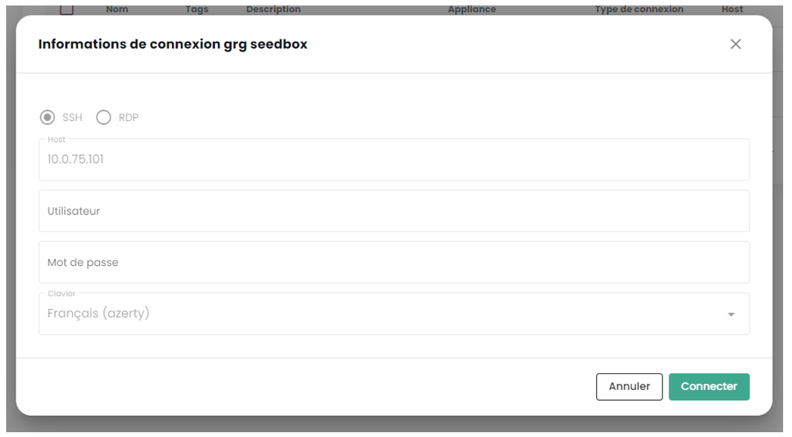

Dieser Schnellstart-Leitfaden zeigt Ihnen, wie Sie die Erstellung eines Appliances beantragen und eine neue Sitzung erstellen und sich damit verbinden können.

## Voraussetzungen

1. Sie haben das Cloud Temple-Angebot abonniert (Appliance Bastion Abonnement).
2. Die zu verwaltenden Geräte müssen aus dem Netzwerk erreichbar sein, auf dem die Appliance Bastion bereitgestellt wird.
3. Sie haben die Berechtigungen für das Bastion-Modul.
4. Im Falle eines On-Premise-Appliance-Bereitstellungs müssen die entsprechenden Flüsse geöffnet sein.

## Beantragen der Appliance-Erstellung
Bevor Sie eine Appliance bereitstellen können, müssen Sie eine Anfrage zur Abonnementerstellung einer Appliance über den Support stellen. 
Der Support ist über das Shiva-Dashboard erreichbar, indem Sie auf das Rettungsring-Symbol in der oberen rechten Ecke des Fensters klicken.

## Eine Sitzung erstellen

Um regelmäßig auf ein zu verwaltendes Gerät zugreifen zu können, ist es am besten, eine Sitzung zu erstellen, die bei jeder Verbindung nur Ihren Benutzernamen und Ihr Passwort erfordert.

Gehen Sie dazu zum "Sitzungen" -Tab im "Bastion" -Menü und klicken Sie dann auf die Schaltfläche "Neue Sitzung".

Geben Sie dann die Informationen ein, die für die Erstellung Ihrer Sitzung erforderlich sind:

    - Sitzungsname;
    - Beschreibung;
    - zugehörige Appliance;
    - Protokolltyp (SSH oder RDP);
    - IP-Adresse des Hosts;
    - Tastaturkonfiguration.

Eine Benachrichtigung über die Erstellung der Sitzung sollte oben rechts auf der Seite angezeigt werden. Die Sitzung wird dann Ihrer Sitzungsliste hinzugefügt.

Sie können auch über den "Appliances" -Tab eine neue Sitzung erstellen, indem Sie auf die Aktionsleiste der Appliance klicken, mit der Sie die Sitzung verknüpfen möchten.

## Eine Sitzung öffnen

Gehen Sie zum "Sitzungen" -Tab im "Bastion" -Menü. Klicken Sie auf die Aktionsleiste der Sitzung, die Sie öffnen möchten, und klicken Sie auf die Schaltfläche "Öffnen".

Bei jeder Verbindung zur Sitzung müssen Sie nur Ihre Anmeldeinformationen eingeben.

Nachdem Sie Ihre Anmeldeinformationen eingegeben haben, wird eine Benachrichtigung angezeigt, dass die Sitzung gestartet wurde, und die Konsole für Ihre virtuelle Maschine wird geöffnet.
