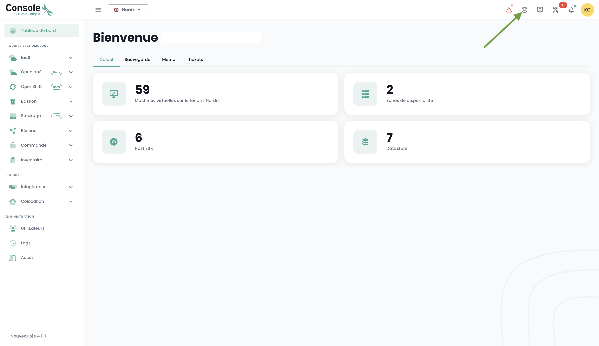

Questa guida rapida ti illustra come richiedere la creazione di un Appliance e come registrare una nuova sessione e connettersi ad essa.

## Requisiti

1. Aver sottoscritto l'offerta Cloud Temple (sottoscrizione Appliance Bastion).
2. Gli apparati da amministrare devono essere accessibili dalla rete in cui è distribuita l'Appliance Bastion.
3. Avere i diritti sul modulo Bastion.
4. Nel caso di un'impianto dell'Appliance in loco, i relativi flussi devono essere aperti.

## Richiedere la creazione di un Appliance
Prima di poter distribuire un Appliance, è necessario inviare una richiesta di sottoscrizione a un Appliance tramite una richiesta di supporto.
Il supporto è accessibile dalla console Shiva tramite l'icona di salvagente sulla barra in alto a destra della finestra.

## Registrare una sessione

Per accedere regolarmente a un apparato da amministrare, è più adatto creare una sessione che richiederà solo il tuo nome utente e la tua password ad ogni connessione.

Per farlo, vai alla scheda "Sessioni" del menu "Bastion" e clicca sul pulsante "Nuova sessione".

Inserisci quindi le informazioni necessarie per la creazione della tua sessione:

    - Nome della sessione;
    - Descrizione;
    - Appliance associata;
    - Tipo di protocollo (SSH o RDP);
    - Indirizzo IP dell'host;
    - Configurazione della tastiera.

Dovrebbe apparire una notifica che conferma la creazione della sessione in alto a destra della pagina. La sessione viene quindi aggiunta all'elenco delle tue sessioni.

Per creare una nuova sessione, è anche possibile passare alla scheda "Appliance" cliccando sulla barra delle azioni dell'Appliance a cui desideri associare una sessione.

## Connessione a una sessione

Vai alla scheda "Sessioni" della scheda "Bastion". Fai clic sulla barra delle azioni della sessione che desideri aprire e fai clic sul pulsante "Apri".

Ad ogni connessione alla sessione, devi inserire solo le tue informazioni di autenticazione.

Dopo aver inserito le tue credenziali, verrà visualizzata una notifica che conferma l'inizio della sessione e la console per la tua macchina virtuale si aprirà.
