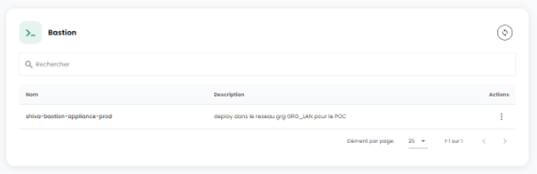
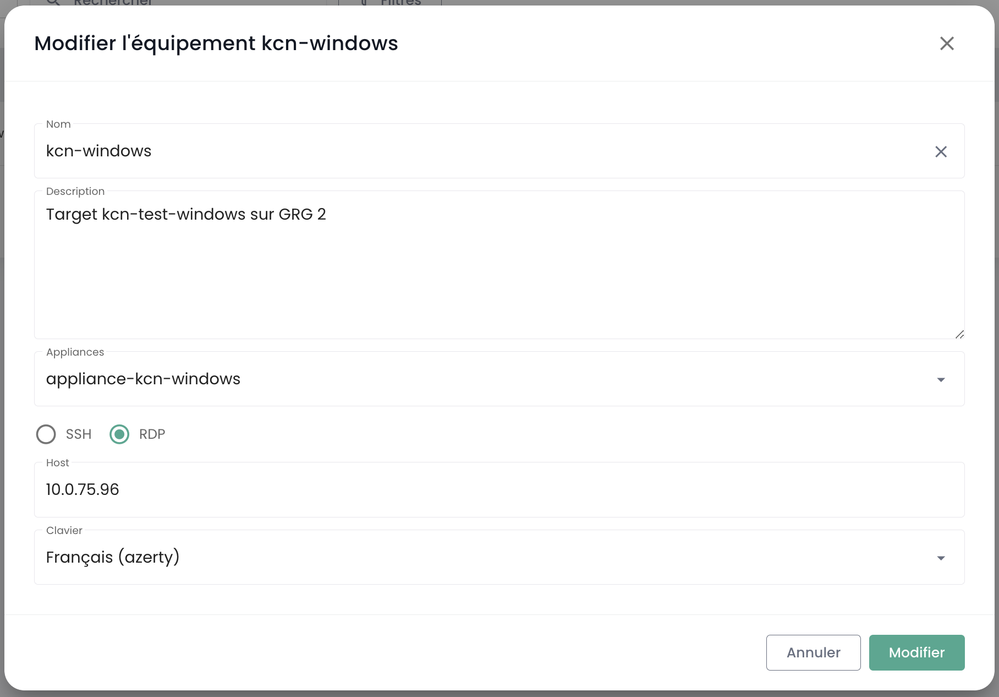

These tutorials will assist you in deploying and managing a Bastion Cloud Temple via the Shiva portal.

## Prerequisites
1. Subscription to the Cloud Temple offer is required (Bastion Appliance subscription).
2. The equipment to be managed must be accessible from the network where the Bastion Appliance is deployed.
3. Have access to Bastion module.
4. In the context of an onpremise Appliance deployment, the corresponding flows must be open.

## Interface
Once connected to the Shiva web portal, go to the "Bastion" tab in the left menu.

The "Equipment" tab allows you to consult the list of your equipment. Equipment corresponds to a connection configuration via a Bastion Appliance. For each piece of equipment, its name, tags, description, the associated Appliance, the connection type (SSH or RDP), the host IP, and finally the keyboard configuration are indicated.

You can filter the list of your equipment according to the tags assigned to them, and a search engine allows you to search for a session by its name.

The "Appliances" tab provides you with the list of your Bastion Appliances. For each Appliance, the name of the Appliance and its description are specified.

A search engine is available to allow you to search for an Appliance by its name.

## Deploy an Appliance
Before deploying an Appliance, it is necessary to request a subscription for an Appliance through a support request.

## Open a stream to a device
In the "Appliances" tab, click on the action bar of the Appliance you want to open. Then click on the "Open" button.

Then enter the necessary information for the connection:

    - Choice of protocol (SSH or RDP);
    - IP address of the host to be administered;
    - Credential information;
    - Keyboard configuration.

Then click on "Connect" to open the Appliance. The console of the virtual machine to be administered will then open.

## Registering a Device
To regularly access a piece of equipment for administration, it is more appropriate to create an equipment configuration, which will only require your username and password for each connection.

To do this, go to the "Equipment" tab in the "Bastion" menu, then click on the "New equipment" button.

Next, enter the necessary information for creating your equipment:

    - Equipment name;
    - Description;
    - Associated appliance;
    - Protocol type (SSH or RDP);
    - Host IP address;
    - Keyboard language.

A notification indicating the creation of your equipment configuration should appear at the top right of the page. The configuration is then added to the list of your equipment.

To create a new connection, you can also go through the "Appliances" tab by clicking on the action bar of the Appliance to which you want to associate an equipment configuration.

## Connecting to a piece of equipment

Proceed to the "Equipment" tab in the "Bastion" section. Click on the action bar of the equipment you wish to access, and click on the "Open" button.

Each time you connect to the equipment, you only need to provide your authentication information.

After entering your credentials, a notification confirming the start of the session will appear, and the console to your virtual machine will open.

## Modify an Equipment Configuration
Navigate to the "Equipment" tab in the "Bastion" section, click on the action bar of the equipment you wish to modify, and click on the "Edit" button.

You can then change the name of the equipment, its description, the associated Appliance, the protocol (SSH or RDP), the host IP address, or the keyboard language.

## Delete an Equipment Configuration
Navigate to the "Equipment" tab in the "Bastion" section, click on the action bar of the equipment you wish to delete, and click on the "Delete" button.

