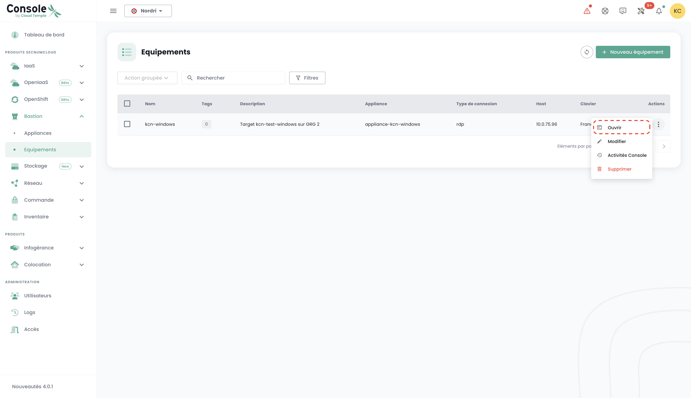

Questi tutorial vi aiuteranno a distribuire e gestire un Bastione Cloud Temple attraverso il portale Shiva.

## Prerequisiti

1. Avere sottoscritto all'offerta Cloud Temple (sottoscrizione Appliance Bastione).
2. Le apparecchiature da amministrare devono essere accessibili dalla rete in cui è distribuita l'Appliance Bastione.
3. Avere i diritti sul modulo Bastione.
4. Nel contesto di un dispiegamento dell'Appliance on-premise, i flussi corrispondenti devono essere aperti.

## Interfaccia
Dopo aver effettuato l'accesso al portale web Shiva, visitate la scheda "Bastione" nel menu di sinistra.

La scheda "Attrezzature" vi permette di consultare l'elenco delle vostre attrezzature. Un'attrezzatura corrisponde a una configurazione di connessione tramite un'apparecchiatura Bastione. Per ciascuna attrezzatura, sono indicati il suo nome, i suoi tag, la sua descrizione, l'apparecchiatura associata, il tipo di connessione (SSH o RDP), l'IP dell'host e infine la configurazione della tastiera.

Potete filtrare l'elenco delle vostre attrezzature in base ai tag che sono loro assegnati, e un motore di ricerca permette di cercare una sessione con il suo nome.

La scheda "Apparecchiature" fornisce l'elenco delle vostre Apparecchiature Bastione. Per ogni Apparecchiatura, sono precisati il nome dell'Apparecchiatura e la sua descrizione.

È disponibile un motore di ricerca per permettervi di cercare un'Apparecchiatura con il suo nome.

## Distribuire un'apparecchiatura
Prima di poter distribuire un Applicazione, è necessario richiedere l'abbonamento ad un Applicazione tramite una richiesta al supporto.

## Aprire un flusso verso un apparecchio
Nella scheda "Apparecchiature", cliccare sulla barra delle azioni dell'Apparecchio che si desidera aprire. Poi cliccare sul pulsante "Aprire".

Inserire poi le informazioni necessarie per la connessione:

    - Scelta del protocollo (SSH o RDP);
    - Indirizzo IP dell'host da amministrare;
    - Informazioni di autenticazione;
    - Configurazione della tastiera.

Cliccare poi su "Connettere" per aprire l'Apparecchio. Si apre quindi la console della macchina virtuale da amministrare.

## Registrare un'apparecchiatura
Per accedere regolarmente a un apparecchiatura da amministrare, è più appropriato creare una configurazione di apparecchiatura, che richiederà solamente il vostro nome utente e la vostra password ad ogni connessione.

A tal fine, recatevi nella scheda "Attrezzature" del menu "Bastione", dopodiché cliccate sul pulsante "Nuova attrezzatura".

Inserite quindi le informazioni necessarie per la creazione della vostra attrezzatura:

    - Nome dell'attrezzatura;
    - Descrizione;
    - Applicazione associata;
    - Tipo di protocollo (SSH o RDP);
    - Indirizzo IP dell'host;
    - Lingua della tastiera.

Una notifica che indica la creazione della vostra configurazione di attrezzatura dovrebbe apparire in alto a destra della pagina. La configurazione si aggiunge poi all'elenco delle vostre attrezzature.

Per creare una nuova connessione, potete anche procedere tramite la scheda "Applicazioni" cliccando sulla barra d'azione dell'Applicazione alla quale desiderate associare una configurazione di attrezzatura.

## Connettersi a un'attrezzatura
Recatevi nella scheda "Equipaggiamenti" del pannello "Bastione". Cliccate sulla barra delle azioni dell'equipaggiamento che desiderate aprire e premete il bottone "Aprire".

Ad ogni connessione all'equipaggiamento, è necessario inserire solamente le vostre informazioni di autenticazione.

Dopo aver immesso i vostri dati di accesso, apparirà una notifica che conferma l'inizio della sessione e la console verso la vostra macchina virtuale si aprirà.

## Modificare una configurazione di equipaggiamento
Visitate la scheda "Equipaggiamenti" nella sezione "Bastione", cliccate sulla barra delle azioni dell'equipaggiamento che desiderate modificare e premere il pulsante "Modifica".

Potete poi modificare il nome dell'equipaggiamento, la sua descrizione, l'Appliance associata, il protocollo (SSH o RDP), l'indirizzo IP dell'host o la lingua della tastiera.

## Eliminare una configurazione di equipaggiamento
Recatevi nella scheda "Equipaggiamenti" della sezione "Bastione", cliccate sulla barra d'azione dell'equipaggiamento che desiderate eliminare e premete sul pulsante "Eliminare".

