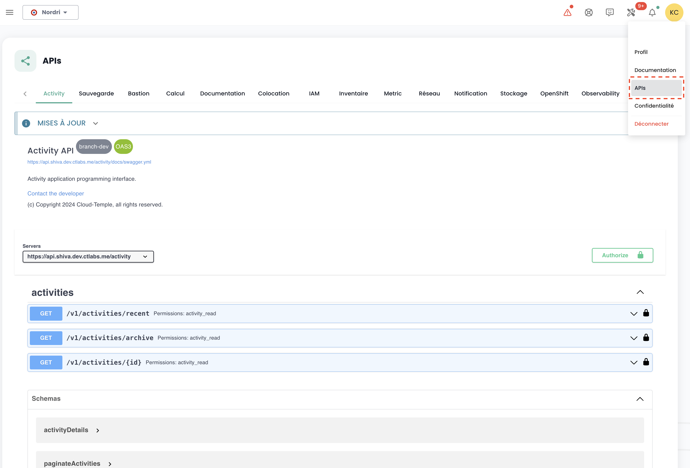

## Claves API

La __clave API__ permite autenticarse cuando se desea hacer solicitudes sobre la API. La generación de una clave API, también llamada __Personal Access Token (PAT)__, 
es una forma segura de conectarse a las API de Shiva sin utilizar una interfaz gráfica. Cada uno de estos tokens está vinculado a un inquilino y al usuario que lo creó.

La creación de este token se hace desde su cuenta. Es posible generar varias claves y configurar para cada una los permisos dentro del límite de sus derechos.

Para crear una clave API, basta con __hacer clic en su perfil__:

{:height="20%" width="20%"}

En el menú del perfil, haga clic en __'Token de acceso personal'__

Entonces tiene en pantalla todas las claves API que se han creado para este usuario en este inquilino. Haga clic en __'Nuevo token de acceso personal'__

{:height="50%" width="50%"}

Luego debe:

- Indicar el nombre de este nuevo token,
- Indicar una fecha de vencimiento (máximo 12 meses de validez),
- Elegir los [permisos asociados al token](permissions.md).

Los detalles acerca de su token son entonces mostrados. __Atención, no será posible acceder a ellos posteriormente.__

Si no anota esta información, tendrá que destruir y recrear el token.

{:height="50%" width="50%"}

Por razones de seguridad, se recomienda crear varios tokens teniendo cada uno un uso específico (un token para cada aplicación o cada proceso de negocio) en lugar de crear 1 token con todos los derechos.

Luego ve el nuevo token creado y su futura fecha de vencimiento.

{:height="70%" width="70%"}

## Acceso al portal API

La documentación OpenAPI 3.0 (Swagger) de las APIs de la consola Cloud Temple está disponible directamente en la aplicación:

{:height="70%" width="70%"}

El acceso a las APIs requiere estar autenticado. Una vez autenticado, todas las operaciones deben tener el encabezado
__'Authorization'__ con el bearer access token obtenido durante la fase de autenticación.

La URL de los puntos de acceso se proporciona directamente en __Swagger__ (en el objeto "Servers" de cada página de APIs).

## Las actividades
El seguimiento de las solicitudes de tipo escritura (POST, PUT, PATCH, DELETE) se asegura a través de la gestión de actividades. Cada solicitud de este tipo genera automáticamente una actividad asociada. Un código de estado HTTP 201 confirma la creación exitosa de la actividad. El identificador único de esta actividad se devuelve en los encabezados de la respuesta, bajo la clave 'Location'.

Una vez recuperado el identificador, es posible acceder a los detalles de la actividad utilizando la API del módulo Activity:

El contenido de la actividad incluye toda la información esencial para identificar la operación, su fecha de ejecución, así como su estado de progreso. Aquí está el modelo de una actividad:

    {
    "tenantId": "UUIDV4",
    "description": "STRING",
    "type": "ComputeActivity" | "BackupActivity" | "IAMActivity" | "TagActivity" | "RTMSActivity" | "BastionActivity" | "SupportActivity",
    "tags": "STRING[]",
    "initiator": "UUIDV4",
    "concernedItems": [
        {
        "type": "string",
        "id": "string"
        }
    ],
    "id": "UUIDV4",
    "creationDate": "DATE",
    "operationType": "read" | "write",
    "state": "CompletedState | RunningState | WaitingState | FailedState"
}

El objeto **state** puede tomar diferentes formas según el estado de la actividad, a saber:

**waiting**, estado antes de que la operación haya comenzado:

    waiting: {}

**running**, estado cuando la operación está en curso:

    running: {
    status: string;
    startDate: Date;
    progression: number;
    };

**failed**, estado si la operación ha fallado:

    failed: {
    startDate: Date;
    stopDate: Date;
    reason: string;
    };

**completed**, estado si la operación ha terminado:

    completed: {
    startDate: Date;
    stopDate: Date;
    result: string;
    };

**Nota: El identificador (UUIDv4) del recurso creado está disponible en el resultado de la actividad una vez que se ha completado.**

## Limitaciones de la API

### ¿Por qué hay límites?

La consola Cloud Temple establece __límites en el volumen de solicitudes__ que un usuario puede hacer
a la API durante un periodo determinado. La instauración de estos límites de frecuencia es una medida común en la gestión de las API, adoptada por varios motivos esenciales:

- **Prevención de abusos**: Estos límites contribuyen a la protección de la integridad de la API previniendo usos
abusivos o torpes que podrían comprometer su funcionamiento.
- **Garantía de la calidad del servicio**: Al regular el acceso a la API, nos aseguramos de una distribución equitativa
de los recursos, permitiendo así que todos los usuarios disfruten de una experiencia estable y de alto rendimiento.

Tomemos el ejemplo de un script mal diseñado o ineficiente que intenta llamadas repetitivas a la API,
corriendo el riesgo de saturar los recursos y degradar el rendimiento. Al establecer umbrales de solicitudes,
prevenimos estas situaciones y aseguramos el mantenimiento de __un servicio fluido e ininterrumpido__ para toda nuestra clientela.

### ¿Cuáles son los límites de tasa para la API de la consola Cloud Temple?
Aplicamos restricciones cuantitativas en las interacciones de los usuarios con la consola para cada producto.

Los límites están definidos en __solicitudes por segundo (s/s) y por IP de origen__. Al superar el umbral límite, el sistema responderá con un código de error HTTP 429, señalando que se ha excedido el límite de solicitudes permitidas.

Aquí están los límites definidos:

| Producto              | Umbral límite |
|----------------------|--------------|
| Console Cloud Temple | 60 s/s       |
| Identidad (IAM)       | 60 s/s       |
| IaaS - Cómputo        | 60 s/s       |
| IaaS - Almacenamiento | 20 s/s       |
| IaaS - Respaldo       | 60 s/s       |
| PaaS - S3             | 60 s/s       |
| PaaS - Openshift      | 60 s/s       |
| Red                   | 60 s/s       |
| Alojamiento           | 60 s/s       |

### ¿Cómo funcionan los límites de tasa?
Si el número de solicitudes enviadas a un punto de API excede el límite permitido, el punto de API reaccionará al retornar
__un código de respuesta HTTP 429__. Este código indica que el usuario ha superado el número de solicitudes permitidas.
Cuando esto sucede, el punto de API proporcionará también un objeto JSON como respuesta,
el cual contendrá información detallada sobre la limitación aplicada:

    {
        "error": {
            "status": "429 Too Many Requests",
            "message": "Too Many Requests"
        }
    }

### ¿Cómo evitar realizar demasiadas solicitudes?
Se recomienda limitar la cantidad de llamadas de API realizadas por su automatización para mantenerse por debajo del límite de tasa establecido para el punto final.

Esta situación se presenta a menudo cuando se ejecutan múltiples solicitudes en paralelo, utilizando varios procesos o hilos.

Existen varios medios para mejorar la eficacia de su automatización, incluyendo el uso de mecanismos de __caché__ y el establecimiento de __un sistema de reintento con atenuación progresiva__. Este método consiste en hacer una breve pausa cuando se encuentra un error de límite de tasa, y luego reintentar la solicitud. Si la solicitud falla de nuevo, la duración de la pausa se incrementa gradualmente hasta que la solicitud tenga éxito o hasta que se alcance un número máximo de intentos.

Esta aproximación presenta numerosas ventajas:

- __La atenuación progresiva__ asegura que los primeros intentos se realicen rápidamente, mientras que prevé retrasos más largos en caso de fallos repetidos.
- La adición de __una variación aleatoria__ en la pausa ayuda a evitar que todos los intentos ocurran simultáneamente.

Es importante notar que __las solicitudes fallidas no afectan su límite de tasa__. Sin embargo, enviar continuamente una solicitud podría no ser una solución viable a largo plazo, puesto que este comportamiento podría ser modificado en el futuro. Por lo tanto, recomendamos no depender exclusivamente de este mecanismo.

Las bibliotecas __[Backoff](https://pypi.org/project/backoff/)__ y __[Tenacity](https://pypi.org/project/tenacity/)__ en Python son buenos puntos de partida para implementar estrategias de atenuación.