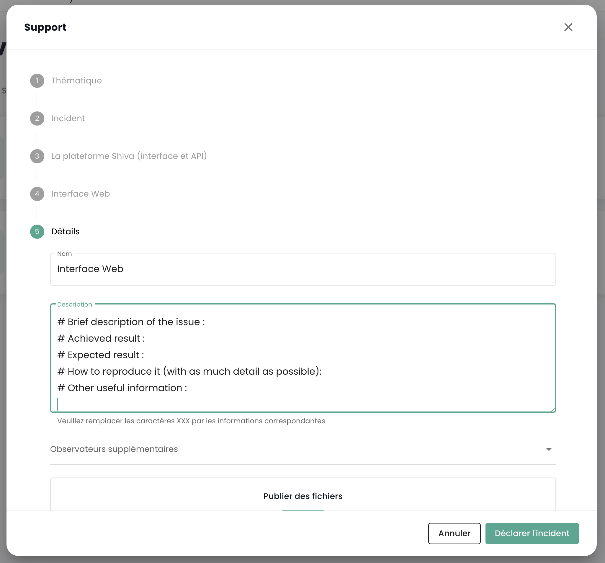

Die Cloud Temple __'Shiva'__ Konsole ist die integrierte __Cloud-Management-Plattform__ (Cloud Management Platform) von __Cloud Temple__.

Mit der Cloud Temple Shiva-Konsole können Sie Cloud-Ressourcen wie virtuelle Server, Speicher, Netzwerke und Anwendungsdienste verwalten.
Es handelt sich um eine zentrale Management-Schnittstelle, mit der Sie Ihre Cloud-Infrastruktur entwerfen und betreiben können.

Die Cloud Temple Shiva-Konsole ermöglicht insbesondere Ihren Teams:

- __Die Verwaltung Ihrer Produkte und Dienstleistungen__ von Cloud Temple,
- __Überwachung und Reporting__ des Betriebs Ihrer Cloud-Ressourcen,
- __Automatisierung und Orchestrierung__: Shiva ermöglicht dank seiner API die Automatisierung wiederkehrender Aufgaben und die Orchestrierung komplexer Workflows zur Bereitstellung, Verwaltung und Skalierung Ihrer Cloud-Ressourcen,
- __Sicherheit und Compliance__: Shiva ermöglicht die Kontrolle der Identität und das Filtern von Zugriffen, um die regulatorische Konformität und die Einhaltung Ihrer Sicherheitsrichtlinien zu gewährleisten,
- __Integration von Cloud-Adoption-Frameworks__: Dank seiner Hybridfunktionen können Sie eine operationelle Kontinuität mit Drittanbieter-Clouds (Microsoft Azure und Amazon AWS) von einer einzigen Schnittstelle aus gewährleisten, was die Integration und das Management Ihrer Multi-Cloud-Anwendungsumgebungen erleichtert.
- __Zugang und Nachverfolgung von technischen Unterstützungsfällen__: Es steht auch eine dedizierte technische Unterstützung zur Verfügung. Dies beinhaltet Kundenbetreuung bei der Lösung technischer Probleme sowie Unterstützung bei der Erstkonfiguration.
- __Die Möglichkeit, professionelle Dienstleistungen zu abonnieren__: Um Ihre Cloud-Umgebungen effizient zu verwalten, können Ihre Teams von der Unterstützung unserer Ingenieure für Beratung, Hilfestellung bei der Implementierung von Architekturen oder Schulungen profitieren.

## Voraussetzungen
- Ein Abonnement für ein Cloud Temple-Angebot abgeschlossen haben. Um einfach zu abonnieren, können Sie [uns kontaktieren](https://www.cloud-temple.com/contactez-nous/) oder per E-Mail an die Adresse __contact@cloud-temple.com__.
- Zugang zur Shiva-Konsole haben
- Ihre öffentliche IPv4 in der Vertrauenszone von Cloud Temple deklariert haben (der Zugang zur Shiva-Konsole ist auf identifizierte Vertrauensadressen beschränkt)

## Anmeldung bei Ihrem Cloud Temple-Tenant
Shiva ist über die folgende URL erreichbar:

    https://shiva.cloud-temple.com
    Oder über die direkte URL, die Ihnen per E-Mail mitgeteilt wurde.

Die Startseite ermöglicht Ihnen, die [Organisation](organisations.md) auszuwählen, in der Ihr Benutzer erstellt wurde.
Nachdem Sie Ihr Unternehmen eingegeben haben, klicken Sie bitte auf __'Anmelden'__.

Danach werden Sie zu einer Seite weitergeleitet, die Sie zur Authentifizierung auffordert.
Nachdem Sie sich angemeldet haben, gelangen Sie auf diese Seite.

## Sprachverwaltung
Die Konsole ist verfügbar in __Französisch__, __Englisch__. Sie können die Betriebssprache ändern, indem Sie auf das __Sprachen__-Symbol oben rechts auf dem Bildschirm klicken.

Das Ändern der Sprache eines Nutzers muss in seinem __'Profil'__ durchgeführt werden, oben rechts auf dem Bildschirm, in den __'Benutzereinstellungen'__.

Die Konfiguration wird für jeden Mandanten [Mandant](tenants.md) durchgeführt.

## Zugang zum technischen Support

Zu jeder Zeit können Sie das __Support-Team von Cloud Temple__ über das __Symbol 'Rettungsring'__ kontaktieren, welches sich oben rechts auf dem Bildschirm befindet.

Sie werden während des gesamten Support-Anfrageprozesses geleitet.

Der erste Schritt ist die Identifizierung der Art der Supportanfrage:

- Beratung zur Nutzung eines Produktes anfragen (außerhalb von Vorfällen),
- Unterstützung in Bezug auf Ihr Kundenkonto anfordern,
- Einen Vorfall melden oder technischen Support anfordern.
- Die Unterstützung eines professionellen Dienstes anfordern (Bereitstellung eines Cloud Temple Ingenieurs für ein spezifisches Problem).

{:height="50%" width="50%"}

Danach haben Sie die Möglichkeit, Details anzugeben und Dateien beizufügen (z. B. Bilder oder Logs).

Nachdem Ihre Anfrage gestellt wurde, können Sie Ihre Anfragen über das __Symbol 'Rettungsring'__ abrufen, das sich oben rechts auf dem Bildschirm befindet:

## Zugriff auf Benutzerfunktionen über das Web-Interface
Die Gesamtheit der Funktionen, die für Ihren Benutzer zugänglich sind (je nach seinen Rechten), befindet sich links auf dem Bildschirm im grünen Streifen.
Die Funktionen sind nach Modul gruppiert. Dies umfasst hauptsächlich:

- Das __Inventar__ Ihrer Ressourcen,
- Die __Nachverfolgung von Operationen__,
- Die __Steuerung von IaaS-Ressourcen__ (Rechenleistung, Speicherplatz, Netzwerk, ...)
- Die __Steuerung von OpenIaaS-Ressourcen__ (Rechenleistung, Speicherplatz, Netzwerk, ...)
- Der Zugriff auf __zusätzliche Dienste__ (Bastion, Monitoring, ...)
- Die __Verwaltung Ihrer Organisation__ (Verwaltung von Tenants, Rechten, ...)

Die Aktivierung eines Moduls für einen Benutzer hängt von den Rechten des Benutzers ab. Zum Beispiel wird das Modul __'Bestellung'__ nicht verfügbar sein, wenn der Benutzer nicht das Recht __'ORDER'__ besitzt.

Hier ist eine Vorstellung der verschiedenen verfügbaren Module. Neue Module bereichern das Konsolenangebot regelmäßig:

{:height="20%" width="20%"}

- __Dashboard__ : ermöglicht eine schnelle Übersicht über die __gesamten Rechen- und Speicherressourcen__, die Statistik der __Datensicherung__ und eine __Zusammenfassung der Support-Ordner__,
- __Inventar__ : ermöglicht einen Überblick über alle Ihre Ressourcen vom Typ __'virtuelle Maschinen'__. Wenn __Tags__ verwendet werden, ermöglicht es die Ansicht nach __Tag__ (zum Beispiel, geschäftsbezogene Ansicht, anwendungsbezogene Ansicht, ...),
- __Managed Services__ : bietet Zugang zur Nachverfolgung Ihrer __Supportanfragen__ und zur __Metrilogie der Dienste__,
- __IaaS__ : ermöglicht die __Steuerung der VMware IaaS-Infrastrukturen__ (virtuelle Maschinen, Cluster, Hypervisoren, Replikationen, Datensicherung, ...),
- __OpenIaaS__ : ermöglicht die __Steuerung von Xen Orchestra-Ressourcen__ (virtuelle Maschinen, Datensicherung, ...),
- __OpenShift__ : ermöglicht die Steuerung Ihrer **RedHat Openshift PaaS-Architektur** und das Management Ihrer Container in den 3 Verfügbarkeitszonen der Plattform.
- __Bastion__ : Ermöglicht das Ausrollen und Steuern von SSH/RDP-Bastion-Appliances in Ihren Netzwerken,
- __Netzwerk__ : ermöglicht die Steuerung von __Netzwerken der Ebene 2 und 3__, der __öffentlichen IP-Adressen__ und Ihrer __Telekommunikationskreisläufe__,
- __Colocation__ : Bietet die Ansicht der Geräte in __gemeinsam genutzter oder dedizierter Colocation-Zone__,
- __Bestellung__ : Ermöglicht die Bestellung von Ressourcen und die Nachverfolgung der Bereitstellung,
- __Verwaltung__ : Gruppiert die Verwaltungsfunktionen für Benutzer und Tenants sowie den Zugriff auf die globale Protokollierung.

## Zugang zu Benutzerfunktionen über die API
Zugang zu allen Funktionen der Shiva-Konsole ist über die Shiva API möglich. Details zu den Verben und Konfigurationen finden Sie unter __'Profil'__ und __'APIs'__:

## Terraform-Anbieter

Cloud Temple stellt Ihnen einen Terraform-Provider zur Verfügung, um Ihre Cloud-Plattform *"as code"* zu steuern. Er ist hier zugänglich:

https://registry.terraform.io/providers/Cloud-Temple/cloudtemple/latest

## Für weitere Informationen
Wir bieten Ihnen nun an, die Funktionsweise zu verstehen:

- Einer Organisation: [Mon organisation](organisations.md)
- Der Benutzerkonten: [Mes comptes](accounts.md)
- Der mit dieser Organisation verbundenen Mandanten: [Mes Tenants](tenants.md)