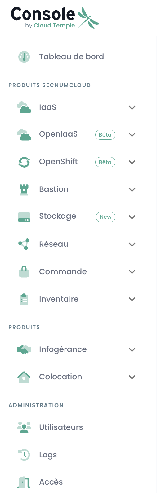

The Cloud Temple '__Shiva__' console is the integrated __cloud management platform__ (Cloud Management Platform) of __Cloud Temple__.

The Cloud Temple Shiva console allows you to manage cloud resources such as virtual servers, storage, networks, and application services.
It is a centralized management interface that lets you design and operate your cloud infrastructure.

The Cloud Temple Shiva console notably enables your teams to:

- __Manage your Cloud Temple products and services__,
- __Monitor and report__ on the operation of your cloud resources,
- __Automation and orchestration__: Shiva, with its API, enables the automation of repetitive tasks and the orchestration of complex workflows to deploy, manage, and scale your cloud resources,
- __Security and compliance__: Shiva enables identity control and access filtering to ensure regulatory compliance and adherence to your security policies,
- __Integration of Cloud Adoption Frameworks__: With its hybridization features, you can ensure operational continuity with third-party cloud providers (Microsoft Azure and Amazon AWS) from a single interface, facilitating the integration and management of your multi-cloud application environments.
- __Access and monitoring of technical support files__: Dedicated technical assistance is also available. This includes customer support for resolving technical issues as well as assistance with initial setup.
- __The possibility of subscribing to professional services__: In order to effectively manage your Cloud environments, your teams can benefit from the assistance of our engineers for advice, help with implementing architecture, or training.

## Prerequisites
- To have subscribed to a Cloud Temple offer. To subscribe easily, you can [contact us](https://www.cloud-temple.com/contactez-nous/) or by email at __contact@cloud-temple.com__.
- To have access to the Shiva console.
- To have your public IPv4 address declared in the Cloud Temple trust zone (access to the Shiva console is limited to identified trusted addresses).

## Connection to your Cloud Temple tenant

Shiva is accessible via the following URL:

    https://shiva.cloud-temple.com
    Or through the direct URL that was communicated to you by email.

The first page allows you to select [the organization](organisations.md) in which your user was created.
Once the company has been entered, please click on __'Log in'__.

You will then be redirected to a page asking you to authenticate yourself.
Once connected, you arrive at this page.

## Language Management
The console is available in __French__, __English__. You can change the operating language by clicking on the __language__ icon located at the top right of the screen.

Changing a user's language should be done in their __'Profile'__, at the top right of the screen, within the __'User Settings'__.

The configuration is made for each tenant [Tenant](tenants.md).

## Access to technical support
At any time, you can contact the __Cloud Temple support team__ via the __'lifebuoy' icon__ located in the upper right corner of the screen.

You will be guided throughout the support request process.

The first step is to identify the type of support request:

- Request advice on using a product (excluding incidents),
- Request assistance related to your customer account,
- Report an incident or request technical support.
- Request the assistance of a professional service (provision of a Cloud Temple engineer on an issue).

{:height="50%" width="50%"}

You then have the opportunity to provide details and include files (such as images or logs).

Once your request has been made, it is possible to find your requests via the __'lifebuoy' icon__ located in the upper right corner of the screen:

## Access to user features via the web interface
All the features available to your user (depending on their access rights) are located on the left side of the screen, within the green sidebar.
The features are grouped by module. These primarily include:

- The __inventory__ of your resources,
- The __tracking of operations__,
- The __management of IaaS resources__ (Compute, storage, network, ...)
- The __management of OpenIaaS resources__ (Compute, storage, network, ...)
- Access to __ancillary services__ (Bastion, monitoring, ...)
- The __administration of your organization__ (Management of tenants, rights, ...)

The activation of a module for a user depends on the user's rights. For instance, the __'Order'__ module will not be available if the user does not have the __'ORDER'__ right.

Here is a presentation of the different modules available. New modules are regularly added to enrich the console:

{:height="20%" width="20%"}

- __Dashboard__: allows for a quick view of the __total compute and storage resources__, backup statistics, and a __summary of the support tickets__,
- __Inventory__: provides a view of all your resources labeled as __'virtual machines'__. If __tags__ are used, it offers a view by __tag__ (for example, business view, application view, ...),
- __Managed Services__: gives access to the tracking of your __support requests__ and the __metrics of services__,
- __IaaS__: allows for the __management of VMware IaaS infrastructures__ (Virtual machines, clusters, hypervisors, replications, backup, ...),
- __OpenIaaS__: enables the __management of Xen Orchestra resources__ (Virtual machines, backup, ...),
- __OpenShift__: allows for the management of your **RedHat Openshift PaaS architecture** and the management of your containers across the platform's three availability zones.
- __Bastion__: Enables the deployment and management of SSH/RDP bastion appliances in your networks,
- __Network__: allows for the management of __level 2 and 3 networks__, __public IPs__, and your __telecom circuits__,
- __Colocation__: Offers a view of the equipment located in the shared or dedicated __colocation area__,
- __Order__: Allows for the ordering of resources and the tracking of deployments,
- __Administration__: Includes the administration functions for users and tenants as well as access to global logging.

## Access to user features via the API

Access to all the features of the Shiva console is possible via the Shiva API. You can get the details of the verbs and configurations via __'Profile'__ and __'APIs'__:

## Terraform Provider
Cloud Temple provides you with a Terraform provider to manage your Cloud platform *"as code"*. It is accessible here:

https://registry.terraform.io/providers/Cloud-Temple/cloudtemple/latest

## To Go Further
We now invite you to understand the functioning:

- Of an organization: [My organization](organisations.md)
- Of user accounts: [My accounts](accounts.md)
- Of the tenants associated with this organization: [My Tenants](tenants.md)