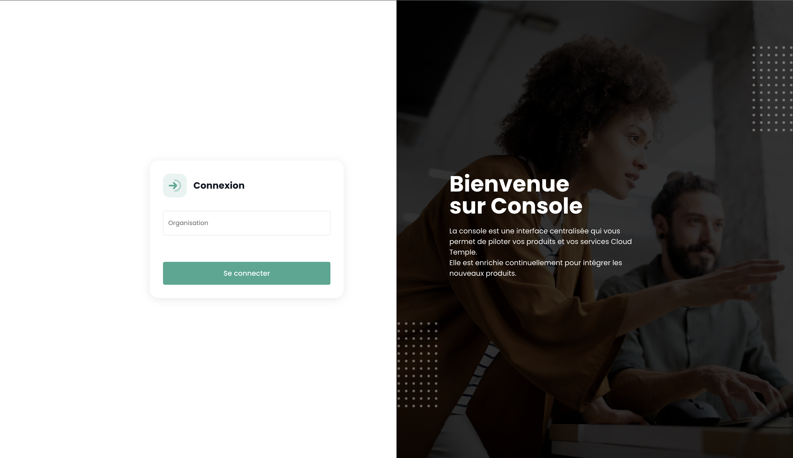

La console Cloud Temple __'Shiva'__ è __la piattaforma di gestione cloud__ (Cloud Management Platform) integrata di __Cloud Temple__.

La console Cloud Temple Shiva vi permette di gestire le risorse cloud come i server virtuali, lo storage, le reti e i servizi applicativi.
È un'interfaccia di gestione centralizzata che vi consente di progettare e operare la vostra infrastruttura cloud.

La console Cloud Temple Shiva offre in particolare ai vostri team:

- __La gestione dei vostri prodotti e servizi__ Cloud Temple,
- __Il monitoraggio e il reporting__ del funzionamento delle vostre risorse cloud,
- __L'automazione e l'orchestrazione__: Shiva, grazie alla sua API, permette di automatizzare compiti ripetitivi e di orchestrare workflow complessi per distribuire, gestire e scalare le vostre risorse cloud,
- __La sicurezza e la conformità__: Shiva permette il controllo dell'identità e il filtraggio degli accessi al fine di garantire la conformità normativa e il rispetto delle vostre politiche di sicurezza,
- __Integrazione dei framework di adozione Cloud__ (Cloud Adoption Framework): grazie alle sue funzioni di ibridazione, potete assicurare una continuità operativa con i fornitori di cloud terzi (Microsoft Azure e Amazon AWS) da un'unica interfaccia, facilitando l'integrazione e la gestione dei vostri ambienti applicativi multi-cloud.
- __L'accesso e il monitoraggio dei ticket di assistenza tecnica__: È disponibile anche un'assistenza tecnica dedicata. Ciò include il supporto clienti per la risoluzione di problemi tecnici così come l'assistenza alla configurazione iniziale.
- __La possibilità di sottoscrivere a servizi professionali__: per gestire efficacemente i vostri ambienti Cloud, i vostri team possono beneficiare dell'assistenza dei nostri ingegneri per consulenza, supporto nell'implementazione di architetture o formazione.

## Prerequisiti
- Avere sottoscritto un'offerta Cloud Temple. Per sottoscrivere facilmente, potete [contattarci](https://www.cloud-temple.com/contactez-nous/) o via email all'indirizzo __contact@cloud-temple.com__.
- Avere accesso alla console Shiva
- Avere il proprio IPv4 pubblico dichiarato nella zona di fiducia Cloud Temple (l'accesso alla console shiva è limitato agli indirizzi fidati identificati)

## Connessione al vostro tenant Cloud Temple
Shiva è accessibile tramite l'URL sottostante:

    https://shiva.cloud-temple.com
    Oppure attraverso l'URL diretto che vi è stato comunicato via email.

La prima pagina vi permette di selezionare [l'organizzazione](organisations.md) nella quale il vostro utente è stato creato.
Una volta indicata l'azienda, si prega di cliccare su __'Connettersi'__.

Successivamente, sarete reindirizzati verso una pagina che vi richiederà di autenticarvi.
Una volta connessi, giungerete su questa pagina.

## Gestione della lingua
La console è disponibile in __francese__, __inglese__. È possibile modificare la lingua di funzionamento tramite l'icona __lingua__ situata in alto a destra dello schermo.

La modifica della lingua di un utente deve essere effettuata nel suo __'Profilo'__, in alto a destra dello schermo, nelle __'Impostazioni utente'__.

La configurazione è realizzata per ciascun tenant [Tenant](tenants.md).

## Accesso al supporto tecnico

In qualsiasi momento, è possibile contattare __il team di supporto Cloud Temple__ tramite __l'icona 'salvagente'__ situata in alto a destra dello schermo.

Sarete guidati durante l'intero processo di richiesta di supporto.

Il primo passo è l'identificazione del tipo di richiesta di supporto:

- Richiedere un consiglio sull'utilizzo di un prodotto (esclusi gli incidenti),
- Richiedere assistenza in relazione al vostro account cliente,
- Dichiarare un incidente o richiedere un supporto tecnico.
- Richiedere l'assistenza di un servizio professionale (disponibilità di un ingegnere Cloud Temple per una problematica).

{:height="50%" width="50%"}

In seguito avete la possibilità di fornire dettagli e di includere file (immagini o registri per esempio).

Una volta effettuata la vostra richiesta, è possibile ritrovare le vostre richieste tramite __l'icona 'salvagente'__ situata in alto a destra dello schermo:

## Accesso alle funzionalità utente tramite l'interfaccia web

L'insieme delle funzionalità accessibili al vostro utente (in funzione dei suoi diritti) è situato a sinistra dello schermo, nella fascia verde.
Le funzionalità sono raggruppate per modulo. Questo include principalmente:

- L'__inventario__ delle vostre risorse,
- Il __seguimento delle operazioni__,
- Il __controllo delle risorse IaaS__ (Calcolo, archiviazione, rete, ...)
- Il __controllo delle risorse OpenIaaS__ (Calcolo, archiviazione, rete, ...)
- L'accesso ai __servizi ausiliari__ (Bastione, monitoraggio, ...)
- L'__amministrazione della vostra organizzazione__ (Gestione dei tenants, dei diritti, ...)

L'attivazione di un modulo per un utente dipende dai diritti dell'utente. Per esempio, il modulo __'Ordine'__ non sarà disponibile se l'utente non dispone del diritto __'ORDER'__.

Ecco una presentazione dei diversi moduli disponibili. Nuovi moduli vengono regolarmente aggiunti alla console:

{:height="20%" width="20%"}

- __Cruscotto__ : consente di avere rapidamente una visione sul __totale delle risorse di calcolo e di archiviazione__, le statistiche del __backup__ e un __riassunto delle cartelle di supporto__,
- __Inventario__ : permette di avere una visione complessiva delle vostre risorse di tipo __'macchine virtuali'__. Se i __tag__ sono utilizzati, consente di avere una visione per __tag__ (ad esempio, visione aziendale, visione applicativa, ...),
- __Managed Services__ : dà accesso al seguito delle vostre __richieste di supporto__ e alla __metrica dei servizi__,
- __IaaS__ : consente il __controllo delle infrastrutture IaaS VMware__ (Macchine virtuali, cluster, ipervisor, repliche, backup, ...),
- __OpenIaaS__ : consente il __controllo delle risorse Xen Orchestra__ (Macchine virtuali, backup, ...),
- __OpenShift__ : consente il controllo della vostra **architettura PaaS RedHat OpenShift** e la gestione dei vostri container sulle 3 zone di disponibilità della piattaforma.
- __Bastione__ : Consete di dispiegare e controllare le appliance bastione SSH/RDP nelle vostre reti,
- __Rete__ : consente il controllo delle __reti di livello 2 e 3__, degli __IP pubblici__ e dei vostri __circuiti telecom__,
- __Colocation__ : Offre una vista sugli equipaggiamenti situati in zona di __collocazione mutualizzata o dedicata__,
- __Ordine__ : Consente l'ordine di risorse e il seguito dei dispiegamenti,
- __Amministrazione__ : Raggruppa le funzioni di amministrazione degli utenti e dei tenants così come l'accesso alla registrazione globale.

## Accesso alle funzionalità utente tramite l'API
L'accesso a tutte le funzionalità della console Shiva è possibile tramite l'API Shiva. È possibile ottenere i dettagli sui verbi e le configurazioni tramite __'Profilo'__ e __'APIs'__ :

## Provider Terraform

Cloud Temple mette a vostra disposizione un provider Terraform per gestire *“as code”* la vostra piattaforma Cloud. È accessibile qui:

https://registry.terraform.io/providers/Cloud-Temple/cloudtemple/latest

## Per andare oltre

Vi proponiamo ora di comprendere il funzionamento:

- Di un'organizzazione: [La mia organizzazione](organisations.md)
- Degli account utenti: [I miei account](accounts.md)
- Dei tenant associati a quest'organizzazione: [I miei Tenant](tenants.md)