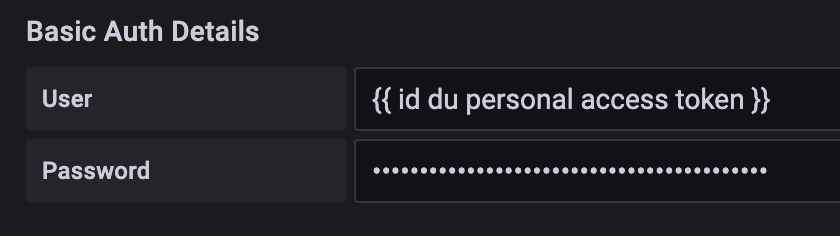

Die SecNumCloud-Qualifikation der ANSSI erfordert eine vertragliche Unterschrift zwischen dem Auftraggeber (der Person, die den Vertrag auf Ihrer Seite unterzeichnet) und Cloud Temple.

Der Auftraggeber erhält bei einem gemeinsamen Aktivierungsworkshop für Ihre Organisation das Master-Konto für den Zugriff auf die Administrationskonsole Ihrer Cloud-Ressourcen.
Während dieses Workshops nutzen wir die Gelegenheit, um zusammen die ersten Schritte der Inbetriebnahme und Initialisierung durchzuführen.

__Insbesondere werden während dieses Workshops die öffentlichen IP-Adressen, die für Ihre Organisation Zugang zur Shiva-Konsole haben sollen, registriert.__

Hier sind die verschiedenen Schritte, die Sie befolgen sollten (Sie verfügen über das Master-Konto der Organisation):

## Schritt 1 : Einen Benutzer in Ihrer Organisation einladen
Die erste Schritt ist die Erstellung eines Benutzerkontos per Einladung: [Einen Benutzer zu Ihrer Organisation einladen](accounts.md#création-dun-compte-utilisateur-dans-votre-organisation)

## Schritt 2: Benutzerberechtigungen verwalten
Es müssen dann die Rechte dem Benutzer zugewiesen werden, um ihm den Zugriff auf die ihn betreffenden Tenants zu ermöglichen
und um die Aktionen durchzuführen, die ihm erlaubt sein werden: [Zuweisung der Rechte an einen Benutzer](accounts.md#zuweisung-der-berechtigungen-an-einen-benutzer)

## Schritt 4: Implementierung einer Identitätsföderation
Standardmäßig bietet Ihnen die Shiva-Konsole eine Datenbank lokaler Konten an. Sie können jedoch [ein externes Authentifizierungsrepository verwenden.](organisations.md#mecanismes-dauthentification)
Im Folgenden finden Sie zwei Beispiele, die Microsoft-Technologien verwenden.

### Beispiel 1: Einrichten eines __Microsoft ADFS__ (Active Directory Federation Services) Providers
Die Konfiguration eines ADFS-Anbieters über einen externen AAD-Dienst (Azure Active Directory) erleichtert die Authentifizierung von Microsoft Onpremise-Benutzern.
[Der Leitfaden ist hier verfügbar.](iam/sso_adfs.md)

### Beispiel 2: Konfiguration eines Anbieters __Microsoft EntraID__ (Azure Active Directory)
Die Konfiguration des SSO (Single Sign-On) über einen Microsoft EntraID-Dienst erleichtert die Authentifizierung von Benutzern in einer Office 365-Umgebung.
[Der Leitfaden ist hier verfügbar.](iam/sso_aad.md)

## Schritt 4: Verwenden Sie einen zweiten Authentifizierungsfaktor (2FA)
Die Einrichtung einer Zwei-Faktor-Authentifizierung ist obligatorisch. Im Falle lokaler Konten ist es möglich, diesen zweiten Authentifizierungsfaktor über die Konsole zu verwalten. Wenn Sie ein externes Authentifizierungsrepository nutzen, __wird der zweite Faktor von diesem Repository verwaltet__.

Die Steuerung erfolgt über Ihr Profil. Administratoren können diese Aktion für alle Benutzer der [Organisation](organisations.md) durchführen.

## Schritt 5: API-Schlüssel erstellen und verwalten
Die Erstellung eines API-Schlüssels, auch __Personal Access Token__ (PAT) genannt, erfolgt über Ihr Profil. Klicken Sie oben rechts auf Ihr Profil und wählen Sie __'Profil'__

Um einen neuen API-Schlüssel zu generieren, klicken Sie auf __'Neuer persönlicher Zugangstoken'__

Sie können mehrere Schlüssel generieren. Jeder Schlüssel ist mit dem Konto der Person verknüpft, die ihn erstellt hat. Sie müssen einen Namen, ein Ablaufdatum und spezifische Rechte für jeden Schlüssel festlegen:

{:height="50%" width="50%"}

__Hinweis: Es ist nicht möglich, mehr Rechte zu erteilen, als auf dem Konto eingestellt sind, das verwendet wurde, um den Schlüssel zu erstellen.__

## Schritt 6: Bestellen Sie zusätzliche Ressourcen über die Web-Oberfläche

### Zusätzliche Hypervisoren bestellen
Um Hypervisoren zu einem Cluster hinzuzufügen, genügt es, zur Konfiguration des Clusters zu gehen und auf die Schaltfläche __'Host hinzufügen'__ zu klicken, die sich im Tableau mit der Liste der Hosts oben rechts befindet.

__Hinweis__:

- *__Die Konfiguration eines Clusters muss homogen sein__. Daher ist es nicht gestattet, verschiedene Typen von Hypervisoren innerhalb eines Clusters zu mischen. Alle Blades müssen vom gleichen Typ sein.*
- *Die Rechte __'order'__ sowie __'compute'__ sind erforderlich, damit das Konto diese Aktion durchführen kann.*

### Zusätzlichen Arbeitsspeicher bestellen
Um zusätzlichen Arbeitsspeicher zu einem Cluster hinzuzufügen, genügt es, auf die Konfiguration des Clusters zuzugreifen und auf __'Speicher bearbeiten'__ zu klicken.

__Hinweis__:
- *__Die Maschinen werden mit der Gesamtheit des physischen Speichers geliefert__. Die Freischaltung der Speicherressource ist nur eine logische Aktivierung auf Clusterebene.*
- *Es ist nicht möglich, die Menge des physischen Speichers eines bestimmten Bladetyps zu ändern. Beachten Sie die Maximalkapazität eines Blades bei der Erstellung eines Clusters.*
- *Die Berechtigungen __'order'__ und __'compute'__ sind erforderlich, damit der Account diese Aktion durchführen kann.*

### Zusätzlichen Speicher bestellen

Der Cloud-Tempel-Speicher im Blockmodus basiert auf dedizierten und verschlüsselten LUNs. Um einen zusätzlichen Datastore in Ihrem SDRS-Speichercluster hinzuzufügen, müssen Sie nur zur
Konfiguration des Speicherclusters gehen und auf die Schaltfläche __'Ein Datastore hinzufügen'__ klicken, die sich in der Tabelle
mit der Liste der Datastores befindet.

__Hinweis__:
- *Die Größe der kleinsten auf einem Cluster aktivierbaren LUN beträgt __500 Gio__.*
- *Die Leistung eines Datastores reicht von durchschnittlich 500 IOPS/Tio bis zu durchschnittlich 15000 IOPS/Tio. __Es handelt sich um eine Software-Begrenzung, die auf der Ebene der Speichercontroller durchgeführt wird__.*
- *Die Abrechnung des von Ihrer Organisation verbrauchten Plattenvolumens ist die Summe aller LUNs über alle genutzten AZs hinweg*.
- *Die Rechte __'order'__ sowie __'compute'__ sind erforderlich, damit das Konto diese Aktion durchführen kann.*

## Schritt 7: Konfigurieren der Shiva-Konsole als Datenquelle in Grafana
Das Ziel ist es, die Beobachtbarkeit Ihrer Cloud-Infrastruktur durch die Cloud Temple-Metrologie zu verbessern.

### Voraussetzungen
- Eine Grafana-Instanz mit Zugriff auf die APIs der Shiva-Konsole.
- Administratorzugriff auf die Grafana-Instanz, um die *Datasources* konfigurieren zu können.
- Ein persönlicher Zugangstoken mit mindestens dem Recht `metrics_read`.

### Konfiguration
In der **Konfiguration** von Grafana gehe zum "**datasources**" Tab und klicke auf "**Add datasource**".

Im URL, gib die **URL of the Shiva Metrics API** ohne Version und endend auf "**/prometheus**" an
(Beispiel: https://shiva.cloud-temple.com/api/metric/prometheus)

{:height="50%" width="50%"}

In der **Authentifizierung**, aktiviere die Option **Basic Auth**.

{:height="50%" width="50%"}

Im Abschnitt "**Basic Auth Details**", konfiguriere den **Benutzernamen** und **Passwort** unter Verwendung der **ID** und des **Geheimnisses** eines **PAT** mit der Berechtigung **metrics_read**.

{:height="50%" width="50%"}

Im Abschnitt "**Alerting**", konfiguriere die Eigenschaft **HTTP Method** auf **GET**.

{:height="50%" width="50%"}

### Ergebnis

Um zu bestätigen, dass die Konfiguration korrekt und funktional ist, drücken Sie die Schaltfläche "**Speichern & testen**".

Sie sollten eine Banneranzeige sehen, die Sie darüber informiert, dass die Konfiguration erfolgreich war.

{:height="50%" width="50%"}

Sie finden eine ganze Reihe von Konfigurationsbeispielen für Grafana hier: https://github.com/Cloud-Temple/console-grafana-iaas

{:height="70%" width="70%"}