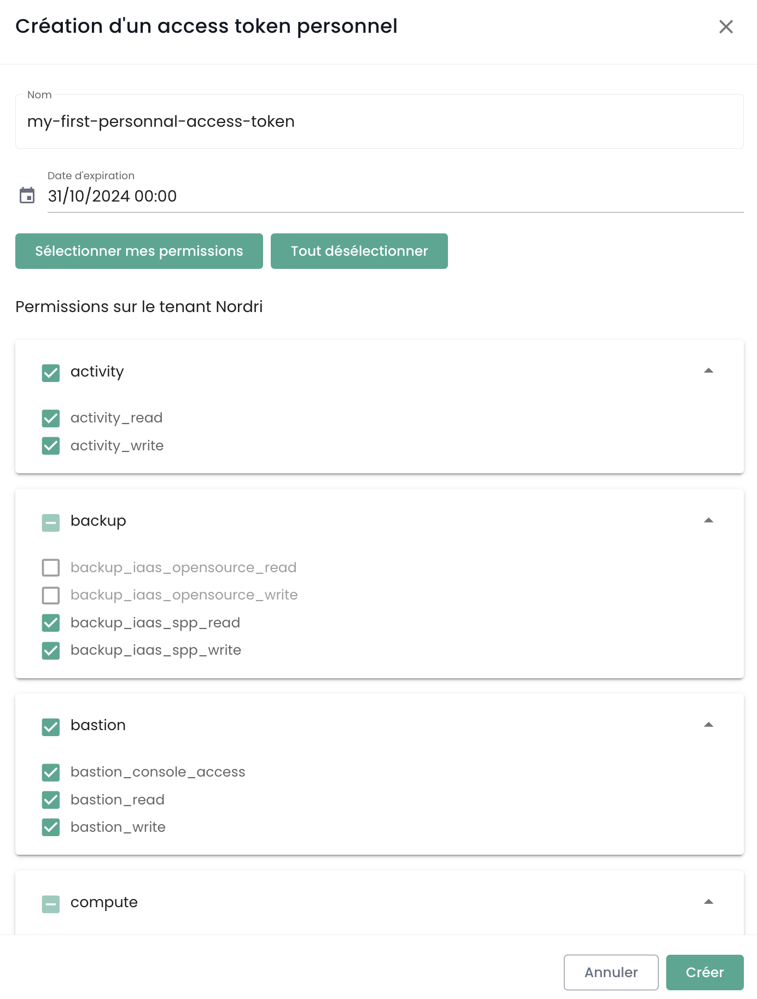
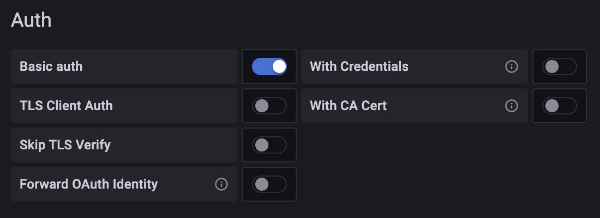

The SecNumCloud qualification from ANSSI (the French National Agency for Information Systems Security) requires a contractual signature between the contracting party (the person signing the contract on your side) and Cloud Temple.

The contracting party is presented, during a joint activation workshop for your organization, with the master access account to the administration console for your Cloud resources.
During this workshop, we also take the opportunity to carry out the initial steps of getting started and setting up together.

__In particular, during this workshop, we declare the public IP addresses authorized to access the Shiva console for your organization.__

Here are the different steps to follow (you have the master account of the organization):

## Step 1: Invite a User into Your Organization
The first step is to create a user account by invitation: [Invite a user to your organization](accounts.md#création-dun-compte-utilisateur-dans-votre-organisation)

## Step 2: Manage a user's permissions

Subsequently, it is necessary to assign permissions to the user to enable access to the relevant tenants
and to perform the actions that will be authorized: [Assigning permissions to a user](accounts.md#assigning-permissions-to-a-user)

## Step 4: Implementing Identity Federation
By default, the Shiva console offers a database of local accounts. However, you can use [an external authentication repository.](organisations.md#mecanismes-dauthentification)
Below are two examples using Microsoft technologies.

### Example 1: Configuring a __Microsoft ADFS__ (Active Directory Federation Services) Provider
The configuration of an ADFS (Active Directory Federation Services) provider via an external AAD (Azure Active Directory) service enables the simplification of the authentication process for Microsoft Onpremise users.
[The guide is available here.](iam/sso_adfs.md)

### Example 2: Configure a __Microsoft EntraID__ (Azure Active Directory) Provider
The configuration of SSO (Single Sign-On) through a Microsoft EntraID service simplifies user authentication in the Office 365 environment.
[The guide is available here.](iam/sso_aad.md)

## Step 4: Use a Second Factor of Authentication (2FA)
Implementing two-factor authentication is mandatory. For local accounts, it is possible to manage this second factor of authentication via the console. When using an external authentication repository, **the second factor is managed by this repository**.

The control is done from your profile. Administrators can perform this action for all users of the [Organization](organisations.md).

## Step 5: Create and Manage API Keys
Creating an API key, also known as a __Personal Access Token__ (PAT), is done from your profile. Click on the top right on your profile and select __'Profile'__

To generate a new API key, click on __'New personal access token'__

You may generate multiple keys. Each key is linked to the account of the individual who created it. You must define a name, an expiration date, and the specific rights for each key:

{:height="50%" width="50%"}

__Note: It is not possible to grant more rights than those set on the account used to create the key.__

## Step 6: Order additional resources via the web interface

### Ordering Additional Hypervisors
To add Hypervisors to a cluster, one must navigate to the cluster configuration and click on the '__Add a host__' button located in the table with the list of hosts, at the top right.

__note__:

- *__Cluster configurations must be consistent__. As such, it is not permitted to mix Hypervisor types within a cluster. All blades must be of the same type.*
- *The __'order'__ and __'compute'__ permissions are required on the account to carry out this action.*

### Order additional memory resource
To add more RAM to a cluster, simply go to the cluster configuration and click on __'Edit Memory'__.

__note__:
- *__Machines are delivered with the full amount of physical memory__. The unlocking of memory resources is merely a software activation at the level of a cluster.*
- *It is not possible to modify the amount of physical memory of a blade type. One must take into account the maximum capacity of a blade when creating a cluster.*
- *The __'order'__ and __'compute'__ permissions are required for the account to carry out this action.*

### Order Additional Storage

Cloud Temple's block storage is based on dedicated and encrypted LUNs. To add an additional datastore to your SDRS storage cluster, simply navigate to the storage cluster configuration and click on the __'Add a datastore'__ button located in the table with the list of datastores.

__Note__:
- *The size of the smallest LUN that can be activated on a cluster is __500 GiB__.*
- *The performance of a datastore ranges from an average of 500 IOPS/TiB up to an average of 15000 IOPS/TiB. __This is a software limitation implemented at the storage controllers level__.*
- *The accounting of disk volume consumed by your organization is the sum of all LUNs across all the utilized AZs.*
- *The rights __'order'__ and __'compute'__ are necessary for the account to perform this action.*

## Step 7: Configure the Shiva console as a datasource in Grafana
The objective is to enhance the observability of your Cloud infrastructure through Cloud Temple's metrology.

### Prerequisites
- A Grafana instance with access to the Shiva Console APIs.
- Administrator access to the Grafana instance in order to configure *datasources*.
- A personal access token with at least `metrics_read` permission.

### Configuration
In the **configuration** of Grafana, go to the "**datasources**" tab and then click on "**Add datasource**".

In the URL, provide the **URL of the Shiva Metrics API** without the version and ending with "**/prometheus**"
(example: https://shiva.cloud-temple.com/api/metric/prometheus)

{:height="50%" width="50%"}

In the **authentication**, enable the **Basic Auth** option.

{:height="50%" width="50%"}

In the "**Basic Auth Details**" section, configure the **username** and **password** using the
**id** and **secret** of a **PAT** with **metrics_read** permission.

{:height="50%" width="50%"}

In the "**Alerting**" section, configure the **HTTP Method** property to **GET**.

{:height="50%" width="50%"}

### Result
To confirm that the configuration is correct and functional, press the "**Save & test**" button.

You should see a banner informing you that the configuration was successful.

{:height="50%" width="50%"}

You will find a whole set of example configurations for Grafana here: https://github.com/Cloud-Temple/console-grafana-iaas

{:height="70%" width="70%"}