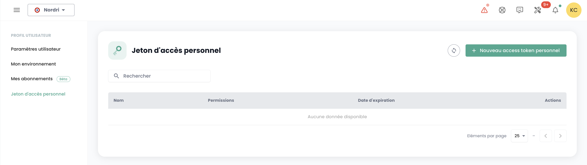
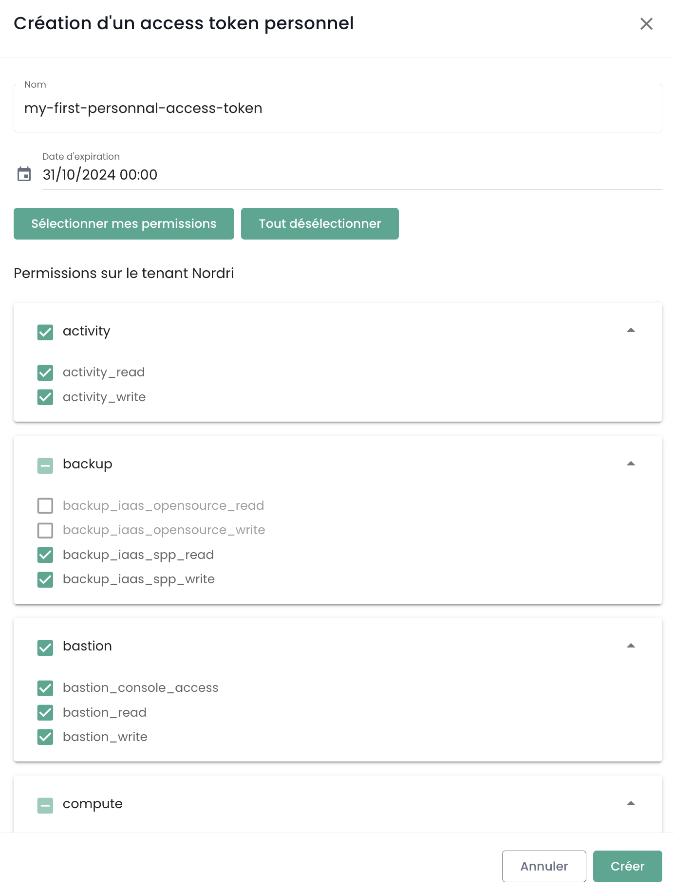
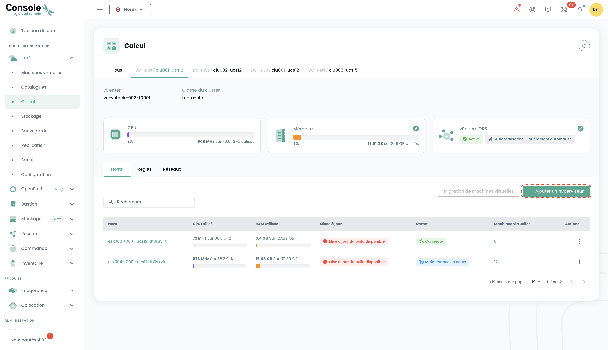
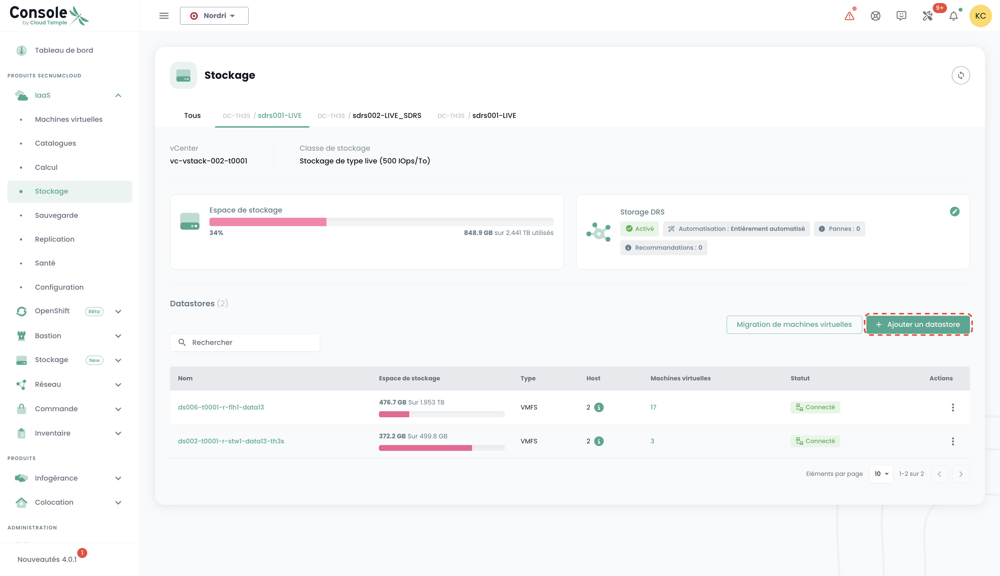
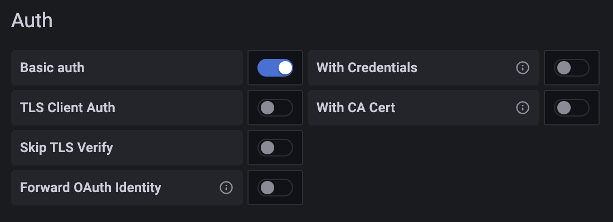
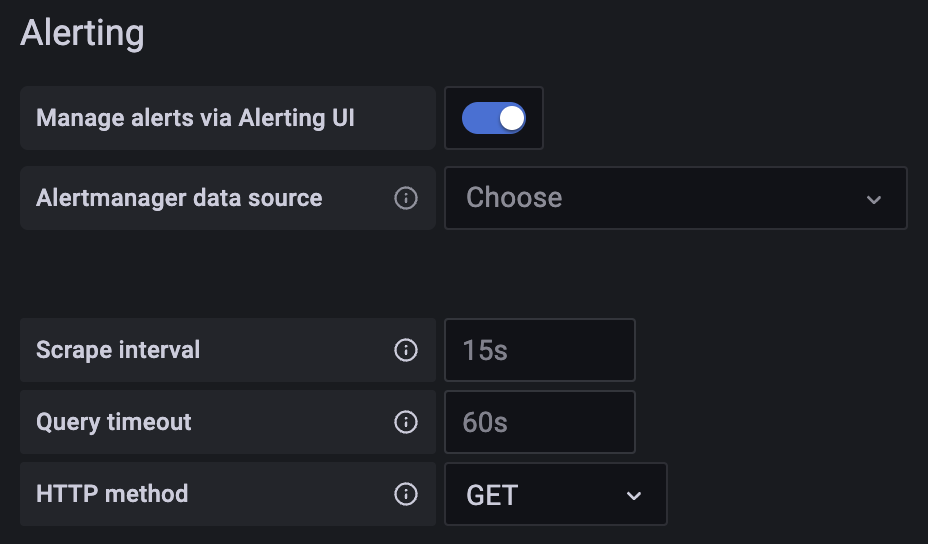
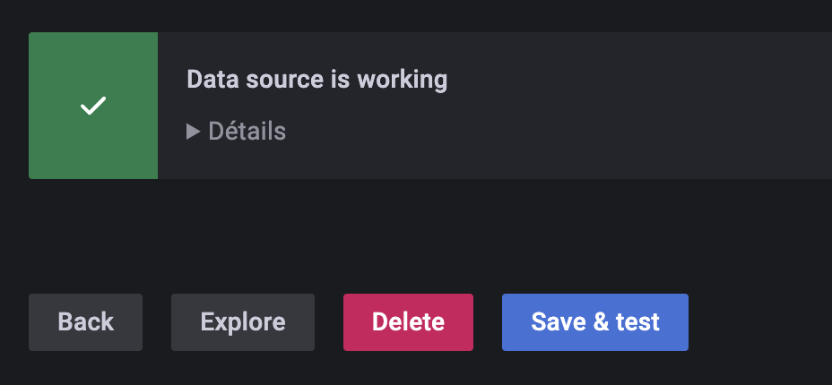

La calificación SecNumCloud del ANSSI requiere una firma contractual entre el patrocinador (la persona que firma el contrato de su lado) y Cloud Temple.

El patrocinador recibe, durante un taller conjunto de activación de su organización, la cuenta maestra de acceso a la consola de administración de sus recursos en la nube.
Durante este taller, también aprovechamos para llevar a cabo juntos los primeros pasos de familiarización e iniciación.

__En particular, declaramos durante este taller las IP públicas autorizadas para que su organización acceda a la consola Shiva.__

Estos son los diferentes pasos a seguir (usted dispone de la cuenta maestra de la organización):

## Paso 1: Invitar a un usuario a su Organización

La primera etapa es crear una cuenta de usuario por invitación: [Invitar a un usuario a su organización](accounts.md#création-dun-compte-utilisateur-dans-votre-organisation)

## Etapa 2: Gestionar los derechos de un usuario
Posteriormente, es necesario asignar los derechos al usuario para que pueda acceder a los inquilinos correspondientes
y para realizar las acciones que se le permitirán: [Asignación de derechos a un usuario](accounts.md#affectation-des-permissions-à-un-utilisateur)

## Paso 4: Implementar una federación de identidades

De manera predeterminada, la consola Shiva le ofrece una base de cuentas locales. Sin embargo, puede utilizar [un repositorio de autenticación externo.](organisations.md#mecanismes-dauthentification)
A continuación, se presentan dos ejemplos que utilizan tecnologías de Microsoft.

### Ejemplo 1: Configurar un proveedor __Microsoft ADFS__ (Servicios de Federación de Directorio Activo)
La configuración de un proveedor ADFS a través de un servicio AAD (Azure Active Directory) externo facilita la autenticación de los usuarios Microsoft Onpremise.
[La guía está disponible aquí.](iam/sso_adfs.md)

### Ejemplo 2: Configurar un proveedor __Microsoft EntraID__ (Azure Active Directory)
La configuración del SSO (Single Sign-On) a través de un servicio de Microsoft EntraID facilita la autenticación de los usuarios en el entorno de Office 365.
[La guía está disponible aquí.](iam/sso_aad.md)

## Paso 4: Utilizar un segundo factor de autenticación (2FA)
La implementación de un doble factor de autenticación es obligatorio. En el caso de cuentas locales, es posible gestionar este segundo factor de autenticación a través de la consola. Cuando se utiliza un repositorio de autenticación externo, __el segundo factor es gestionado por este repositorio__.

La gestión se realiza desde su perfil. Los administradores pueden realizar esta acción para todos los usuarios de la [Organización](organisations.md).

## Paso 5: Crear y gestionar las claves API
La creación de una clave API, también llamada __Personal Access Token__ (PAT), se realiza desde su perfil. Haga clic en la parte superior derecha en su perfil y elija __'perfil'__

Para generar una nueva clave API, haga clic en __'Nuevo token de acceso personal'__

Puede generar varias claves. Cada clave está vinculada a la cuenta de la persona que creó la clave. Debe definir un nombre, una fecha de vencimiento y los derechos específicos para cada clave:

{:height="50%" width="50%"}

__Nota: no es posible otorgar más derechos que los establecidos en la cuenta utilizada para crear la clave.__

## Paso 6: Solicitar recursos adicionales a través de la interfaz web

### Ordenar hipervisores adicionales
Para añadir Hipervisores a un clúster, basta con ir a la configuración del clúster y hacer clic
en el botón __'Añadir un host'__, que se encuentra en la tabla con la lista de hosts, en la parte superior derecha.

__nota__ :

- *__La configuración de un clúster debe ser homogénea__. Por lo tanto, no está permitido mezclar tipos de hipervisores dentro de un clúster. Todas las unidades deben ser del mismo tipo.*
- *Los permisos __'order'__ así como __'compute'__ son necesarios en la cuenta para llevar a cabo esta acción.*

### Solicitar memoria adicional
Para agregar memoria RAM a un clúster, simplemente vaya a la configuración del clúster y haga clic en __'Modificar la memoria'__.

__nota__ :
- *__Las máquinas se entregan con toda la memoria física incluida__. La liberación de la memoria solo es una activación de software a nivel de un clúster.*
- *No se puede modificar la cantidad de memoria física de un tipo de blade. Tenga en cuenta la capacidad máxima de un blade al crear un clúster.*
- *Los permisos __'order'__ y __'compute'__ son necesarios en la cuenta para llevar a cabo esta acción.*

### Pedir almacenamiento adicional
El almacenamiento Cloud temple en modo bloque está basado en LUNs dedicadas y cifradas. Para añadir un datastore adicional en su clúster de almacenamiento SDRS, basta con ir a la
configuración del clúster de almacenamiento y hacer clic en el botón __'Añadir un datastore'__ que se encuentra en la tabla
con la lista de los datastores.

__nota__:
- *El tamaño de la LUN más pequeña que se puede activar en un clúster es de __500 Gio__.*
- *El rendimiento de un datastore varía desde 500 iops/Tio de media hasta 15000 iops/Tio de media. __Es una limitación de software realizada a nivel de los controladores de almacenamiento__.*
- *La contabilidad del volumen de disco consumido por su organización es la suma de todas las LUNs en todos los AZs utilizados.*
- *Los permisos __'order'__ así como __'compute'__ son necesarios en la cuenta para llevar a cabo esta acción.*

## Etapa 7: Configurar la consola Shiva como datasource en Grafana
El objetivo es enriquecer la observabilidad de su infraestructura en la nube a través de la metrología de Cloud Temple.

### Prerrequisitos

- Una instancia de Grafana con acceso a las API de la Consola Shiva.
- Acceso de administración en la instancia de Grafana para poder configurar los *datasources*.
- Un personal access token que posea al menos el derecho `metrics_read`.

### Configuración
En la **configuración** de Grafana ir a la pestaña "**datasources**" y luego hacer clic en "**Add datasource**".

En la URL, proporcionar la **URL de la API Shiva Metrics** sin la versión y que termine en "**/prometheus**"
(ejemplo: https://shiva.cloud-temple.com/api/metric/prometheus)

{:height="50%" width="50%"}

En la **autenticación**, activar la opción **Basic Auth**.

{:height="50%" width="50%"}

En la sección "**Basic Auth Details**", configurar el **username** y **password** usando,
respectivamente, los **id** y **secret** de un **PAT** con permisos de **metrics_read**.

{:height="50%" width="50%"}

En la sección "**Alerting**", configurar la propiedad **HTTP Method** en **GET**.

{:height="50%" width="50%"}

### Resultado

Para confirmar que la configuración es correcta y funcional, presione el botón "**Save & test**".

Debería ver aparecer una barra informándole de que la configuración ha tenido éxito.

{:height="50%" width="50%"}

Puede encontrar un conjunto completo de ejemplos de configuración para Grafana aquí: https://github.com/Cloud-Temple/console-grafana-iaas

{:height="70%" width="70%"}