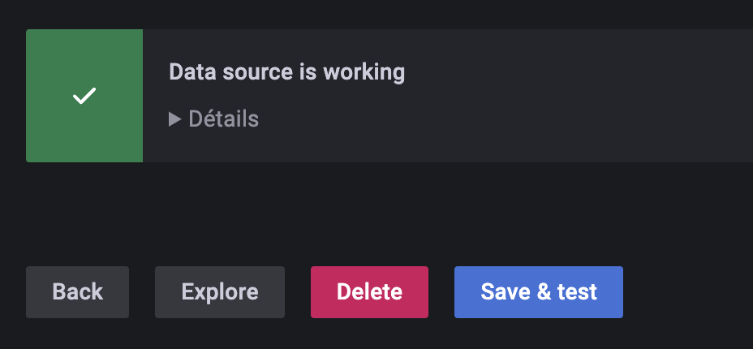

La qualificazione SecNumCloud dell'ANSSI impone una firma contrattuale tra il committente (la persona che firma il contratto da parte vostra) e Cloud Temple.

Il committente riceve, durante un workshop congiunto per l'attivazione della vostra organizzazione, l'account master per accedere alla console di amministrazione delle vostre risorse Cloud.
Durante questo workshop, cogliamo l'occasione per svolgere insieme i primi passi per la presa in mano e l'inizializzazione.

__In particolare, durante questo workshop dichiariamo gli indirizzi IP pubblici autorizzati ad accedere alla console Shiva per la vostra organizzazione.__

Ecco i vari passaggi da seguire (disponete dell'account master dell'organizzazione):

## Fase 1: Invitare un utente nella vostra Organizzazione

La prima fase consiste nel creare un account utente tramite invito: [Invitare un utente nella propria organizzazione](accounts.md#création-dun-compte-utilisateur-dans-votre-organisation)

## Fase 2: Gestire i diritti di un utente

Poi è necessario assegnare i diritti all'utente per consentirgli di accedere ai tenant di sua pertinenza
e di svolgere le azioni che gli saranno autorizzate: [Assegnazione dei diritti a un utente](accounts.md#assegnazione-dei-permessi-a-un-utente)

## Step 4: Implementare una federazione delle identità

Per impostazione predefinita, la console Shiva offre una base di account locali. Tuttavia, è possibile utilizzare [un repository di autenticazione esterno.](organisations.md#mecanismes-dauthentification)
Di seguito due esempi che utilizzano le tecnologie Microsoft.

### Esempio 1: Configurare un fornitore __Microsoft ADFS__ (Active Directory Federation Services)
La configurazione di un provider ADFS tramite un servizio AAD (Azure Active Directory) esterno facilita l'autenticazione degli utenti Microsoft Onpremise.
[La guida è disponibile qui.](iam/sso_adfs.md)

### Esempio 2: Configurare un provider __Microsoft EntraID__ (Azure Active Directory)
La configurazione del SSO (Single Sign-On) tramite un servizio Microsoft EntraID permette di facilitare l'autenticazione degli utenti nell'ambiente Office 365.
[La guida è disponibile qui.](iam/sso_aad.md)

## Passo 4: Utilizzare un secondo fattore di autenticazione (2FA)
L'implementazione di un'autenticazione a due fattori è obbligatoria. Nel caso di account locali, è possibile gestire questo secondo fattore di autenticazione tramite la console. Quando si utilizza un repository di autenticazione esterno, __il secondo fattore è gestito da questo repository__.

La gestione avviene dal proprio profilo. Gli amministratori possono eseguire questa azione sull'intero insieme degli utenti dell'[Organizzazione](organisations.md).

## Passo 5: Creare e gestire le chiavi API
La creazione di una chiave API, comunemente denominata __Personal Access Token__ (PAT), avviene dal vostro profilo. Cliccate in alto a destra sul vostro profilo e scegliete __'profilo'__

Per generare una nuova chiave API, cliccare su __'Nuovo token di accesso personale'__

Potete generare più chiavi. Ogni chiave è collegata all'account della persona che l'ha creata. Dovete definire un nome, una data di scadenza e i diritti specifici per ciascuna chiave:

{:height="50%" width="50%"}

__Nota: non è possibile assegnare più diritti di quelli che si hanno sull'account utilizzato per creare la chiave.__

## Passo 6: Ordinare ulteriori risorse tramite l'interfaccia web

### Ordinare ulteriori ipervisori
Per aggiungere degli Hypervisor a un cluster, è sufficiente visitare la configurazione del cluster e cliccare
sul pulsante __'Aggiungere un host'__ che si trova nella tabella con la lista degli host, in alto a destra.

__nota__ :

- *__La configurazione di un cluster deve essere omogenea__. Pertanto, non è permesso mescolare i tipi di hypervisor all'interno di un cluster. Tutti i nodi devono essere dello stesso tipo.*
- *Per compiere questa azione sono necessari i permessi __'order'__ e __'compute'__ sull'account.*

### Ordinare risorse di memoria aggiuntive
Per aggiungere memoria RAM a un cluster, basta andare alla configurazione del cluster e cliccare su __'Modifica memoria'__.

__nota__ :
- *__Le macchine sono fornite con l'intera memoria fisica__. L'attivazione della memoria risorsa è solamente una attivazione software a livello di cluster.*
- *Non è possibile modificare la quantità di memoria fisica di un tipo di lama. Tenere sempre conto della capacità massima di una lama durante la creazione di un cluster.*
- *I diritti __'order'__ così come __'compute'__ sono necessari al conto per eseguire questa azione.*

### Ordinare dello spazio di archiviazione aggiuntivo
Il deposito Cloud temple in modalità blocco si basa su LUN dedicate e criptate. Per aggiungere un datastore supplementare nel vostro cluster di deposito SDRS, è sufficiente raggiungere la configurazione del cluster di deposito e cliccare sul pulsante __'Aggiungi un datastore'__ situato nella tabella con la lista dei datastores.

__nota__ :
- *La dimensione della più piccola LUN attivabile su un cluster è di __500 Gio__.*
- *Le prestazioni di un datastore variano da 500 iops/Tio in media fino a 15000 iops/Tio in media. __Questo è un limitazione software realizzata a livello dei controller di deposito__.*
- *La contabilità del volume di disco consumato dalla vostra organizzazione risulta dalla somma di tutte le LUN sull'insieme delle AZ utilizzate*.
- *I permessi __'order'__ e __'compute'__ sono necessari al conto per effettuare questa azione.*

## Passaggio 7: Configurare la console Shiva come origine dati in Grafana
L'obiettivo è di arricchire l'osservabilità della vostra infrastruttura Cloud attraverso la metrologia di Cloud Temple.

### Prerequisiti
- Un'istanza Grafana con accesso alle API della Console Shiva.
- Accesso amministrativo sull'istanza Grafana per configurare le *datasources*.
- Un token di accesso personale con almeno il diritto `metrics_read`.

### Configurazione
Nella **configurazione** di Grafana, andare nella scheda "**datasources**" e cliccare su "**Aggiungi datasource**".

Nell'URL, fornire l'**URL dell'API Shiva Metrics** senza la versione e che termina con "**/prometheus**"
(esempio: https://shiva.cloud-temple.com/api/metric/prometheus)

{:height="50%" width="50%"}

Nell'**autenticazione**, attivare l'opzione **Basic Auth**.

{:height="50%" width="50%"}

Nella sezione "**Dettagli Base Auth**", configurare il **username** e **password** utilizzando rispettivamente gli **id** e **secret** di un **PAT** che abbia il diritto **metrics_read**.

{:height="50%" width="50%"}

Nella sezione "**Alerting**", configurare la proprietà **HTTP Method** su **GET**.

{:height="50%" width="50%"}

### Risultato
Per confermare che la configurazione sia corretta e funzionante, premere il pulsante "**Salva e testa**".

Dovreste vedere apparire una fascia informativa che indica che la configurazione è stata completata con successo.

{:height="50%" width="50%"}

Potete trovare un insieme di esempi di configurazione per Grafana qui: https://github.com/Cloud-Temple/console-grafana-iaas

{:height="70%" width="70%"}