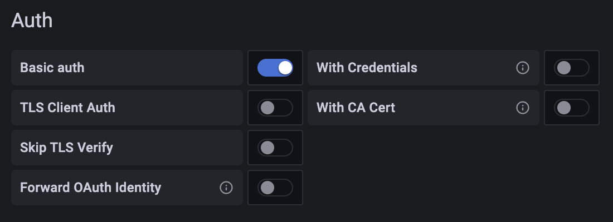
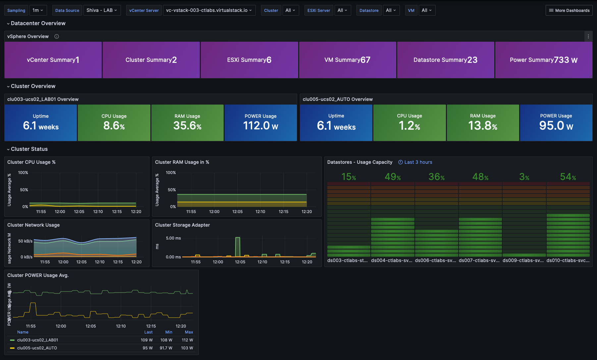

La qualification SecNumCloud de l'ANSSI impose une signature contractuelle entre le commanditaire (la personne qui signe le contrat de votre côté) et Cloud Temple.

Le commanditaire se voit remettre, lors d'un atelier conjoint d'activation de votre organisation, le compte maitre d'accès à la console d'administration de vos ressources Cloud.
Lors de cet atelier, nous en profitons pour réaliser ensemble les premieres étapes de prises en main et d'initialisation.

__En particulier, nous déclarons durant cet atelier les IP publiques autorisée à accéder pour votre organisation à la console Shiva.__

Voici les différentes étapes à suivre (vous disposez du compte maitre de l'organisation) :

## Etape 1 : Inviter un utilisateur dans votre Organisation

La première étape est de créer un compte utilisateur par invitation : [Inviter un utilisateur dans votre organisation](accounts.md#création-dun-compte-utilisateur-dans-votre-organisation)

## Etape 2 : Gérer les droits d'un utilisateur

Il faut ensuite affecter les droits à l'utilisateur pour lui permettre d'accéder aux tenants le concernant
et de réaliser les actions qui lui seront autorisées : [Affectation des droits à un utilisateur](accounts.md#affectation-des-permissions-à-un-utilisateur)

## Etape 4 : Mettre en œuvre une fédération d'identité

Par défaut, la console Shiva vous propose une base de comptes locaux. Vous pouvez cependant utiliser [un référentiel d'authentification externe.](organisations.md#mecanismes-dauthentification)
Ci-après deux exemples utilisant les technologies Microsoft.

### Exemple 1 : Configurer un fournisseur __Microsoft ADFS__ (Active Directory Federation Services)
La configuration d'un fournisseur ADFS via un service AAD (Azure Active Directory) externe permet de faciliter l'authentification des utilisateurs Microsoft Onpremise.
[Le guide est disponible ici.](iam/sso_adfs.md)

### Exemple 2 : Configurer un fournisseur __Microsoft EntraID__ (Azure Active Directory)
La configuration du SSO (Single Sign-On) via un service Microsoft EntraID permet de faciliter l'authentification des utilisateurs en environnement Office 365.
[Le guide est disponible ici.](iam/sso_aad.md)

## Etape 4 : Utiliser un second facteur d'authentification (2FA)
La mise en place d'un double facteur d'authentification est obligatoire. Dans le cas des comptes locaux, il est possible de gèrer ce deuxième facteur d'authentification via la console. Lorsque vous utilisez un référentiel d'authentification externe, __le second facteur est géré par ce référentiel__.

Le pilotage se fait depuis votre profil. Les administrateurs peuvent faire cette action sur l'ensemble des utilisateurs de l'[Organisation](organisations.md).

## Etape 5 : Créer et gérer les clés API
La création d'une clé API, aussi appelée __Personal Acces Token__ (PAT), se fait depuis votre profil. Cliquez en haut à droite sur votre profil et choisissez __'profil'__

Pour générer une nouvelle clef API, cliquer sur __'Nouveau access token personnel'__

Vous pouvez générer plusieurs clés. Chaque clé est liée au compte de la personne qui a fait la création. Vous devez définir un nom, une date d'expiration et les droits spécifiques pour chaque clé :

{:height="50%" width="50%"}

__Nota : il n'est pas possible de donner plus de droit que ceux positionnés sur le compte utilisé pour créer la clé.__

## Etape 6 : Commander des ressources complémentaires via l'interface web

### Commander des hyperviseurs supplémentaires
Pour ajouter des Hyperviseurs à un cluster, il suffit de se rendre sur la configuration du cluster et de cliquer
sur le bouton __'Ajouter un host'__ qui se situe dans le tableau avec la liste des hosts, en haut à droite.

__nota__ :

- *__La configuration d'un cluster doit être homogène__. Ainsi, il n'est pas permis de mixer les types d'hyperviseur au sein d'un cluster. Toutes les lames doivent être de même type.*
- *Les droits __'order'__ ainsi que __'compute'__ sont nécessaires au compte pour mener cette action.*

### Commander de la ressource mémoire supplémentaire
Pour ajouter de la mémoire vive sur un cluster, il suffit de se rendre sur la configuration du cluster et de cliquer sur __'Modifier la mémoire'__.

__nota__ :
- *__Les machines sont livrées avec la totalité de la mémoire physique__. Le débridage de la ressource mémoire n'est qu'une activation logicielle au niveau d'un cluster.*
- *Il n'est pas possible de modifier la quantité de mémoire physique d'un type de lame. Bien tenir compte de la capacité maximale d'une lame lors de la création d'un cluster.*
- *Les droits __'order'__ ainsi que __'compute'__ sont nécessaires au compte pour mener cette action.*

### Commander du stockage supplémentaire
Le stockage Cloud temple en mode bloc est basé sur des LUNs dédiées et chiffrées. Pour ajouter un datastore supplémentaire dans votre cluster de stockage SDRS, il suffit de se rendre sur la
configuration du cluster de stockage et de cliquer sur le bouton __'Ajouter un datastore'__ qui se situe dans le tableau
avec la liste des datastores.

__nota__ :
- *La taille de la plus petite LUN activable sur un cluster est de __500 Gio__.*
- *Les performances d'un datastore vont de 500 iops/Tio en moyenne jusqu'à 15000 iops/Tio en moyenne. __C'est un bridage logiciel réalisé au niveau des contrôleurs de stockage__.*
- *La comptabilité du volume de disque consommé par votre organisation est la somme de toutes les LUNs sur l'ensemble des AZs utilisées*.
- *Les droits __'order'__ ainsi que __'compute'__ sont nécessaires au compte pour mener cette action.*

## Etape 7 : Configurer la console Shiva en tant que datasource dans Grafana

L'objectif est d'enrichir l'observabilité de votre infrastructure Cloud via la métrologie Cloud Temple.

### Prérequis
- Une instance Grafana ayant accès aux API de la Console Shiva.
- Un accès d'administration sur l'instance Grafana afin de pouvoir configurer les *datasources*.
- Un personal access token possédant au moins le droit `metrics_read`.

### Configuration
Dans la **configuration** de Grafana aller dans l'onglet "**datasources**" puis cliquer sur "**Add datasource**".

Dans l'URL, fournir l'**URL de l'API Shiva Metrics** sans la version et finissant par "**/prometheus**"
(exemple : https://shiva.cloud-temple.com/api/metric/prometheus)

{:height="50%" width="50%"}

Dans l'**authentification**, activer l'option **Basic Auth**.

{:height="50%" width="50%"}

Dans la partie "**Basic Auth Details**", configurer le **username** et **password** en utilisant
respectivement les **id** et **secret** d'un **PAT** ayant le droit **metrics_read**.

{:height="50%" width="50%"}

Dans la partie "**Alerting**", configurer la propriété **HTTP Method** en **GET**.

{:height="50%" width="50%"}

### Résultat
Afin de confirmer que la configuration est correcte et fonctionnelle, appuyez sur le bouton "**Save & test**".

Vous devriez voir s'afficher un bandeau vous informant que la configuration a réussie.

{:height="50%" width="50%"}

Vous trouverez tout un ensemble d'exemple de configuration pour Grafana ici : https://github.com/Cloud-Temple/console-grafana-iaas

{:height="70%" width="70%"}
