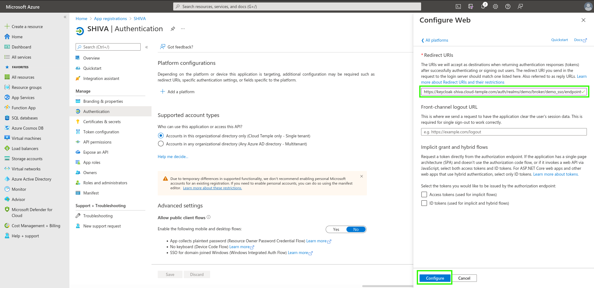

Hier ist ein Beispiel für die Konfiguration des Authentifizierungsrepositories einer Cloud Temple Organisation mit __Microsoft EntraID__ (Azure Active Directory).

Die Konfiguration Ihres Microsoft Repositories auf Organisationsebene bei Cloud Temple erleichtert die Authentifizierung Ihrer Benutzer in der Shiva-Konsole. Dadurch wird die Vielzahl von Authentifizierungsfaktoren vermieden und die Angriffsfläche verringert.

Wenn Ihre Benutzer bei ihrem Microsoft-Konto angemeldet sind, ist die Authentifizierung für die Shiva-Konsolendienste transparent.

Hier sind die verschiedenen Schritte zur Durchführung dieser Konfiguration:

## Schritt 1: Konfiguration des SSO auf der Microsoft Azure-Seite

### Registrierung einer neuen Azure-Anwendung (Azure-Portal)

Um eine __App-Registrierung__ zu erstellen, gehen Sie zum Microsoft Azure-Portal und dann zu Microsoft EntraID, "__HINZUFÜGEN > App-Registrierung__"

Bitte geben Sie Folgendes an:

- __Name__: "SHIVA"
- __Unterstützte Kontotypen__: "Nur Konten in diesem organisatorischen Verzeichnis" (__<Ihr Azure-Mandant>__ only - Einzelnachweis)
- __Umleitungs-URL__: vorerst nicht konfigurieren. Die URL wird von Cloud Temple Support bereitgestellt und später in dieses Feld eingefügt.

Die Informationen **Anwendungs (Client) ID** und **Verzeichnis (Mandanten) ID** sind die Informationen, die dem Cloud Temple Support-Team zur Aktivierung der Microsoft EntraID-Authentifizierung auf Organisationsebene zur Verfügung gestellt werden müssen.

### Definition eines Geheimnisses
Erstellen Sie in der Registerkarte "Zertifikate und Geheimnisse" ein neues Geheimnis.

*Bitte beachten Sie: Das Ablaufdatum des Geheimnisses darf einschließlich eines benutzerdefinierten Ablaufdatums nicht länger als 24 Monate sein.*

Das generierte Geheimnis muss dem Support-Team zur Verfügung gestellt werden:

### Definition des EntraID-Tokens

Das EntraID-Token ist für die Konfiguration der Authentifizierung erforderlich.

Wählen Sie im Menü __"Token-Konfiguration"__, klicken Sie auf __"Optionale Behauptung hinzufügen"__. Wählen Sie "ID" als Art des Tokens aus und aktivieren Sie "E-Mail".

Die Azure-Benutzeroberfläche wird Sie fragen, ob Sie eine Berechtigung hinzufügen möchten, mit der Sie die E-Mail-Adresse eines Benutzers lesen können (Microsoft Graph E-Mail). Kreuzen Sie das Feld an und bestätigen Sie.

Gehen Sie dann zu "API-Berechtigungen" und klicken Sie auf __"Admin-Zustimmung für Cloud Temple erteilen"__.

### Weitere Sicherheitskonfigurationen (optional, aber empfohlen)

Standardmäßig gibt Ihnen Microsoft EntraID die Möglichkeit, jedem Benutzer Ihres Azure-Mandanten eine Verbindung zu Ihrer Cloud Temple-Organisation herzustellen.
Es ist möglich, in der __"App-Registrierung"__ den Zugriff einzuschränken, um nur eine Liste von Benutzern oder Gruppen zur Verbindung mit Ihrer Cloud Temple-Organisation zuzulassen.

So gehen Sie vor:

#### Zugriff auf zusätzliche "App-Registrierungs" Einstellungen
##### Option 1
Gehen Sie zum Tab "Übersicht" und klicken Sie auf den Namen der Anwendung (Link unter "Verwaltete Anwendung").

##### Option 2
Gehen Sie zu "Enterprise Applications" und suchen Sie nach dem Namen der zuvor erstellten Anwendung.

#### Beschränkung der Authentifizierung auf zugewiesene Benutzer in der Anwendung

Geben Sie hier an, dass eine Benutzerzuweisung zur Anwendung erforderlich ist, um die Authentifizierung zu ermöglichen:

#### Benutzer und Gruppen Anwendungszuweisung
Nur den Anwendung zugewiesene Gruppen und Benutzer können über die Anwendungsregistrierung auf Ihre Cloud Temple-Organisation zugreifen.

Schließlich müssen Sie die Zuweisung durch Klicken auf "Zuweisen" bestätigen.

Von nun an können nur Benutzer, die der Anwendung zugewiesen sind, über die erstellte Anwendung auf Ihre Cloud Temple-Organisation zugreifen.

## Schritt 2: Anforderung der SSO-Konfiguration (Single Sign-On) Ihrer Organisation

Diese Konfiguration erfolgt auf Organisationsebene durch das Cloud Temple-Team.

Um dies zu tun, stellen Sie eine __Support-Anfrage__ in der Konsole, in der Sie angeben, dass Sie ein Microsoft EntraID-SSO konfigurieren möchten.

Bitte geben Sie folgende Informationen in der Supportanfrage an:

    Name Ihrer Organisation
    Der Name einer Kontaktperson mit E-Mail-Adresse und Telefonnummer, um die Konfiguration abzuschließen
    Anwendungs-ID (Eindeutige ID, die der zuvor erstellten Anwendung zugeordnet ist)
    Verzeichnis-ID (entspricht der Azure AD-ID des Azure-Mandanten)
    Geheimnis (dem zuvor erstellten Anwendungsgeheimnis zugeordnet)

Sobald die Konfiguration in der Shiva-Konsole abgeschlossen ist, wird der angegebene Kontakt informiert.

## Schritt 3: Abschließende Konfiguration

Auf der Startseite der App-Registrierung, im Überblickmenü, klicken Sie auf "Umleitungs-URL hinzufügen".

Gehen Sie dann zu "Plattform hinzufügen" und fügen Sie eine Plattform vom Typ "Web" hinzu.

Geben Sie einfach die von der Produktanwendungsteams bereitgestellte "Umleitungs-URL" ein.

Wenn die "Umleitungs-URL" hinzugefügt wurde, erhalten Sie dieses Ergebnis.

Die Konfiguration der "Umleitungs-URL" kann einige Minuten dauern, um wirksam zu werden.
Sobald alle Schritte abgeschlossen sind, können Sie sich über Ihr SSO bei Ihrer Cloud Temple-Organisation authentifizieren.

