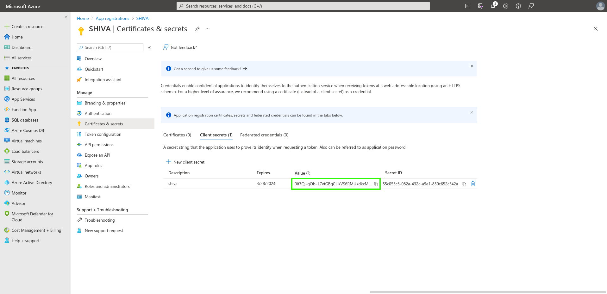

Aquí tienes un ejemplo de configuración del repositorio de autenticación de la organización Cloud Temple utilizando __Microsoft EntraID__ (Azure Active Directory).

La configuración del repositorio de Microsoft a nivel de la organización Cloud Temple facilita la autenticación de los usuarios en la consola Shiva. Esto evita la multiplicación de los factores de autenticación y reduce la superficie de ataque.

Si tus usuarios están autenticados en su cuenta de Microsoft, la autenticación en los servicios de la consola Shiva será transparente.

Estos son los diferentes pasos para realizar esta configuración:

## Paso 1: Configuración de SSO en Microsoft Azure

### Registro de una nueva aplicación en Azure (portal de Azure)

Para crear el registro de la aplicación, ve al portal de Microsoft Azure, luego a Microsoft EntraID y selecciona "ADD > App Registration".

En la página "Register an application", indica lo siguiente:

- __Name__: "SHIVA"
- __Supported account types__: "Accounts in this organizational directory only" (<Tu Tenant Azure> only - Single tenant)
- __Redirect URL__: No la configures por ahora. El soporte de Cloud Temple te proporcionará la URL a añadir en este campo más adelante.

La información **Application (client) ID** y **Directory (tenant) ID** es la información que deberás proporcionar al equipo de soporte de Cloud Temple para activar la autenticación de Microsoft EntraID en tu organización.

### Definición de un secreto
En la pestaña "Certificates & secrets", crea un nuevo secreto.

*Nota: la fecha de expiración del secreto no puede ser superior a 24 meses, incluyendo una fecha de expiración personalizada.*

El secreto generado deberá ser proporcionado al equipo de soporte:

### Definición del token EntraID

El token EntraID es necesario para la configuración de la autenticación.

En el menú __"Token Configuration"__, haz clic en __"Add optional claim"__. Deberás seleccionar "ID" como tipo de token y marcar "email".

Azure te preguntará si deseas añadir un permiso que te permita leer el correo electrónico de un usuario (correo electrónico de Microsoft Graph), marca la casilla y valida.

Luego, ve a "API permissions" y haz clic en __"Grant admin consent for Cloud Temple"__.

### Configuraciones de seguridad adicionales (opcional pero recomendado)

Por defecto, Microsoft EntraID, tal como está configurado, permitirá que cualquier usuario de tu Tenant Azure se conecte a tu organización Cloud Temple.
Es posible restringir el acceso solo a una lista de usuarios o grupos autorizados a conectarse a tu organización Cloud Temple a nivel de __"App Registration"__.

Aquí tienes el procedimiento a seguir:

#### Acceder a la configuración adicional de "App Registration"
##### Opción 1
Ve a la pestaña "Overview" y haz clic en el nombre de la aplicación (el enlace bajo "Managed application").

##### Opción 2
Ve a "Enterprise applications" y busca usando el nombre de la aplicación creada anteriormente.

#### Restricción de autenticación a usuarios asignados a la aplicación

Indica aquí la necesidad de asignar el usuario a la aplicación para permitir su autenticación:

#### Asignar usuarios y grupos a la aplicación
Solo los grupos y usuarios asignados a la aplicación podrán conectarse a tu organización Cloud Temple a través del registro de la aplicación.

Por último, haz clic en "Assign" para aplicar la asignación.

A partir de ahora, los usuarios asignados a la aplicación podrán conectarse a tu organización Cloud Temple a través de la aplicación creada.

## Paso 2: Solicitar la configuración de SSO (Single Sign-On) para tu organización

Esta parte de la configuración se realiza a nivel de la organización por el equipo de Cloud Temple.

Para ello, crea una __solicitud de asistencia__ en la consola indicando que deseas configurar un SSO de Microsoft EntraID.

Proporciona la siguiente información en la solicitud de asistencia:

    El nombre de tu organización
    El nombre de un contacto con su correo electrónico y número de teléfono para finalizar la configuración
    Application ID (identificador único asociado a la aplicación creada anteriormente)
    Directory ID (identificador de Azure AD del tenant Azure)
    Secret (Secreto asociado a la aplicación creada anteriormente)

Una vez que la configuración esté completada en la consola Shiva, se informará al contacto indicado.

## Paso 3: Finalizar la configuración

En la página de inicio de App Registration, en el menú "overview", haz clic en "Add a Redirect URL".

Luego, ve a "Add a platform" y añade una plataforma de tipo Web.

Simplemente completa la "Redirect URL" proporcionada por el equipo de Aplicaciones de Producto.

Deberías obtener este resultado una vez que la "Redirect URL" haya sido añadida.

La configuración de la "Redirect URL" puede tardar unos minutos en ser efectiva.
Una vez completados todos los pasos, podrás autenticarte en tu organización Cloud Temple a través de tu SSO.

