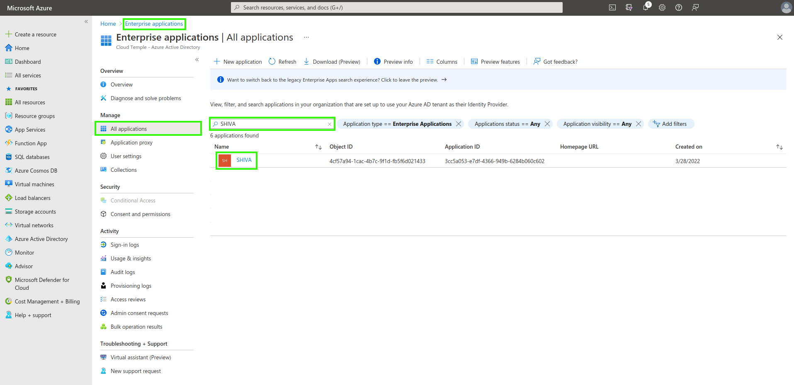

Ecco un esempio di configurazione del repository di autenticazione per l'organizzazione Cloud Temple con Microsoft EntraID (Azure Active Directory).

La configurazione del repository Microsoft a livello di organizzazione Cloud Temple semplifica l'autenticazione degli utenti sulla console Shiva. Ciò consente di evitare la proliferazione dei fattori di autenticazione e ridurre la superficie di attacco.

Se i tuoi utenti sono autenticati sul proprio account Microsoft, l'autenticazione ai servizi della console Shiva sarà trasparente.

Ecco i vari passaggi per realizzare questa configurazione:

## Passaggio 1: Configurazione del SSO su Microsoft Azure

### Registrazione di una nuova applicazione Azure (portale Azure)

Per la creazione dell'__app registration__, accedi al portale Microsoft Azure, quindi vai su Microsoft EntraID, __"AGGIUNGI > Registrazione applicazione"__.

Nella pagina "Registra un'applicazione", indica quanto segue:

- __Nome__: "SHIVA"
- __Tipi di account supportati__: "Solo account in questa directory organizzativa" (__<Il tuo Tenant Azure>__ - Single tenant)
- __URL di reindirizzamento__: non impostare inizialmente. L'URL sarà fornito dal supporto Cloud Temple e sarà da aggiungere successivamente in questo campo.

Le informazioni **ID applicazione (client)** e **ID directory (tenant)** sono le informazioni utili da fornire nella richiesta di supporto al team Cloud Temple per attivare l'autenticazione Microsoft EntraID a livello dell'organizzazione.

### Definizione di una chiave segreta
Nella scheda "Certificati e segreti", crea una nuova chiave segreta.

*Nota: la data di scadenza della chiave segreta non può essere superiore a 24 mesi, incluso con una data di scadenza personalizzata.*

La chiave segreta generata dovrà essere fornita nella richiesta di supporto:

### Definizione del token EntraID

Il token EntraID è necessario per la configurazione dell'autenticazione.

Nel menu __"Configurazione token"__, fai clic su __"Aggiungi claim facoltativo"__. Dovrai selezionare "ID" come tipo di token e spuntare "email".

L'interfaccia di Azure ti chiederà se desideri aggiungere un permesso che ti consentirà di leggere l'email di un utente (Microsoft Graph email), spunta la casella e conferma.

Successivamente, vai su "Autorizzazioni API" e fai clic su __"Concedi consenso amministratore per Cloud Temple"__.

### Configurazioni di sicurezza aggiuntive (opzionale ma consigliato)

Per impostazione predefinita, Microsoft EntraID come configurato darà a qualsiasi utente nel tuo tenant Azure la possibilità di accedere all'organizzazione Cloud Temple. È possibile limitare l'accesso solo a determinati utenti o gruppi dell'organizzazione Cloud Temple tramite __"App Registration"__.

Ecco la procedura da seguire;

#### Accedere alle impostazioni aggiuntive "App Registration"
##### Opzione 1
Vai alla scheda "Panoramica" e clicca sul nome dell'applicazione (il collegamento dopo "Managed application").

##### Opzione 2
Vai su "Applicazioni aziendali" e cerca utilizzando il nome dell'applicazione creata in precedenza.

#### Limitazione dell'autenticazione agli utenti assegnati all'applicazione

Indica qui la necessità che l'utente sia assegnato all'applicazione per autorizzare la sua autenticazione:

#### Assegnazione di utenti e gruppi all'applicazione
Solo i gruppi e gli utenti assegnati all'applicazione potranno accedere all'organizzazione Cloud Temple tramite l'app registration.

Infine, puoi applicare l'assegnazione facendo clic su "Assegna".

Da questo momento, solo gli utenti assegnati all'applicazione potranno accedere all'organizzazione Cloud Temple tramite l'applicazione creata.

## Passaggio 2: Richiesta di configurazione del SSO (Single Sign-On) dell'organizzazione

Questa parte della configurazione viene eseguita a livello di organizzazione dal team Cloud Temple.

Per farlo, invia una __richiesta di assistenza__ nella console comunicando l'intenzione di configurare un SSO Microsoft EntraID.

Fornisci le seguenti informazioni nella richiesta di assistenza:

    - Nome dell'organizzazione
    - Nome di un contatto con il suo indirizzo email e numero di telefono per completare la configurazione
    - ID dell'applicazione (identificatore univoco associato all'applicazione creata in precedenza)
    - ID della directory (corrispondente all'ID Azure AD del tenant Azure)
    - Secret (segreto associato all'applicazione creata in precedenza)

Una volta completata la configurazione lato console Shiva, il contatto indicato verrà informato.

## Passaggio 3: Completamento della configurazione

Nella pagina principale dell'App Registration, nel menu panoramica, clicca su "Aggiungi URL di reindirizzamento".

Quindi vai su "Aggiungi una piattaforma" e aggiungi una di tipo Web.

Dovrai fornire l'URL di reindirizzamento fornito dal Team Produit Applications.

Dovresti ottenere questo risultato una volta aggiunto l'URL di reindirizzamento.

La configurazione dell'URL di reindirizzamento potrebbe richiedere alcuni minuti per diventare effettiva.

Una volta completati tutti i passaggi, puoi autenticarti nell'organizzazione Cloud Temple tramite il tuo SSO.

