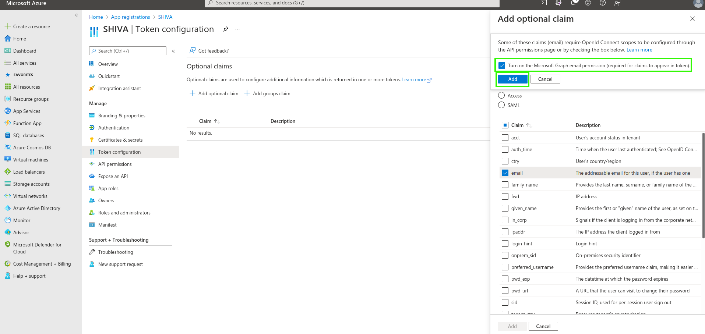
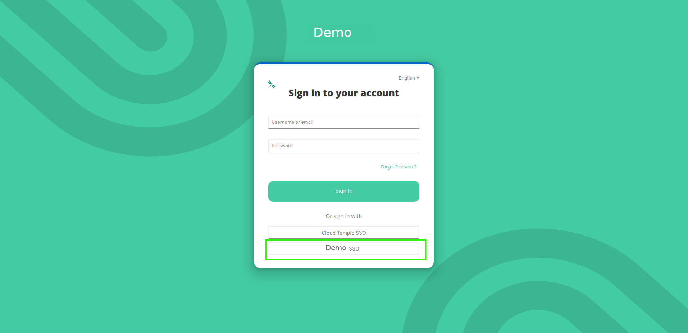

Voici un exemple de configuration du référentiel d'authentification d'une organisation Cloud Temple avec __Microsoft EntraID__ (Azure Active Directory).  

La configuration de votre référentiel Microsoft au niveau d'une organisation Cloud Temple facilite l'authentification de vos utilisateurs sur la console Shiva. Cela permet d'éviter la multiplication des facteurs d'authentification et de diminuer la surface d'attaque.  

Si vos utilisateurs sont authentifiés à leur compte Microsoft, l'authentification aux services de la console Shiva sera transparente.

Voici les différentes étapes pour réaliser cette configuration :

## Etape 1 : Configuration du SSO coté Microsoft Azure

### Enregistrement d'une nouvelle application Azure (portail Azure)

Pour la création de l'__app registration__, il faut se rendre sur le portail Microsoft Azure, puis daans Microsoft EntraID, __"ADD > App Registration"__ 

Dans la page "Register an application", veuillez indiquer :

- __Name__ : Indiquer "__SHIVA__"
- __Supported account types__ :  __Accounts in this organizational directory only__ (__<Votre Tenant Azure>__ only - Single tenant) 
- __Redirect URL__ : A ne pas paramétrer dans un premier temps. L'URL sera fournie par le support Cloud Temple et sera à ajouter dans ce champ plus tard.

Les informations **Application (client) ID** et **Directory (tenant) ID** sont les informations utiles à fournir dans la demande de support à l'équipe Cloud Temple pour activer l'authentification Microsoft EntraID au niveau de votre organisation.

### Définition d'un secret
Dans l'onglet "Certificates & secrets", créer un nouveau secret.  

*À noter : la date d'expiration du secret ne peut être supérieure à 24 mois, y compris avec une date d'expiration custom.*

Le secret généré sera à fournir dans la demande de support :

### Définition du token EntraID 

Le token EntraID est nécessaire à la configuration de l'authentification.  

Dans le menu __"Token Configuration"__, cliquer sur __"Add optional claim"__. Vous devrez sélectionner "ID" en tant que type de token et cocher "email".

L'interface Azure va vous demander si vous souhaitez ajouter une permission qui vous permettra de lire l'email d'un utilisateur (Microsoft Graph email), cochez la case et validez.

Ensuite, rendez-vous sur "API permissions" et cliquez sur __"Grant admin consent for Cloud Temple"__.

### Configurations de sécurité supplémentaires (optionel mais recommandé)

Par défaut, Microsoft EntraID tel que configuré donnera à n'importe quel utilisateur de votre tenant Azure la possibilité de se connecter à votre organisation Cloud Temple.
Il est  possible de restreindre au niveau de __"App Registration"__ les accès pour n'autoriser qu'une liste d'utilisateurs ou groupes à se connecter à votre organisation Cloud Temple.

Voici la procédure à suivre ;

#### Accéder aux paramètres supplémentaires "App Registration"
##### Option 1 
Allez sur l'onglet "Overview" puis cliquez sur le nom de l'application (le lien situé à la suite de "Managed application").

##### Option 2 
Se rendre dans les "Enterprise applications" et chercher en utilisant le nom de l'application créée précédemment.

#### Restriction de l'authentification aux utilisateurs assignés à l'application

Indiquer ici la nécessité d'un assignement de l'utilisateur à l'application pour autoriser son authentification :

#### Assignation des utilisateurs et groupes à l'application
Seuls les groupes et utilisateurs assignés à l'application pourront se connecter à votre organisation Cloud Temple via l'app registration.

Enfin, vous n'aurez plus qu'à appliquer l'assignation en cliquant sur "Assign".

Désormais les utilisateurs assignés à l'application pourront se connecter à votre organisation Cloud Temple via l'application créée.

## Etape 2 : Demander la configuration du SSO (Single Sign-On) de votre organisation

Cette partie de la configuration se fait au niveau de l'organisation par l'équipe Cloud temple.  

Pour se faire, faites __une demande d'assistance__ dans la console indiquant votre souhait de configurer une SSO Microsoft EntraID.  

Veuillez donner les informations suivantes dans la demande d'assistance :

    Le nom de votre Organisation
    Le nom d'un contact avec son mail et n° de téléphone pour finaliser la configuration
    Application ID (identifiant unique associé à l'application créée précédemment)
    Directory ID (correspond à l'identifiant Azure AD du tenant Azure)
    Secret (Secret associé à l'application créée précédemment)

Dès que la configuration est réalisée coté console Shiva, le contact indiqué sera informé.

## Etape 3 : Finalisation de la configuration

Sur la page d’accueil de l’App Registration, dans le menu overview, cliquez sur "Add a Redirect URL".

Ensuite, dirigez-vous vers le "Add a platform" et ajoutez-en une de type Web.

Il vous suffit de renseigner la "Redirect URL" fournie par la Team Produit Applications.

Vous devriez obtenir ce résulat une fois la "Redirect URL" ajoutée.

La configuration de la "Redirect URL" peut mettre quelques minutes à être effective.
Une fois toutes les étapes réalisées, vous pouvez vous authentifier à votre organisation Cloud Temple via votre SSO.

