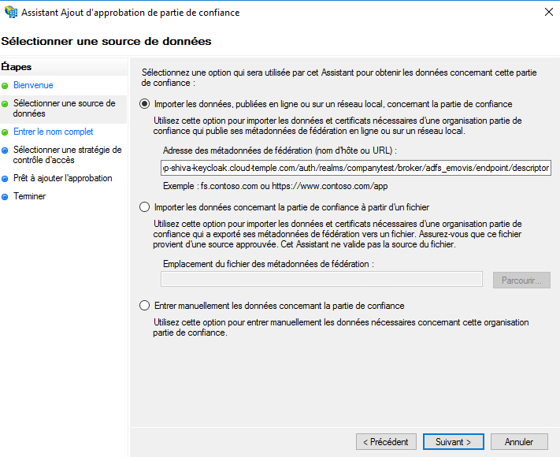
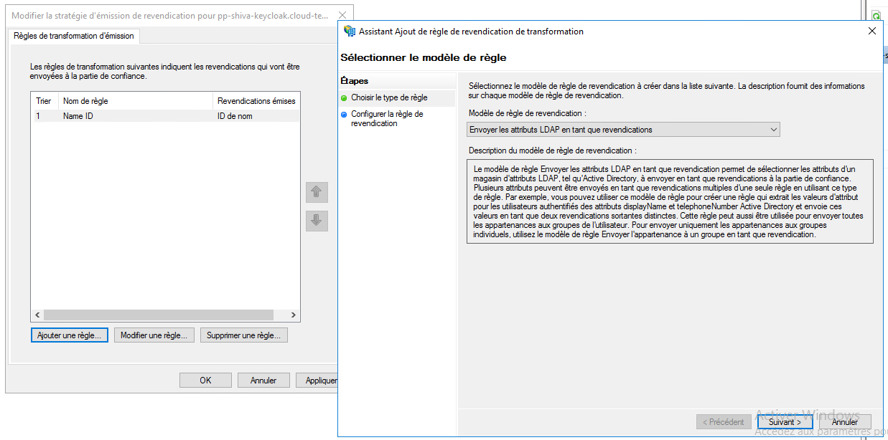
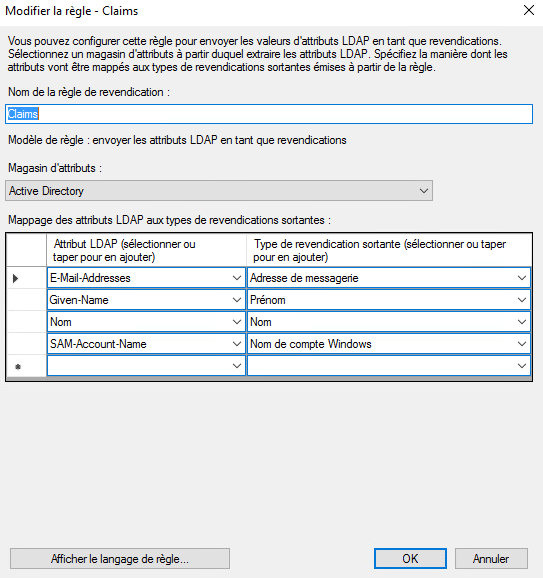

Here is an example of configuring the authentication repository for a Cloud Temple organization with __Microsoft ADFS__.

Configuring your Microsoft repository at the Cloud Temple organization level facilitates authentication of your users on the Shiva console.
This avoids the multiplication of authentication factors and reduces the attack surface.
If your users are authenticated to their Microsoft account, authentication to Shiva console services will be seamless.

Here are the different steps to perform this configuration:

## Prerequisites
Your Microsoft ADFS server must be able to access the following Cloud Temple URL: https://keycloak-shiva.cloud-temple.com/auth/.

ADFS must be accessible from Cloud Temple networks and __expose a TLS certificate from a public CA__.

Users wishing to connect to the portal must have their email, first name, and last name provided on the Active Directory.

## Step 2: Request the SSO (Single Sign-On) configuration for your organization

This part of the configuration is done at the organization level by the Cloud Temple team.

To do this, make __a support request__ in the console indicating your desire to configure your Microsoft ADFS authentication repository.

Please provide the following information in the support request:

    - The name of your Organization
    - The name of a contact person with their email and phone number to finalize the configuration
    - Public URL of the ADFS federation metadata (<adfs domain name>/FederationMetadata/2007-06/FederationMetadata.xml)
    (Example: https://adfs.test.local/FederationMetadata/2007-06/FederationMetadata.xml)

Once the configuration is done on the Shiva console, the contact provided will be informed.

The Cloud Temple support team will provide you with a URL that looks like this: https://keycloak-shiva.cloud-temple.com/auth/realms/companytest/broker/adfs_test/endpoint/descriptor

*You can paste the URL into a browser to test it. If it works correctly, you should see an XML displayed.*

## Step 3: Configuring ADFS
### Authentication federation configuration

#### Adding a relying party trust

On your ADFS server, go to __"Add Relying Party Trust"__.

### Configure the claims
Claims provide information to the token that will be transmitted to the Cloud Temple console.

They transmit the connected user's information necessary for the proper functioning of various services, such as their email, first name, and last name.

Select "Import data about the relying party published online or on a local network" and enter the URL provided by the Cloud Temple support.

You can provide a name and a description for the relying party, which is optional.

By default, we allow everyone, but you can select __"Allow only a specific group"__ to select the group(s) that will be allowed to access Shiva console services via ADFS.

Once all these steps are completed, you have finished configuring the relying party trust.

Next, you need to edit the claim issuing policy for this new relying party trust.

Click on "Add Rule" and specify the template as "Transform an Incoming Claim".

You just need to enter the information as indicated in the screenshot below.

### Add claims
Add a second rule with the template "Send LDAP Attributes as Claims".

Select the attribute store and add the attributes "E-Mail Addresses, Given-Name, Nom, and SAM-Account-Name" as shown in the screenshot below.

Simply apply the changes.

## Step 3: Finalization

You can now test by going to the Shiva console and clicking on the button corresponding to the ADFS client authentication; in this example, it is __"ADFS Test"__.

