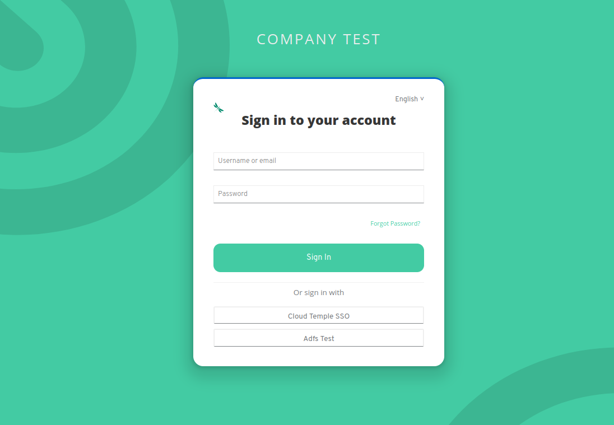

Aquí hay un ejemplo de configuración del repositorio de autenticación de la organización Cloud Temple con __Microsoft ADFS__.

La configuración de tu repositorio de Microsoft a nivel de la organización de Cloud Temple facilita la autenticación de tus usuarios en la consola Shiva.
Esto evita la multiplicación de factores de autenticación y reduce la superficie de ataque.
Si tus usuarios están autenticados en su cuenta de Microsoft, la autenticación en los servicios de la consola Shiva será transparente.

Aquí tienes los diferentes pasos para realizar esta configuración:

## Requisitos previos
Tu servidor de Microsoft ADFS debe poder acceder a la siguiente URL de Cloud Temple: https://keycloak-shiva.cloud-temple.com/auth/.

ADFS debe ser accesible desde las redes de Cloud Temple y __exponer un certificado TLS de una CA pública__.

Los usuarios que quieran iniciar sesión en el portal deben tener su correo electrónico, nombre y apellido completados en Active Directory.

## Paso 2: Solicitar la configuración de SSO (Single Sign-On) de tu organización

Esta parte de la configuración se realiza a nivel de la organización por el equipo de Cloud Temple.

Para ello, __envía una solicitud de asistencia__ en la consola indicando tu deseo de configurar tu repositorio de autenticación Microsoft ADFS.

Proporciona la siguiente información en la solicitud de asistencia:

    El nombre de tu organización.
    El nombre de un contacto con su correo electrónico y número de teléfono para finalizar la configuración.
    URL pública de los metadatos de federación de ADFS (<nombre de dominio del adfs>/FederationMetadata/2007-06/FederationMetadata.xml)
    (Ejemplo: https://adfs.test.local/FederationMetadata/2007-06/FederationMetadata.xml)

Una vez que la configuración se haya completado en la consola Shiva, se informará al contacto indicado.

El equipo de soporte de Cloud Temple te proporcionará una URL similar a esta: https://keycloak-shiva.cloud-temple.com/auth/realms/companytest/broker/adfs_test/endpoint/descriptor

*Puedes pegar la URL en un navegador para verificarlo. Si funciona correctamente, debería aparecer un XML.*

## Paso 3: Realizar la configuración de ADFS
### Configuración de la federación de autenticación

#### Agregar una confianza de parte de aprobación

En tu servidor de ADFS, ve a "Agregar una confianza de parte de aprobación".

### Configurar los "claims"
Los claims permiten proporcionar información al token que se transmitirá a la consola Cloud Temple.

Transmiten la información del usuario conectado que es necesaria para el correcto funcionamiento de los diferentes servicios, como su correo electrónico, nombre y apellido.

Selecciona "Importar datos publicados en línea o en una red local de la parte de confianza" y proporciona la URL proporcionada por el soporte de Cloud Temple.

Puedes proporcionar un nombre y una descripción para la parte de confianza, esta parte es opcional.

Por defecto, permitimos a todos pero puedes seleccionar __"Permitir un grupo específico"__ para seleccionar el o los grupos que tendrán acceso a los servicios de la consola Shiva a través de ADFS.

Una vez que hayas realizado todos estos pasos, habrás terminado la configuración de la parte de confianza.

Luego deberás editar la política de emisión de claims de esta nueva parte de confianza.

Haz clic en "Agregar una regla" y especifica el modelo, ya sea "Transformar un claim de entrada".

Solo tendrás que proporcionar la información como se indica en la captura de pantalla a continuación.

### Agregar los claims
Agrega una segunda regla con el modelo "Enviar atributos LDAP como claims".

Selecciona la tienda de atributos y agrega los atributos "E-Mail Addresses, Given-Name, Nom y SAM-Account-Name" como se muestra en la captura de pantalla a continuación.

Solo tienes que aplicar los cambios.

## Paso 3: Finalización

Ahora puedes probarlo yendo a la consola Shiva y haciendo clic en el botón correspondiente a la autenticación del cliente ADFS; en este ejemplo, se trata de __"ADFS Test"__.

