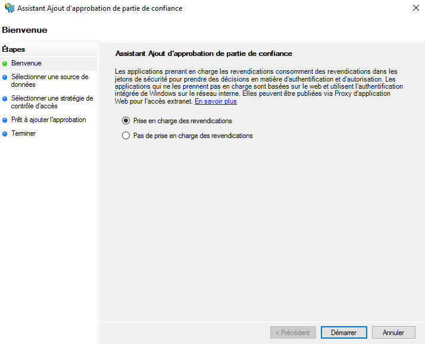
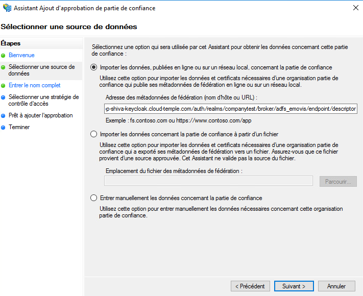
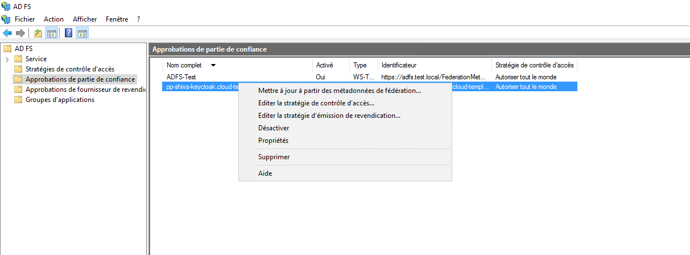

Ecco un esempio di configurazione del repository di autenticazione di un'organizzazione Cloud Temple con __Microsoft ADFS__.

La configurazione del tuo repository Microsoft a livello di un'organizzazione Cloud Temple semplifica l'autenticazione degli utenti sulla console Shiva.
Ciò consente di evitare la proliferazione di fattori di autenticazione e di ridurre la superficie di attacco.
Se gli utenti sono autenticati sul proprio account Microsoft, l'autenticazione ai servizi della console Shiva sarà trasparente.

Ecco i vari passaggi per realizzare questa configurazione:

## Prerequisiti
Il tuo server Microsoft ADFS deve poter accedere all'url Cloud Temple seguente: https://keycloak-shiva.cloud-temple.com/auth/.

L'ADFS deve essere accessibile dalle reti di Cloud Temple e __esporre un certificato TLS da un'autorità di certificazione pubblica__.

Gli utenti che desiderano accedere al portale devono avere il loro indirizzo email, nome e cognome inseriti nell'Active Directory.

## Step 2: Richiedere la configurazione del SSO (Single Sign-On) della tua organizzazione

Questa parte della configurazione viene fatta a livello dell'organizzazione dal team di Cloud Temple.

Per fare ciò, effettua una __richiesta di assistenza__ nella console indicando il tuo desiderio di configurare il tuo repository di autenticazione Microsoft ADFS.

Fornisci le seguenti informazioni nella richiesta di assistenza:

    Il nome della tua organizzazione
    Il nome di un contatto con il suo indirizzo email e il numero di telefono per finalizzare la configurazione
    URL pubblico dei metadati della federazione dell'ADFS (<nome dominio adfs>/FederationMetadata/2007-06/FederationMetadata.xml)
    (Esempio: https://adfs.test.local/FederationMetadata/2007-06/FederationMetadata.xml)

Una volta che la configurazione è stata completata sul lato della console Shiva, il contatto indicato sarà informato.

Il team di supporto di Cloud Temple ti fornirà un URL che assomiglierà a questo: https://keycloak-shiva.cloud-temple.com/auth/realms/companytest/broker/adfs_test/endpoint/descriptor

*Puoi incollare l'URL in un browser per testarlo. Se funziona correttamente, dovresti visualizzare un XML*

## Step 3: Realizzazione della configurazione ADFS
### Configurazione della federazione di autenticazione

#### Aggiunta di un'affidabilità di una parte fidata

Nel tuo server ADFS, vai su __"Aggiungi una fiducia di una parte fidata"__.

### Configura le "claim" (richieste) (claims in italiano mi suonano strano ma dovrebbe andare)
Le claim permettono di fornire informazioni al token che verrà trasmesso alla console Cloud Temple.

Trasmettono le informazioni dell'utente connesso che sono necessarie per il corretto funzionamento dei vari servizi, come l'indirizzo email, il nome e il cognome.

Seleziona "Importa dati pubblicati online o in una rete locale relativi alla parte fidata" e inserisci l'URL fornito dal supporto di Cloud Temple.

Puoi fornire un nome e una descrizione per la parte fidata, questa parte è opzionale.

Per impostazione predefinita, autorizziamo tutti, ma è possibile selezionare __"Consenti un gruppo specifico"__ per selezionare il gruppo o i gruppi che avranno accesso ai servizi della console Shiva tramite ADFS.

Una volta completati tutti questi passaggi, hai terminato la configurazione della parte fidata.

Successivamente, dovrai modificare la strategia di emissione delle richieste di questa nuova parte fidata.

Fai clic su "Aggiungi una regola" e specifica il modello, "Trasforma una richiesta in ingresso".

Dovrai solo fornire le informazioni come indicato nella schermata di esempio qui sotto.

### Aggiungere le richieste (claim)
Aggiungi una seconda regola con il modello "Invia attributi LDAP come richieste".

Seleziona il negozio degli attributi e aggiungi gli attributi "E-Mail Addresses, Given-Name, Nom e SAM-Account-Name" come indicato nella schermata di esempio qui sotto.

Dovrai solo applicare le modifiche.

## Step 3: Finalizzazione

Ora puoi testare accedendo alla console Shiva e facendo clic sul pulsante corrispondente all'autenticazione client ADFS; in questo esempio, si tratta di __"ADFS Test"__

