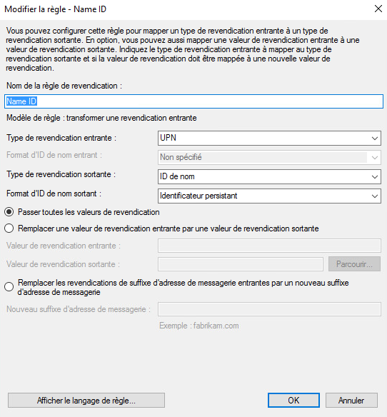

Voici un exemple de configuration du référentiel d'authentification d'une organisation Cloud Temple avec __Microsoft ADFS__.

La configuration de votre référentiel Microsoft au niveau d'une organisation Cloud Temple facilite l'authentification de vos utilisateurs sur la console Shiva.
Cela permet d'éviter la multiplication des facteurs d'authentification et de diminuer la surface d'attaque.
Si vos utilisateurs sont authentifiés à leur compte Microsoft, l'authentification aux services de la console Shiva sera transparente.

Voici les différentes étapes pour réaliser cette configuration :

## Prérequis
Votre serveur Microsoft ADFS doit pouvoir accéder à l'url Cloud Temple suivante : https://keycloak-shiva.cloud-temple.com/auth/.

L'ADFS doit pouvoir être accessible depuis les réseaux de Cloud Temple et __exposer un certificat TLS d'une CA publique__.

Les utilisateurs souhaitant se connecter sur le portail doivent avoir leur email, nom et prénom renseignés sur l'Active Directory.

## Etape 2 : Demander la configuration du SSO (Single Sign-On) de votre organisation

Cette partie de la configuration se fait au niveau de l'organisation par l'équipe Cloud temple.  

Pour se faire, faites __une demande d'assistance__ dans la console indiquant votre souhait de configurer votre référentiel d'authentification Microsoft ADFS.  

Veuillez donner les informations suivantes dans la demande d'assistance :

    Le nom de votre Organisation
    Le nom d'un contact avec son mail et n° de téléphone pour finaliser la configuration
    URL publique des Metadata de la fédération de l'ADFS (<nom de domaine de l'adfs>/FederationMetadata/2007-06/FederationMetadata.xml)
    (Exemple : https://adfs.test.local/FederationMetadata/2007-06/FederationMetadata.xml)

Dès que la configuration est réalisée coté console Shiva, le contact indiqué sera informé.

L'équipe support Cloud Temple vous transmettra une URL qui ressemblera à celle-ci : https://keycloak-shiva.cloud-temple.com/auth/realms/companytest/broker/adfs_test/endpoint/descriptor

*Vous pouvez coller l'URL dans un navigateur afin de la tester. Si elle fonctionne correctement vous devriez voir s'afficher un XML*

## Etape 3 : Réalisation de la configuration ADFS
### Configuration de la fédération d'authentification

#### Ajout d'une approbation de partie de confiance

Sur votre serveur ADFS, aller dans __"Ajouter une approbation de partie de confiance"__.

### Configurer les "claims"
Les claims permettent de fournir des informations au token qui sera transmis à la console Cloud Temple. 

Ils transmettent les informations de l'utilisateur connecté qui sont nécessaires au bon fonctionnement des différents services, telles que son email, son nom et prénom.

Sélectionnez "Importer les données, publiées en ligne ou sur un réseau local, concernant la partie de confiance" et renseignez l'URL fournie par le support Cloud Temple.

Vous pouvez renseigner un nom et une description pour la partie de confiance, cette partie est optionnelle. 

Par défaut, nous autorisons tout le monde mais il est possible de sélectionner __"Autoriser un groupe spécifique"__ pour sélectionner le ou les groupes qui seront autorisés à accéder aux services de la console Shiva via l'ADFS.

Une fois toutes ces étapes effectuées, vous avez terminé la configuration de la partie de confiance.

Il faudra ensuite éditer la stratégie d'émission de revendication de cette nouvelle partie de confiance. 

Cliquez sur "Ajouter une règle" et spécifiez le modèle, soit "Transformer une revendication entrante".

Vous n'aurez plus qu'à renseigner les informations telles qu'indiquées dans la capture d'écran ci-dessous.

### Ajouter les claims
Ajoutez une seconde règle avec, cette fois-ci, le modèle "Envoyer les attributs LDAP en tant que revendications".

Sélectionnez le magasin d'attributs et ajoutez les attributs "E-Mail Addresses, Given-Name, Nom et SAM-Account-Name" comme indiqué sur la capture d'écran ci-dessous.

Il vous suffit d'appliquer les changements.

## Etape 3 : Finalisation

vous pouvez désormais tester en vous rendant sur la console Shiva et en cliquant sur le bouton correspondant à l'authentification  ADFS client; dans cet exemple, il s'agit ici de __"ADFS Test"__

