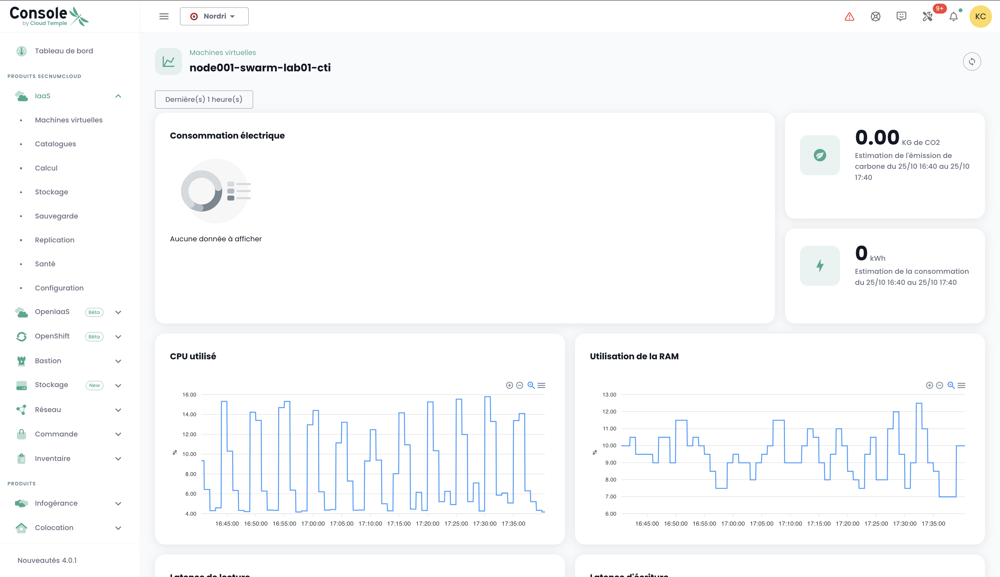
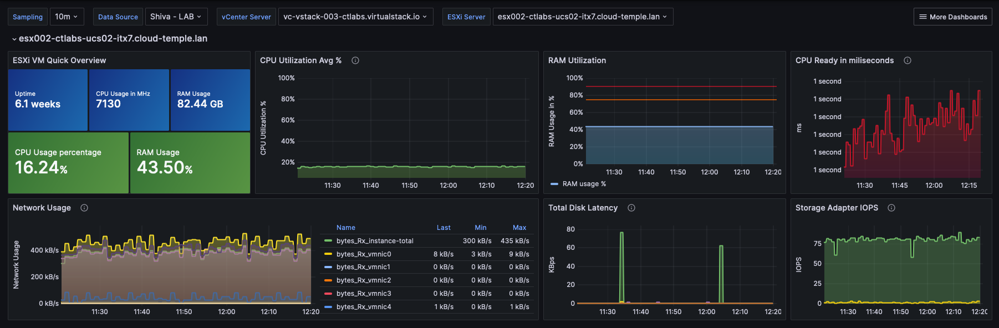

## Konzept

Die Mehrheit der __Cloud Temple__ Kunden verfügt über Visualisierungs-, Monitoring- und Metrik-Tools, um ihre Operationen zu verfolgen.

Die Philosophie der Shiva-Konsole besteht darin, den Zugang zu Daten zu ermöglichen, um sich in diese Tools durch einen integrierten Prometheus-Proxy einzufügen.

Dieser Proxy ermöglicht es Ihnen, Daten über ein Visualisierungswerkzeug wie [Grafana](https://grafana.com) abzufragen und zu manipulieren.

Es ist jedoch möglich, einige Leistungsdaten Ihrer Cloud-Ressourcen in der Webinterface der Shiva-Konsole zu visualisieren.

*__Beachte:__ Die Philosophie von __Cloud Temple__ besteht nicht darin, mehrere Graphiken in das Webinterface zu integrieren, sondern ein Maximum an Informationen über die API zugänglich zu machen.*

## Integriertes Dashboard im Webinterface

*__Hinweis:__ Um auf diese Dashboards zugreifen zu können, ist es erforderlich, über das Recht __'metric_read'__ zu verfügen*

### Überwachung der Kohlenstoffemissionen für die Berechnung
Das Dashboard der Shiva-Konsole enthält standardmäßig ein Diagramm zur Überwachung des Stromverbrauchs Ihrer Berechnung sowie eine Schätzung der damit verbundenen CO2-Emissionen.

Es ist direkt auf der Startseite der Webinterface der Cloud Temple Konsole zugänglich, indem Sie auf __'Metric'__ klicken:

### Gesamtüberblick über den Gesundheitszustand der virtuellen Maschinen
Die Zusammenfassung des Zustandes der virtuellen Maschinen finden Sie im Menü __'IaaS'__ auf der linken Seite Ihres Bildschirms, im Untermenü __'Gesundheit'__ und dann __'Virtuelle Maschinen'__.

Diese Zusammenfassung gibt für den im __'Filter'__ gewählten Zeitraum an:

- die Anzahl der CPUs und den __durchschnittlichen CPU-Gebrauch__,
- die Anzahl der GB an Speicher und den __durchschnittlichen Speicherbedarf__,
- die Durchschnittswerte der __Zugriffsverzögerung auf den Speicher__ beim Lesen und Schreiben,
- die durchschnittliche __'CPU Ready'__ Zeit der virtuellen Maschine (was der durchschnittlichen Wartezeit auf die Verfügbarkeit eines physischen Kerns durch die virtuelle Maschine entspricht).

Für jede VM können Sie durch Klicken auf das grüne Icon __'Historie'__ der virtuellen Maschine in der Aktionspalte auf den Verlauf ihrer Leistung zugreifen:

Dann gelangen Sie zu der Seite zur grafischen Darstellung der historischen Daten, einschließlich einer Ansicht der __Umweltleistung__:

## Verwendung mit __Grafana__
Es ist möglich, die Shiva-Konsole als __Datasource__ für Ihre [Grafana](https://grafana.com) Infrastruktur zu verwenden.

Hier finden Sie ein Beispiel für die Konfiguration [einer Grafana-Datasource über die Shiva-Konsole](howto.md#etape-7--configurer-la-console-shiva-en-tant-que-datasource-dans-grafana).

Hier finden Sie eine Reihe von __Beispielkonfigurationen für Grafana__:

https://github.com/Cloud-Temple/console-grafana-iaas

{:height="50%" width="50%"} 

{:height="50%" width="50%"} 

{:height="50%" width="50%"}

