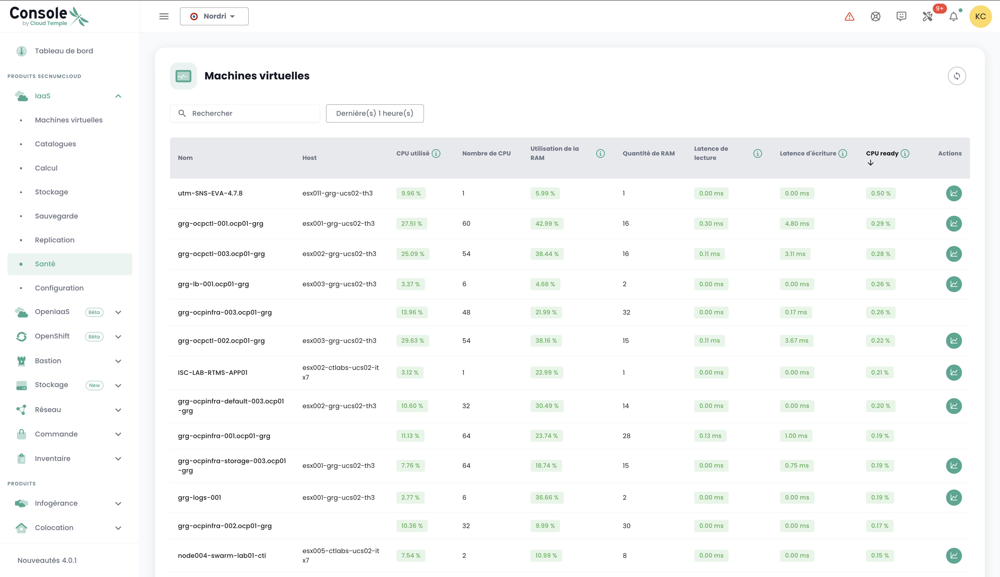
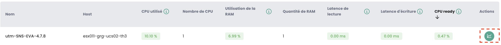

## Concept
The majority of __Cloud Temple__ clients have access to visualization, monitoring, and metrology tools for tracking their operations.

The philosophy of the Shiva console is to allow access to data in order to integrate with such tools through an integrated Prometheus proxy.

This proxy allows you to query and manipulate data from a visualization tool such as [Grafana](https://grafana.com).

However, it is possible to view certain performance data of your Cloud resources within the web interface of the Shiva console.

*__Nota:__ The __Cloud Temple__ philosophy is not to integrate multiple charts into the web interface, but rather to offer the maximum amount of information accessible via the API.*

## Dashboard integrated into the web interface

*__Nota:__ To access these dashboards, it is necessary to have the __'metric_read'__ permission*

### Carbon Emission Tracking for Computation
The dashboard of the Shiva console includes by default a chart for monitoring the electrical consumption of your computation as well as an estimate of the associated carbon emissions.

It is directly accessible from the homepage of the Cloud Temple console web interface by clicking on __'Metric'__:

### Overall View of Virtual Machines' Health
The synthesis of the state of virtual machines is available in the __'IaaS'__ menu on the left side of your screen, under the __'Health'__ sub-menu, and then __'Virtual Machines'__.

This synthesis provides, over the selected time range in __'Filters'__:

- the number of CPUs and the __average CPU utilization__,
- the amount of memory in GB and the __average memory usage__,
- Averages of __storage access latency__ for reads and writes,
- The average __'CPU Ready'__ of the virtual machine (which corresponds to the average waiting time for the availability of a physical core by the virtual machine).

For each VM, you can access the performance history by clicking on the green __'History'__ icon of the virtual machine in the action column:

You will then access the graphical visualization page of the historical data, including an __environmental performance__ view:

## Usage with __Grafana__
The Shiva service console can act as a __datasource__ for your [Grafana](https://grafana.com) infrastructure.

Here is an example of configuring [a Grafana datasource from the Shiva console](howto.md#step-7--configure-the-shiva-console-as-a-datasource-in-grafana).

A whole set of __example configurations for Grafana__ can be found here:

https://github.com/Cloud-Temple/console-grafana-iaas

{:height="50%" width="50%"} 

{:height="50%" width="50%"} 

{:height="50%" width="50%"}
