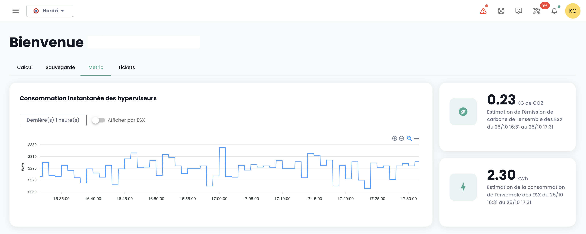
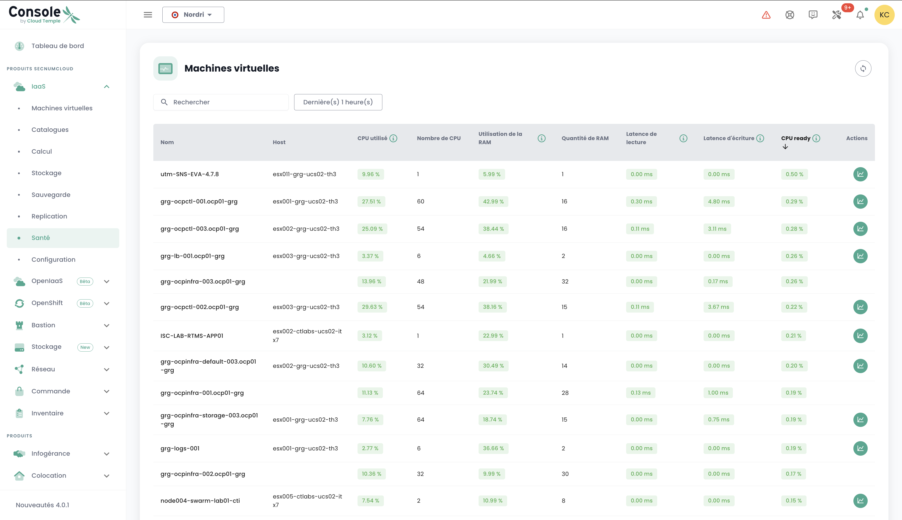
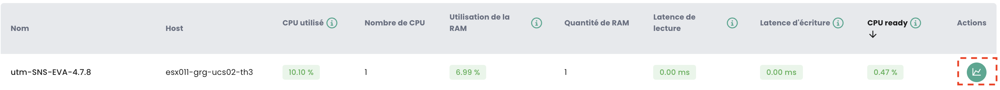
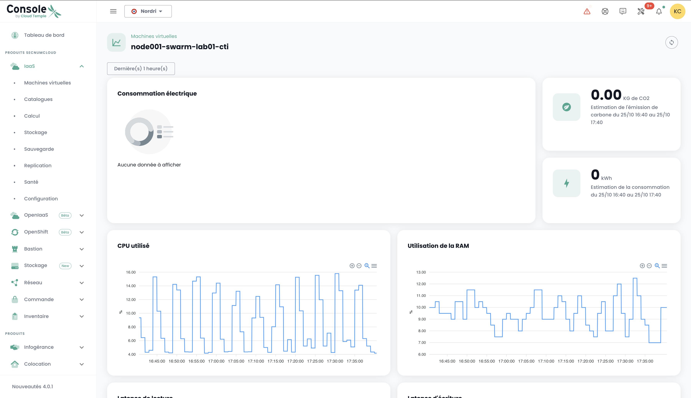
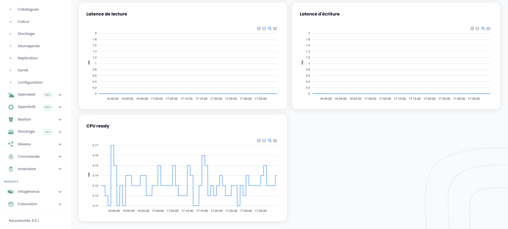
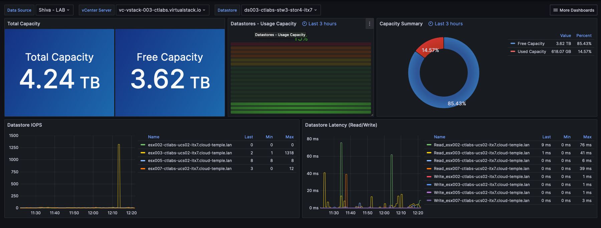

---

título: Metrología general

---

## Concepto
La mayoría de los clientes de __Cloud Temple__ cuentan con herramientas de visualización, monitoreo y metrología para el seguimiento de sus operaciones.

La filosofía de la consola Shiva es permitir el acceso a los datos para integrarse en estas herramientas a través de un proxy prometheus integrado.

Este proxy le permite consultar y manipular los datos desde una herramienta de visualización como [Grafana](https://grafana.com).

Sin embargo, es posible visualizar algunos datos de rendimiento de sus recursos Cloud en la interfaz web de la consola Shiva.

*__Nota:__ La filosofía de __Cloud Temple__ no es integrar múltiples gráficos en la interfaz web, sino ofrecer la máxima cantidad de información accesible a través de la API*

## Tablero integrado en la interfaz web

*__Nota :__ Para acceder a estos paneles, es necesario poseer el derecho __'metric_read'__*

### Seguimiento de las emisiones de carbono para el cálculo
El tablero de control de la consola Shiva integra por defecto un gráfico de seguimiento del consumo eléctrico de su cálculo, así como la estimación 
de la emisión de carbono asociada.

Se puede acceder directamente desde la página de inicio de la interfaz web de la consola Cloud Temple, haciendo clic en __'Metric'__ :

### Vista global de la salud de las máquinas virtuales
La síntesis del estado de las máquinas virtuales está accesible en el menú __'IaaS'__ ubicado al izquierdo de su pantalla, en el submenú __'Salud'__ y luego __'Máquinas virtuales'__

Esta síntesis proporciona, en el intervalo de tiempo seleccionado en __'Filtros'__:

- el número de CPU y la __media de utilización de CPU__,
- el número de GB de memoria y la __media de uso de la memoria__,
- Las medias de __latencia de acceso al almacenamiento__ en lectura y escritura,
- El __'CPU Ready'__ medio de la máquina virtual (lo que corresponde al tiempo medio de espera de disponibilidad de un núcleo físico por la máquina virtual).

Para cada VM, puede acceder al historial de su rendimiento haciendo clic en el icono verde __'Historial'__ de la máquina virtual en la columna de acción. :

Entonces llegará a la página de visualización gráfica de los datos históricos, que incluye una vista __de rendimiento ambiental__:

## Uso con __Grafana__
Es posible para la consola Shiva prestar servicio de __fuente de datos__ para su infraestructura [Grafana](https://grafana.com).

Aquí encontrará un ejemplo de configuración [de una fuente de datos Grafana desde la consola Shiva](howto.md#etape-7--configurar-la-consola-shiva-como-fuente-de-datos-en-grafana).

Podrá encontrar toda una serie de __ejemplo de configuración para Grafana__ aquí:

https://github.com/Cloud-Temple/console-grafana-iaas

{:height="50%" width="50%"} e

{:height="50%" width="50%"} 

{:height="50%" width="50%"}
