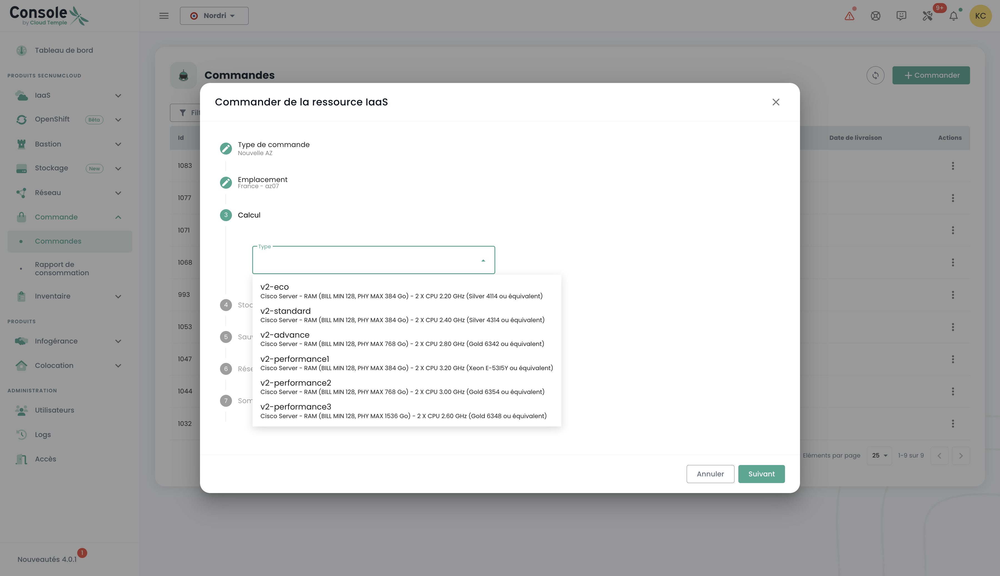
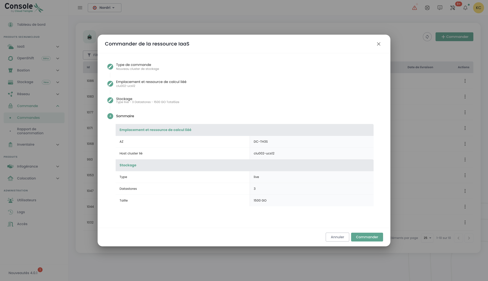

## Konzept
Die Verfolgung der Bereitstellung neuer Ressourcen erfolgt im Menü __'Bestellungen'__, welches über die grüne Leiste links auf dem Bildschirm zugänglich ist.

Es ermöglicht die Ansicht der bestellten Cloud-Ressourcen, die sich in der Bereitstellung befinden, und möglicher Fehler innerhalb eines [Mandanten](tenants.md) Ihrer [Organisation](organisations.md).

*__Hinweis: In diesem Moment ist eine globale Ansicht auf Organisationsebene aller in den verschiedenen Mandanten bereitgestellten Ressourcen noch nicht möglich.__ Dieses Thema wird im Jahr 2024 durch die Implementierung eines Portals für den Auftraggeber (im Sinne des Unterzeichners) und die Steuerung seiner Organisation behandelt.*

Die Bereitstellung der Ressourcen oder deren Entfernung erfolgt in jedem der Produkte über die Menüs __'IaaS'__ und __'Netzwerk'__ links auf dem Bildschirm in der grünen Leiste.

Es ist auch möglich, die Lieferungen direkt über die Benachrichtigungen der Cloud Temple-Konsole zu sehen:

{:height="50%" width="50%"}

Von der Bestellungsseite aus können Sie den Fortschritt einer Lieferung verfolgen und gegebenenfalls mit dem Team kommunizieren, indem Sie Kommentare oder Klarstellungen beisteuern:

**Hinweis**: **Es ist nicht möglich, mehrere Bestellungen desselben Ressourcentyps gleichzeitig zu starten. Sie müssen daher warten, bis die laufende Bestellung bearbeitet und abgeschlossen wurde, bevor Sie eine neue vornehmen können. Dies garantiert eine effektive und geordnete Verwaltung der Ressourcen innerhalb Ihrer Umgebung.**

## Eine neue Verfügbarkeitszone bestellen
Es ist möglich, eine neue Verfügbarkeitszone hinzuzufügen, indem Sie auf das Menü "**Bestellung**" zugreifen. Diese Option ermöglicht es Ihnen, Ihre Ressourcen zu erweitern und die Verfügbarkeit und Resilienz Ihrer Anwendungen mit nur wenigen Klicks zu verbessern:

Zunächst wählt man den gewünschten Standort aus, indem man zuerst die geografische Region und dann die entsprechende Verfügbarkeitszone (AZ) aus den verfügbaren Optionen auswählt. Dieser Schritt ermöglicht es Ihnen, den Einsatz Ihrer Ressourcen an den Standort und die Anforderungen Ihrer Infrastruktur anzupassen:

Anschließend gehen Sie zur Auswahl des gewünschten Hypervisor-Cluster-Typs über, indem Sie denjenigen auswählen, der am besten den Leistungs- und Verwaltungsanforderungen Ihrer Cloud-Infrastruktur entspricht:

Wählen Sie dann die Anzahl der Hypervisoren und die gewünschte Menge an Speicher aus, um die Ressourcen an die Arbeitslast und die spezifischen Anforderungen Ihrer Cloud-Umgebung anzupassen:

Wählen Sie als Nächstes die Anzahl der im Cluster bereitzustellenden Datenspeicher sowie deren Typen aus. Es ist wichtig zu beachten, dass die maximale Anzahl der zulässigen Datenspeicher 10 beträgt, mit einem Minimum von 2 erforderlichen Datenspeichern. Jeder unterschiedliche Datenspeichertyp führt zur Erstellung eines weiteren datastoreClusters. Wenn Sie beispielsweise 2 Datenspeicher vom Typ "live" und 1 Datenspeicher vom Typ "mass" auswählen, führt dies zur Bildung von 2 getrennten datastoreClusters:

Definieren Sie die für das Backup benötigte Speichergröße, indem Sie sicherstellen, dass Sie eine Kapazität vorsehen, die der Ihres Produktionspeichers entspricht. Berücksichtigen Sie eine durchschnittliche Kompressionsrate von 2, um den Backup-Speicherplatz zu optimieren und einen wirksamen Schutz Ihrer Daten sicherzustellen:

Wählen Sie die Netzwerke aus, die entsprechend Ihren Anforderungen verbreitet werden sollen. Zudem haben Sie die Möglichkeit, die Option "Internetzugang" zu aktivieren, falls nötig, indem Sie die Anzahl der gewünschten IP-Adressen festlegen, mit einer Auswahl zwischen 1 und einem Maximum von 8:

Danach erhalten Sie eine Zusammenfassung der ausgewählten Optionen, bevor Sie Ihre Bestellung bestätigen.

## Zusätzlichen Speicherressourcen bestellen
Die Logik für die Zuweisung von Blockspeicher in Rechenclustern wird [hier beschrieben](../iaas/storage.md).

### Einen neuen Rechencluster bereitstellen
Bestellen Sie einen Hypervisor-Cluster, indem Sie die Optionen auswählen, die Ihren Anforderungen an die Virtualisierung entsprechen. Definieren Sie die Schlüsseleigenschaften wie die Anzahl der Hypervisoren, die Art des Clusters, die Menge des Speichers sowie die erforderlichen Rechenressourcen:

Wählen Sie die Verfügbarkeitszone:

Wählen Sie den Typ der Rechenblase:

Danach haben Sie die Möglichkeit, bereits vorhandene Netzwerke zu wählen und zu verbreiten, oder Sie können direkt bei diesem Schritt neue Netzwerke erstellen, je nach den Anforderungen Ihrer Infrastruktur. Beachten Sie, dass die Gesamtanzahl der konfigurierbaren Netzwerke auf maximal 20 begrenzt ist:

Anschließend erhalten Sie eine Zusammenfassung der ausgewählten Optionen, bevor Sie Ihre Bestellung bestätigen, und Sie können dann Ihre laufende Bestellung einsehen:

### Ein neues Storage-Cluster bereitstellen
Im Menü "**Bestellung**" führen Sie die Bestellung eines **neuen Speicherclusters** für Ihre Umgebung durch, indem Sie die Optionen auswählen, die Ihren Anforderungen an Kapazität, Leistung und Redundanz entsprechen. Wählen Sie den Standort:

Definieren Sie die Anzahl der im Cluster zu provisionierenden Datastores sowie deren Typ, unter Beachtung der folgenden Grenzen: Es können mindestens 2 und maximal 10 Datastores konfiguriert werden. Wählen Sie die Datastore-Typen aus, die am besten zu Ihren Anforderungen an Leistung, Kapazität und Nutzung passen, um den Speicher Ihrer Umgebung zu optimieren:

Wählen Sie den gewünschten Speichertyp aus den verschiedenen verfügbaren Optionen aus:

Anschließend gelangen Sie zu einer vollständigen Zusammenfassung der von Ihnen gewählten Optionen, die Ihnen erlaubt, alle Parameter vor der endgültigen Bestätigung Ihrer Bestellung zu überprüfen:

### Einen neuen Datastore innerhalb eines SDRS VMware-Clusters bereitstellen
In diesem Beispiel werden wir blockbasierten Speicher für eine VMware-Infrastruktur hinzufügen.
Um einen zusätzlichen Datenspeicher in Ihrem SDRS-Speichercluster hinzuzufügen, gehen Sie zum Untermenü __'Infrastructure'__ und dann __'VMWare'__. 
Wählen Sie dann den VMware-Stack und die Verfügbarkeitszone. Gehen Sie danach zum Untermenü __'Speicher'__.

Wählen Sie den SDRS-Cluster aus, der den gewünschten Leistungsmerkmalen entspricht, und klicken Sie auf die Schaltfläche __'Einen Datenspeicher hinzufügen'__, die sich in der Tabelle 
mit der Liste der Datenspeicher befindet.

{:height="90%" width="90%"}

__nota__ :  
- *Die Größe der kleinsten auf einem Cluster aktivierbaren LUN beträgt __500 Gio__.*  
- *Die Leistung eines Datenspeichers reicht von durchschnittlich 500 Iops/Tio bis zu durchschnittlich 15000 Iops/Tio. __Dies ist eine softwareseitige Begrenzung, die auf den Speicherkontrollern eingerichtet wird__.*  
- *Die Abrechnung des Speichervolumens, das von Ihrer Organisation verbraucht wird, ist die Summe aller LUNs in allen verwendeten Verfügbarkeitszonen*.  
- *Die Berechtigungen __'order'__ sowie __'compute'__ sind notwendig, damit das Konto diese Aktion durchführen kann.*

### Neue Netzwerke bestellen
Die Netzwerktechnologie, die in der Cloud Temple-Infrastruktur verwendet wird, basiert auf [VPLS](https://fr.wikipedia.org/wiki/Virtual_Private_LAN_Service). Sie ermöglicht es Ihnen, __Netzwerke der Schicht 2 zu nutzen, die innerhalb einer Region zwischen Ihren Verfügbarkeitszonen durchgängig sind__. Es ist auch möglich, Netzwerke zwischen Ihren Mandanten zu teilen und sie in der Hosting-Zone zu beenden.
Grundsätzlich können Sie sich ein Cloud Temple-Netzwerk wie ein vlan 802.1q vorstellen, das überall in Ihrem Mandanten verfügbar ist.

*Die vollständigen Details zur Erstellung eines neuen Netzwerks sind [im Netzwerkabschnitt beschrieben](../network/private_network.md).*

Die Bestellung eines neuen Netzwerks und die Entscheidungen über die Teilung zwischen Ihren Mandanten werden im Menü __'Netzwerk'__ in der grünen Leiste links auf dem Bildschirm durchgeführt. Die Netzwerke werden zuerst erstellt, und dann wird ein separater Auftrag generiert, um sie zu verbreiten. Sie können den Fortschritt der laufenden Aufträge verfolgen, indem Sie auf das Tab "Bestellung" im Menü zugreifen oder auf die Informationslabels klicken, die Sie zu den aktiven oder in Bearbeitung befindlichen Aufträgen weiterleiten.

Es ist auch möglich, bereits existierende Netzwerke zu verbreiten oder die beiden Schritte zu trennen, indem Sie zunächst das Netzwerk erstellen und dann später nach Ihren Bedürfnissen mit der Verbreitung fortfahren. Die Verbreitungsoption finden Sie in den Optionen des ausgewählten Netzwerks:

Klicken Sie für ein bereits existierendes Netzwerk auf die Option "Verbreiten" und wählen Sie dann das gewünschte Verbreitungsziel aus. Diese Stufe ermöglicht es Ihnen, den Ort oder die Ressourcen zu definieren, auf welche das Netzwerk verbreitet werden soll:

### Deaktivierung eines Netzwerks
Ein Netzwerk kann auch bei Bedarf deaktiviert werden. Diese Option ermöglicht es Ihnen, den Zugang oder die Nutzung des Netzwerks vorübergehend zu pausieren, ohne es dauerhaft zu entfernen, und bietet somit Flexibilität bei der Verwaltung Ihrer Infrastruktur entsprechend Ihren Bedürfnissen.

Die Deaktivierungsoption befindet sich in den Optionen des ausgewählten Netzwerks.

## Zusätzliche Hypervisoren zu einem Rechencluster hinzufügen
Die Funktionslogik von Rechenclustern wird [hier beschrieben]().

Das Hinzufügen von Hypervisoren zu einem Rechencluster erfolgt im Menü __'IaaS'__ in der grünen Leiste links auf dem Bildschirm.
In dem folgenden Beispiel werden wir Rechenleistung zu einem Hypervisor-Cluster hinzufügen, der die VMware-Technologie verwendet.

Gehen Sie in das Untermenü __'Infrastruktur'__ und dann __'VMWare'__. Wählen Sie dann den VMware-Stack und die Verfügbarkeitszone sowie den Rechencluster aus.
In diesem Beispiel handelt es sich um den __'clu001-ucs12'__. Klicken Sie auf die Schaltfläche __'Einen Host hinzufügen'__, die sich im oberen rechten Bereich des Tabellen mit der Liste der Hosts befindet.

__Notiz__:

- *__Die Konfiguration eines Clusters muss homogen sein.__ Es ist daher nicht erlaubt, unterschiedliche Typen von Hypervisoren innerhalb eines Clusters zu mischen. Alle Blades müssen vom gleichen Typ sein.*
- *Die Rechte __'order'__ sowie __'compute'__ sind für das Konto erforderlich, um diese Aktion durchzuführen.*

{:height="80%" width="80%"}

## Zusätzliche Speicherressourcen zu einem Rechencluster hinzufügen
Die Logik der Speicherzuweisung auf Rechenclustern ist [hier beschrieben](../iaas/compute.md).

Um den Arbeitsspeicher auf einem Cluster zu erweitern, navigieren Sie einfach zur Konfiguration des Clusters (wie zuvor bei der Hinzufügung eines Rechenhosts gesehen) und klicken Sie auf __'Speicher bearbeiten'__.

{:height="70%" width="70%"}

__Hinweis__ :  
- *__Die Maschinen werden mit der gesamten physischen Speicherkapazität geliefert__. Die Freischaltung der Speicherressource ist nur eine softwareseitige Aktivierung auf Clusterebene.*  
- *Es ist nicht möglich, die Menge des physischen Speichers eines Bladetyps zu ändern. Berücksichtigen Sie die maximale Kapazität eines Blades beim Erstellen eines Clusters.*  
- *Die Berechtigungen __'order'__ sowie __'compute'__ sind für das Konto erforderlich, um diese Aktion durchzuführen.*