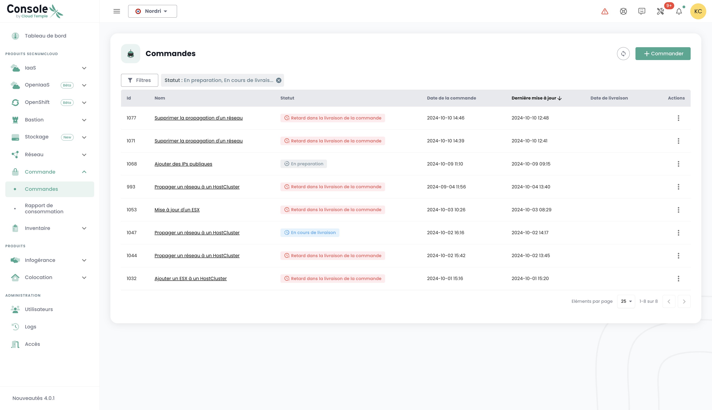
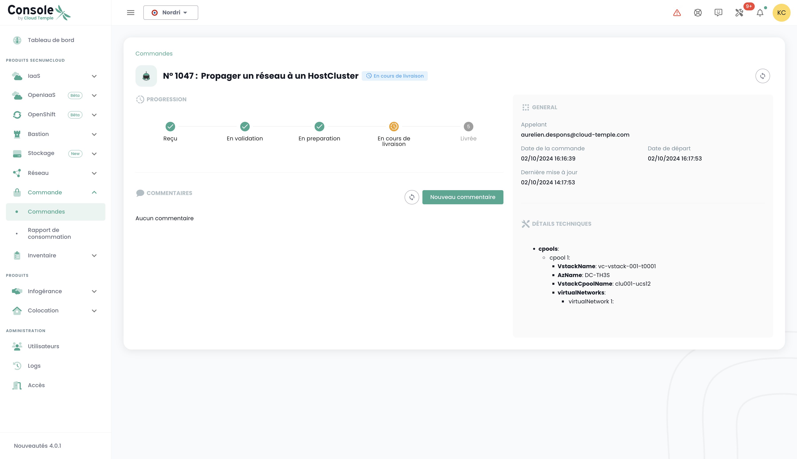
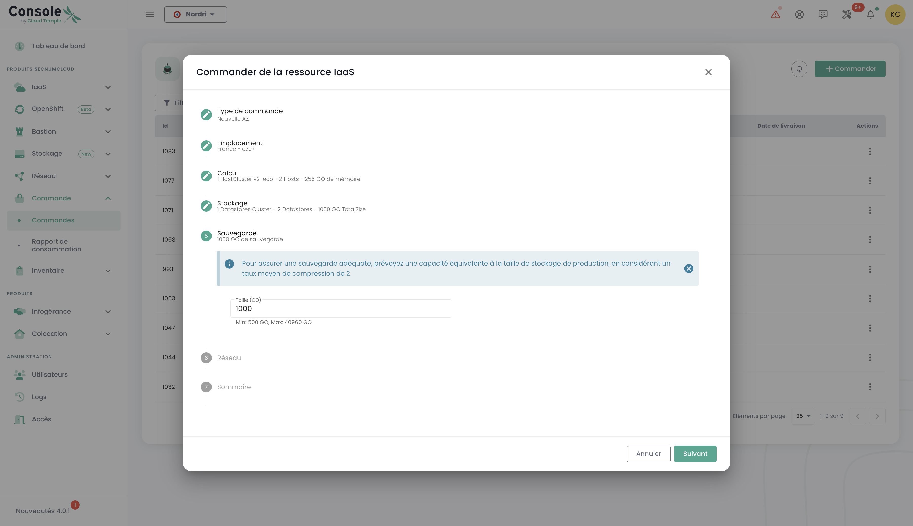
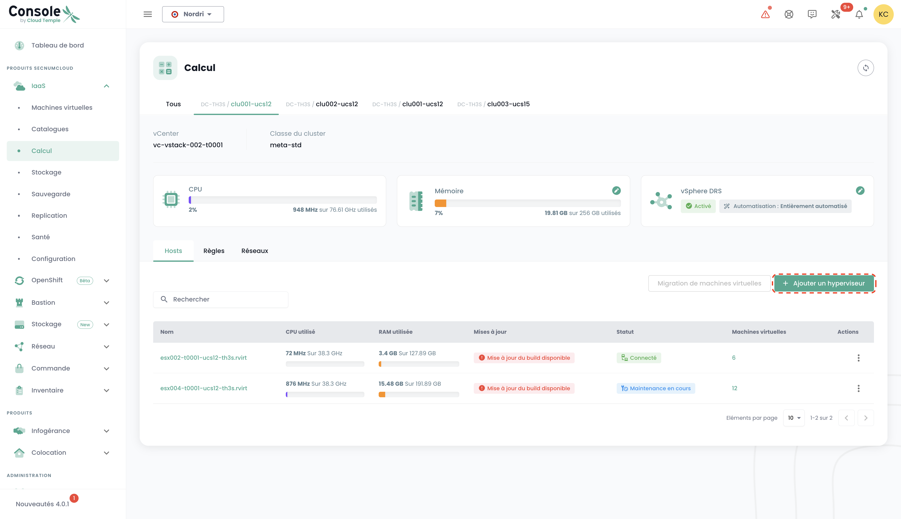

## Concept
Monitoring the deployment of new resources is done through the __'Orders'__ menu, accessible in the green banner on the left side of the screen.

It allows you to view Cloud resources ordered, currently being deployed, and any possible errors within a [tenant](tenants.md) of your [Organization](organisations.md).

*__Note: At this moment, a global view at the organization level of all the resources deployed across different tenants is not yet possible.__ This issue will be addressed in 2024 through the implementation of a portal dedicated to the principal (in the sense of the signatory) and the management of their organization.*

The deployment or deletion of resources is done within each product through the __'IaaS'__ and __'Network'__ menus on the left side of the screen in the green banner.

It is also possible to directly view deliveries through the notification system of the Cloud Temple console:

{:height="50%" width="50%"}

From the orders page, you can view the progress of a delivery and possibly interact with the team by providing comments or clarifications:

**Note**: **It is not possible to initiate multiple orders of the same resource type simultaneously. Therefore, you must wait for the current order to be processed and finalized before placing a new one. This ensures an efficient and orderly management of resources within your environment.**

## Order a new availability zone
It is possible to add a new availability zone by accessing the "**Order**" menu. This option allows you to expand your resources and improve the availability and resilience of your applications in just a few clicks:

First, select the desired location by first choosing the geographical region, then the corresponding availability zone (AZ) from those that are available. This step enables you to tailor the deployment of your resources according to the location and requirements of your infrastructure:

Next, proceed to select the type of hypervisor cluster you desire, choosing the one that best meets the performance and management needs of your cloud infrastructure:

Then, select the number of hypervisors and the desired amount of memory in order to tailor the resources to the workload and specific requirements of your cloud environment:

Next, select the number of datastores to provision in the cluster as well as their types. It is important to note that the maximum number of datastores allowed is 10, with a minimum of 2 datastores required. Each different type of datastore will lead to the creation of an additional datastoreCluster. For example, if you choose 2 "live" type datastores and 1 "mass" type datastore, this will result in the formation of 2 distinct datastoreClusters:

Define the necessary storage size for backup, ensuring to plan a capacity equivalent to your production storage. Take into account an average compression rate of 2 to optimize backup space and ensure effective protection of your data:

Select the networks to spread according to your needs. You also have the option to enable "Internet Access" if necessary, defining the number of desired IP addresses, with a choice ranging from 1 to a maximum of 8:

You will then obtain a summary of the selected options before validating your order.

## Order Additional Storage Resource
The logic for block storage allocation on computing clusters is [described here](../iaas/storage.md).

### Deploying a New Computing Cluster
Proceed to order a hypervisor cluster by selecting the options that are suited to your virtualization needs. Define the key features such as the number of hypervisors, the type of cluster, the amount of memory, as well as the required computing resources:

Select the availability zone:

Choose the type of compute blade:

You then have the option to select existing networks and propagate them, or to create new ones directly at this stage, according to the needs of your infrastructure. Note that the total number of configurable networks is limited to a maximum of 20:

You will then obtain a summary of the selected options before validating your order, and you can then view your ongoing order:

### Deploy a new storage cluster

In the "**Order**" menu, proceed to order a **new storage cluster** for your environment by selecting the options that meet your needs in terms of capacity, performance, and redundancy. Select the location:

Define the number of datastores to be provisioned in the cluster as well as their type, adhering to the following limits: a minimum of 2 datastores and a maximum of 10 can be configured. Choose the types of datastores that best meet your needs in terms of performance, capacity, and usage to optimize the storage for your environment:

Select the desired storage type from the various options available:

You will then access a complete summary of the options you have selected, allowing you to check all parameters before definitively validating your order:

### Deploy a new datastore within a VMware SDRS cluster
In this example, we will add block storage to a VMware infrastructure.
To add an additional datastore to your SDRS storage cluster, navigate to the __'Infrastructure'__ submenu and then to __'VMWare'__.
Then select the VMware stack and the availability zone. Next, go to the __'Storage'__ submenu.

Choose the SDRS cluster that fits the performance characteristics you are looking for and click on the __'Add a datastore'__ button located in the table 
with the list of datastores.

__Note__:
- *The size of the smallest LUN that can be activated on a cluster is __500 GiB__.*
- *The performance of a datastore can range from an average of 500 IOPS/TiB up to 15000 IOPS/TiB. __This is a software limitation implemented at the storage controller level__.*
- *The accounting of disk volume consumed by your organization is the total of all LUNs across all the AZs used.*
- *The __'order'__ and __'compute'__ permissions are required for the account to carry out this action.*

### Order New Networks
The network technology used in the Cloud Temple infrastructure is based on [VPLS](https://fr.wikipedia.org/wiki/Virtual_Private_LAN_Service). It allows you to benefit from __level 2 networks that are continuous between your availability zones within a region__. It is also possible to share networks between your tenants and to terminate them in a hosting area.
Essentially, you can think of a Cloud Temple network like an 802.1q VLAN that is available at every point within your tenant.

*The complete details of creating a new network are [described in the network section](../network/private_network.md).*

Ordering a new network and making decisions about sharing between your tenants are carried out in the __'Network'__ menu of the green banner on the left of the screen. Networks will first be created, and then a separate command will be generated to propagate them. You can follow the progress of ongoing orders by accessing the "Order" tab in the menu, or by clicking on the information labels that redirect you to active or processing orders.

It is also possible to propagate existing networks or to separate the two steps by starting with the network creation and then proceeding to propagate it later according to your needs. The propagation option is found in the options of the selected network:

Click on the "Propagate" option for an existing network, then select the desired target for propagation. This step allows you to define the location or resources to which the network should be propagated:

### Deactivation of a Network

A network can also be disabled if necessary. This option allows you to temporarily pause access to, or usage of, the network without permanently deleting it, thus offering flexibility in managing your infrastructure according to your needs.

The disable option is located in the selected network's options.

## Adding Additional Hypervisors to a Compute Cluster
The logic of computation clusters' operation is [described here]().

The addition of hypervisors to a computation cluster is done in the __'IaaS'__ menu in the green banner on the left of the screen.
In the following example, we will add computing power to a hypervisor cluster using VMware technology.

Go to the __'Infrastructure'__ submenu and then __'VMWare'__. Then choose the VMware stack, the availability zone, and the computation cluster.
In this example, it is __'clu001-ucs12'__. Click on the __'Add a host'__ button located in the table with the list of hosts, at the top right.

__note__:

- *__The configuration of a cluster must be homogeneous__. Therefore, it is not allowed to mix hypervisor types within a cluster. All blades must be of the same type.*
- *The __'order'__ and __'compute'__ rights are necessary for the account to carry out this action.*

## Add additional memory resources to a computation cluster

The logic governing memory allocation on compute clusters is [described here](../iaas/compute.md).

To add RAM to a cluster, you need to go to the cluster's configuration settings (as seen previously for adding a compute host) and click on __'Edit Memory'__.

{:height="70%" width="70%"}

__Note__:
- *__Machines are delivered with the full amount of physical memory__. Unleashing the memory resource is simply a software activation at the cluster level.*
- *It is not possible to modify the amount of physical memory for a type of blade. Be sure to consider the maximum capacity of a blade when creating a cluster.*
- *The __'order'__ and __'compute'__ permissions are required on the account to carry out this action.*