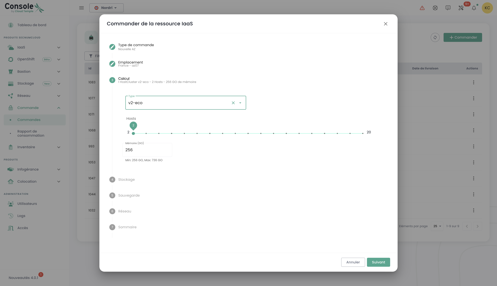
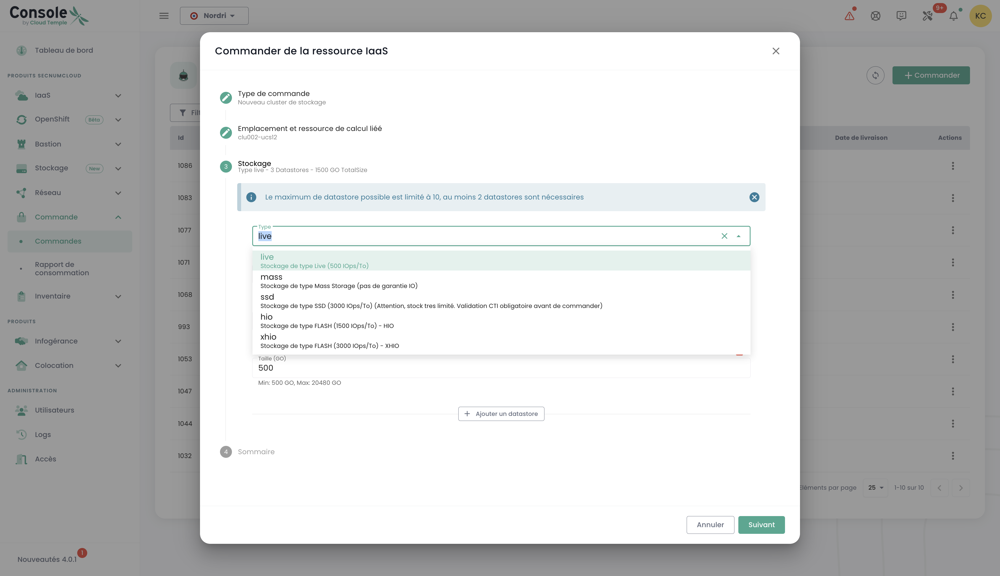
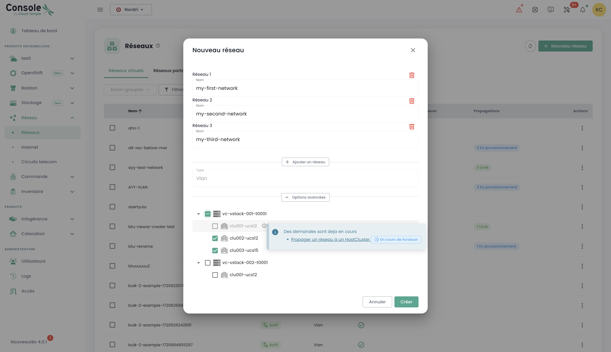
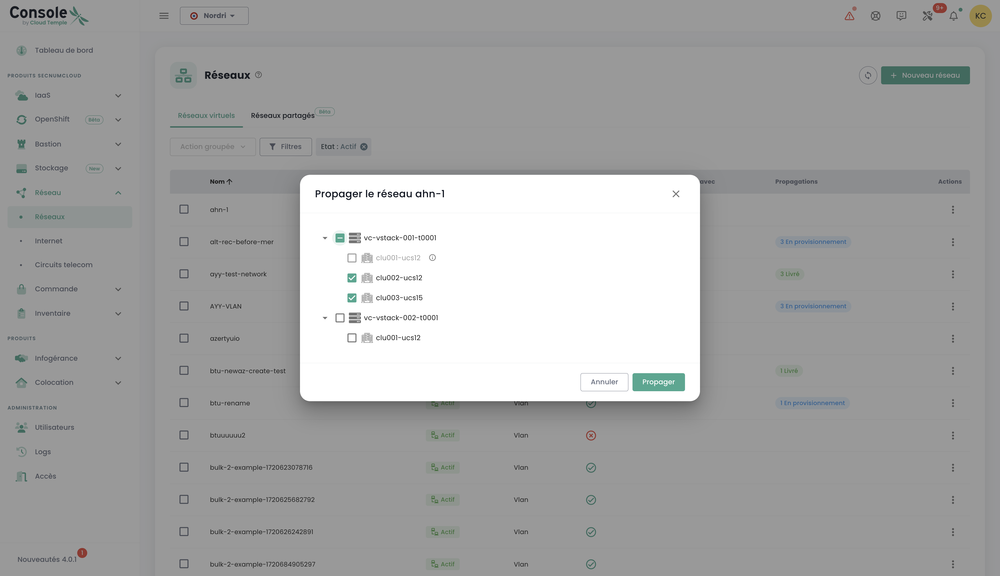

## Concepto

El seguimiento del despliegue de nuevos recursos se realiza en el menú __'Pedidos'__ accesible en la barra verde a la izquierda de la pantalla.

Permite visualizar los recursos Cloud solicitados, en proceso de despliegue y los posibles errores dentro de un [tenant](tenants.md) de su [Organización](organisations.md).

*__Nota: En este momento, la vista global a nivel de una organización de todos los recursos desplegados en los diferentes tenants aún no es posible.__ Este tema será tratado en 2024 mediante la implementación de un portal dedicado al solicitante (en el sentido de firmante) y a la gestión de su organización.*

El despliegue de recursos o su eliminación se hacen en cada uno de los productos en los menús __'IaaS'__ y __'Red'__ a la izquierda de la pantalla en la barra verde.

También es posible ver directamente las entregas a nivel de las notificaciones de la consola Cloud Temple:

{:height="50%" width="50%"}

Desde la página de pedidos, puede ver el estado de avance de una entrega y posiblemente dialogar con el equipo aportando comentarios o precisiones:

**Nota**: **No es posible lanzar varios pedidos del mismo tipo de recurso simultáneamente. Por lo tanto, deberá esperar a que el pedido en curso sea procesado y finalizado antes de poder realizar uno nuevo. Esto garantiza una gestión eficaz y ordenada de los recursos dentro de su entorno.**

## Solicitar una nueva zona de disponibilidad
Es posible agregar una nueva zona de disponibilidad accediendo al menú "**Orden**". Esta opción le permite expandir sus recursos y mejorar la disponibilidad y resiliencia de sus aplicaciones con solo unos pocos clics:

Comenzamos seleccionando la ubicación deseada, eligiendo primero la región geográfica y luego la zona de disponibilidad (AZ) correspondiente de las que están disponibles. Este paso permite adaptar la implementación de sus recursos en función de la ubicación y los requisitos de su infraestructura:

Luego, proceda a seleccionar el tipo de clúster de hipervisor deseado, eligiendo el que mejor se adapte a las necesidades de rendimiento y gestión de su infraestructura en la nube:

A continuación, seleccione el número de hipervisores y la cantidad de memoria deseada, a fin de adaptar los recursos a la carga de trabajo y los requisitos específicos de su entorno en la nube:

Luego seleccione el número de almacenes de datos a aprovisionar en el clúster así como sus tipos. Es importante tener en cuenta que el número máximo de almacenes de datos permitidos es de 10, con un mínimo de 2 almacenes de datos requeridos. Cada tipo de almacén de datos diferente resultará en la creación de un datastoreCluster adicional. Por ejemplo, si elige 2 almacenes de datos tipo "en vivo" y 1 almacén de datos tipo "masa", esto dará lugar a la formación de 2 datastoreClusters distintos:

Defina el tamaño de almacenamiento necesario para la copia de seguridad asegurándose de prever una capacidad equivalente a la de su almacenamiento de producción. Considere un índice de compresión promedio de 2 para optimizar el espacio de copia de seguridad y asegurar una protección eficaz de sus datos:

Seleccione las redes para propagar de acuerdo con sus necesidades. También tiene la opción de activar la opción de "Acceso a Internet" si es necesario, definiendo la cantidad de direcciones IP deseadas, con una elección de entre 1 y un máximo de 8:

Luego obtiene un resumen de las opciones seleccionadas antes de validar su orden.

## Solicitar almacenamiento adicional
La lógica de asignación de almacenamiento en modo bloque en los clústeres de cálculo está [descrita aquí](../iaas/storage.md).

### Desplegar un nuevo clúster de cálculo
Realice el pedido de un clúster de hipervisor seleccionando las opciones adecuadas para sus necesidades de virtualización. Defina las características clave como la cantidad de hipervisores, el tipo de clúster, la cantidad de memoria, así como los recursos de computación requeridos:

Seleccione la zona de disponibilidad:

Elija el tipo de blade de cómputo:

Luego tiene la opción de seleccionar redes ya existentes y propagarlas, o de crear nuevas directamente en este paso, según las necesidades de su infraestructura. Tenga en cuenta que el número total de redes configurables está limitado a un máximo de 20:

Luego obtiene un resumen de las opciones seleccionadas antes de validar su pedido y puede visualizar su pedido en curso:

### Desplegar un nuevo clúster de almacenamiento
En el menú "**orden**", proceda al pedido de un **nuevo clúster de almacenamiento** para su entorno seleccionando las opciones que correspondan a sus necesidades en términos de capacidad, rendimiento y redundancia. Seleccione la ubicación:

Defina el número de almacenes de datos a aprovisionar en el clúster, así como su tipo, respetando los límites siguientes: un mínimo de 2 almacenes de datos y un máximo de 10 pueden configurarse. Elija los tipos de almacenes de datos que respondan mejor a sus necesidades en términos de rendimiento, capacidad y uso, a fin de optimizar el almacenamiento de su entorno:

Seleccione el tipo de almacenamiento deseado entre las diferentes opciones disponibles:

A continuación, accede a un resumen completo de las opciones que ha seleccionado, lo que le permite verificar todos los parámetros antes de validar definitivamente su pedido:

### Desplegar un nuevo almacén de datos dentro de un clúster SDRS VMware

En este ejemplo, vamos a añadir almacenamiento en modo bloque para una infraestructura VMware.
Para agregar un datastore adicional en su clúster de almacenamiento SDRS, diríjase al submenú __'Infraestructura'__ y luego a __'VMWare'__.
Seleccione entonces la pila vmware y la zona de disponibilidad. Después, vaya al submenú __'Almacenamiento'__.

Elija el clúster SDRS que corresponde a las características de rendimiento que desea y haga clic en el botón __'Agregar un datastore'__ que se encuentra en la tabla 
con la lista de los datastores.

{:height="90%" width="90%"}

__nota__ :  
- *El tamaño del LUN más pequeño que se puede activar en un clúster es de __500 Gio__.*  
- *El rendimiento de un datastore varía desde 500 iops/Tio en promedio hasta 15000 iops/Tio en promedio. __Esto es una restricción de software realizada a nivel de los controladores de almacenamiento__.*  
- *La compatibilidad del volumen de disco consumido por su organización es la suma de todos los LUN en todas las ZA utilizadas*.  
- *Los permisos __'order'__ así como __'compute'__ son necesarios en la cuenta para llevar a cabo esta acción.*

### Solicitar nuevas redes

La tecnología de red utilizada en la infraestructura de Cloud Temple se basa en [VPLS](https://fr.wikipedia.org/wiki/Virtual_Private_LAN_Service). Esto le permite beneficiarse de __redes de nivel 2 en continuidad entre sus zonas de disponibilidad dentro de una región__. También es posible compartir redes entre sus arrendatarios y terminarlas en zona de alojamiento.
Básicamente, puede imaginar una red de Cloud Temple como una vlan 802.1q disponible en cualquier punto de su arrendatario.

*El detalle completo de la creación de una nueva red está [descrito en la sección de redes](../network/private_network.md).*

El pedido de una nueva red y las decisiones de compartir entre sus arrendatarios se realizan en el menú __'Red'__ de la barra verde a la izquierda de la pantalla. Las redes se crearán primero, y luego se generará un pedido separado para su propagación. Puede seguir el progreso de los pedidos en curso accediendo a la pestaña "Pedido" en el menú, o haciendo clic en las etiquetas de información que lo redirigen a los pedidos activos o en proceso.

También es posible propagar redes ya existentes o separar las dos etapas, comenzando por la creación de la red y luego procediendo a la propagación posteriormente según sus necesidades. La opción de propagación se encuentra en las opciones de la red seleccionada:

Haga clic en la opción "Propagar" para una red ya existente, luego seleccione el objetivo de propagación deseado. Este paso le permite definir la ubicación o los recursos sobre los cuales la red debe ser propagada:

### Desactivación de una red
Una red también puede ser desactivada si es necesario. Esta opción le permite pausar temporalmente el acceso o el uso de la red sin eliminarla de forma permanente, ofreciendo así flexibilidad en la gestión de su infraestructura según sus necesidades.

La opción para desactivar se encuentra en las opciones de la red seleccionada.

## Añadir hipervisores adicionales a un clúster de cálculo

La lógica de funcionamiento de los clústeres de cálculo está [descrita aquí]().

La adición de hipervisores a un clúster de cálculo se realiza en el menú __'IaaS'__ en la banda verde a la izquierda de la pantalla.
En el siguiente ejemplo, vamos a agregar capacidad de cálculo a un clúster de hipervisores utilizando la tecnología VMware.

Vaya al submenú __'Infraestructura'__ y luego __'VMWare'__. Elija la pila de VMware y la zona de disponibilidad y el clúster de cálculo.
En este ejemplo, es el __'clu001-ucs12'__. Haga clic en el botón __'Agregar un host'__ que se encuentra en la tabla con la lista de hosts, en la parte superior derecha.

__nota__ : 

- *__La configuración de un clúster debe ser homogénea__. Por lo tanto, no está permitido mezclar tipos de hipervisores dentro de un clúster. Todas las cuchillas deben ser del mismo tipo.*
- *Los permisos __'order'__ así como __'compute'__ son necesarios para la cuenta para llevar a cabo esta acción.*

{:height="80%" width="80%"}

## Añadir recursos de memoria adicionales a un clúster de cálculo
La lógica de asignación de memoria en los clústeres de cálculo está [descrita aquí](../iaas/compute.md).

Para agregar más memoria RAM en un clúster, simplemente hay que ir a la configuración del clúster (como se vio anteriormente para la adición de un host de cálculo) y hacer clic en __'Modificar la memoria'__.

{:height="70%" width="70%"}

__nota__ :  
- *__Las máquinas se entregan con la totalidad de la memoria física__. La liberación de recursos de memoria es solo una activación a nivel de software en un clúster.*  
- *No es posible modificar la cantidad de memoria física de un tipo de blade. Hay que tener en cuenta la capacidad máxima de una blade al crear un clúster.*  
- *Se necesitan los permisos __'order'__ y __'compute'__ en la cuenta para realizar esta acción.*
