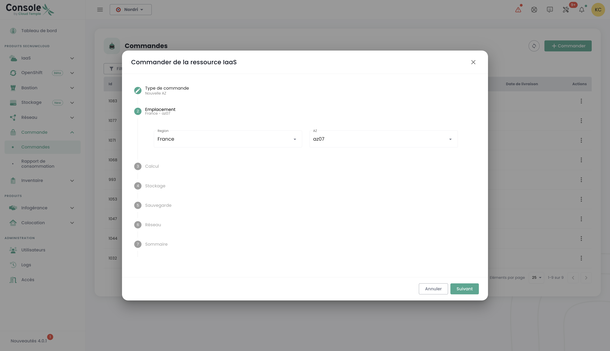
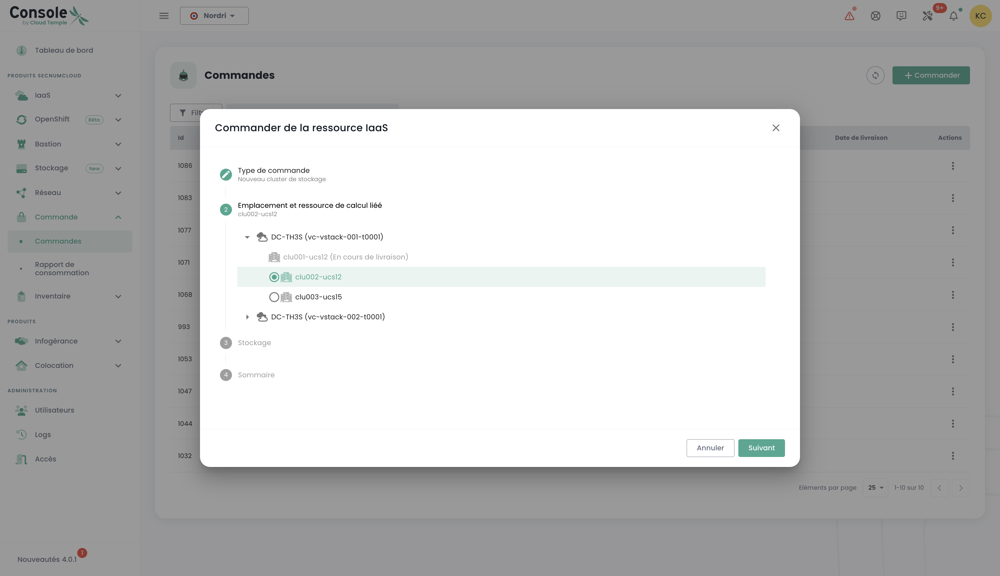
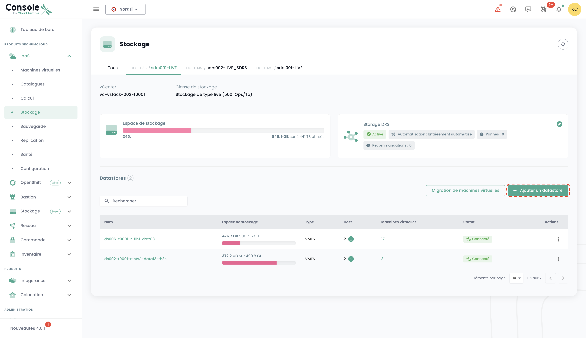

## Concetto
Il monitoraggio del deployment di nuove risorse avviene nel menu __'Ordini'__ accessibile dalla barra verde sulla sinistra dello schermo.

Consente di visualizzare le risorse Cloud ordinate, in fase di deployment e gli eventuali errori all'interno di un [tenant](tenants.md) della vostra [Organizzazione](organisations.md).

*__Nota: Al momento, la visione globale a livello di un'organizzazione di tutte le risorse dispiegate nei diversi tenant non è ancora possibile.__ Questa questione sarà affrontata nel 2024 con l'implementazione di un portale dedicato al committente (in quanto firmatario) e alla gestione della sua organizzazione.*

Il deployment delle risorse o la loro eliminazione avviene in ciascuno dei prodotti nei menu __'IaaS'__ e __'Rete'__ sulla sinistra dello schermo nella barra verde.

È anche possibile visualizzare direttamente le consegne a livello delle notifiche della console Cloud Temple:

{:height="50%" width="50%"}

Dalla pagina degli ordini, potete vedere lo stato di avanzamento di una consegna e eventualmente dialogare con il team fornendo commenti o chiarimenti:

**Nota**: **Non è possibile effettuare più ordini dello stesso tipo di risorsa contemporaneamente. Dovrete quindi attendere che l'ordine in corso sia trattato e finalizzato prima di poter effettuarne uno nuovo. Questo garantisce una gestione efficace e ordinata delle risorse all'interno del vostro ambiente.**

## Ordinare una nuova area di disponibilità

È possibile aggiungere una nuova zona di disponibilità accedendo al menu "**Ordine**". Questa opzione vi permette di estendere le vostre risorse e di migliorare la disponibilità e la resilienza delle vostre applicazioni in pochi clic:

Si inizia selezionando la località desiderata, scegliendo prima la regione geografica e poi la zona di disponibilità (AZ) corrispondente tra quelle disponibili. Questo passaggio consente di adattare il dispiegamento delle risorse in funzione della localizzazione e delle esigenze della vostra infrastruttura:

Successivamente, procedete alla selezione del tipo di cluster di ipervisor desiderato, scegliendo quello che meglio soddisfa le necessità di prestazione e gestione della vostra infrastruttura cloud:

Selezionate poi il numero di ipervisor nonché la quantità di memoria desiderata, al fine di adattare le risorse al carico di lavoro e alle esigenze specifiche del vostro ambiente cloud:

Selezionate in seguito il numero di datastore da provisionare nel cluster e i loro tipi. È importante notare che il numero massimo di datastore consentiti è di 10, con un minimo di 2 datastore richiesti. Ogni tipo di datastore diverso comporterà la creazione di un datastoreCluster aggiuntivo. Per esempio, se scegliete 2 datastore di tipo "live" e 1 datastore di tipo "mass", questo risultarebbe nella formazione di 2 datastoreClusters distinti:

Definite la dimensione dello spazio di archiviazione necessaria per il backup assicurandovi di prevedere una capacità equivalente a quella del vostro archivio di produzione. Considerate un tasso medio di compressione di 2 per ottimizzare lo spazio di salvataggio e assicurare una protezione efficiente dei vostri dati:

Selezionate le reti da propagare in base alle vostre necessità. Avete anche la possibilità di attivare l'opzione "Accesso internet" se necessario, definito il numero di indirizzi IP richiesti, con una scelta che varia da 1 a un massimo di 8:

Otterrete quindi un sommario delle opzioni selezionate prima di convalidare il vostro ordine.

## Ordinare risorse di archiviazione aggiuntive

La logica di allocazione dello spazio di archiviazione in modalità blocco sui cluster di calcolo è [descritta qui](../iaas/storage.md).

### Distribuire un nuovo cluster di calcolo
Procedere con l'ordine di un cluster di ipervisor selezionando le opzioni adatte alle vostre esigenze di virtualizzazione. Definire le caratteristiche chiave come il numero di ipervisori, il tipo di cluster, la quantità di memoria e le risorse di calcolo necessarie:

Selezionare l'area di disponibilità:

Scegliere il tipo di lama di calcolo:

Avete poi la possibilità di selezionare reti già esistenti e propagarle, o di crearne di nuove direttamente a questa tappa, secondo le necessità della vostra infrastruttura. Da notare che il numero totale di reti configurabili è limitato a un massimo di 20:

Si ottiene quindi un riepilogo delle opzioni selezionate prima di convalidare l'ordine e si può poi visualizzare l'ordine in corso:

### Implementare un nuovo cluster di memorizzazione
Nel menu "**ordine**", procedere all'ordine di un **nuovo cluster di archiviazione** per il vostro ambiente, selezionando le opzioni che corrispondono ai vostri bisogni in termini di capacità, prestazioni e ridondanza. Selezionate la posizione:

Definire il numero di datastore da provisionare nel cluster come pure il loro tipo, rispettando i seguenti limiti: un minimo di 2 datastore e un massimo di 10 possono essere configurati. Scegliete i tipi di datastore che soddisfano al meglio le vostre necessità in termini di prestazioni, capacità e utilizzo, al fine di ottimizzare l'archiviazione del vostro ambiente:

Selezionate il tipo di archiviazione desiderato tra le varie opzioni disponibili:

Successivamente accederete a un riepilogo completo delle opzioni che avete selezionato, permettendovi di verificare tutti i parametri prima di convalidare definitivamente il vostro ordine:

### Implementare un nuovo datastore all'interno di un cluster SDRS VMware
In questo esempio, aggiungeremo dello storage in modalità blocco per un'infrastruttura VMware.
Per aggiungere un datastore supplementare nel vostro cluster di storage SDRS, andate nel sottomenu __'Infrastruttura'__ poi __'VMWare'__.
Scegliete quindi lo stack VMware e l'area di disponibilità. Andate successivamente nel sottomenu __'Archiviazione'__.

Scegliete il cluster SDRS che corrisponde alle caratteristiche di prestazione che desiderate e cliccate sul pulsante __'Aggiungi un datastore'__ che è situato nella tabella
con l'elenco dei datastores.

{:height="90%" width="90%"}

__nota__:
- *La dimensione della più piccola LUN che può essere attivata su un cluster è di __500 Gio__.*
- *Le prestazioni di un datastore vanno da 500 iops/Tio in media fino a 15000 iops/Tio in media. __Questo è un limitazione software realizzata a livello dei controller di archiviazione__.*
- *La contabilità del volume di disco consumato dalla vostra organizzazione è la somma di tutte le LUN su tutte le AZ utilizzate.*
- *I diritti __'order'__ oltre a __'compute'__ sono necessari per l'account per portare a termine questa azione.*

### Ordinare nuove reti
La tecnologia di rete utilizzata sull'infrastruttura Cloud Temple si basa su [VPLS](https://fr.wikipedia.org/wiki/Virtual_Private_LAN_Service). Essa vi consente di beneficiare di __reti di livello 2 in continuità fra le vostre zone di disponibilità all'interno di una regione__. È anche possibile condividere reti fra i vostri tenants e terminarle in zona di hosting.
Fondamentalmente, potete immaginare una rete Cloud Temple come un vlan 802.1q disponibile in ogni punto del vostro tenant.

*Il dettaglio completo della creazione di una nuova rete è [descritto nella sezione reti](../network/private_network.md).*

L'ordine di una nuova rete e le decisioni di condivisione fra i vostri tenants vengono effettuate nel menù __'Rete'__ della barra verde a sinistra dello schermo. Le reti verranno prima create, poi un ordine distinto verrà generato per la loro diffusione. Potete seguire il progresso degli ordini in corso accedendo alla scheda "Ordine" nel menù, o cliccando sulle etichette informative che reindirizzano agli ordini attivi o in elaborazione.

È inoltre possibile diffondere reti già esistenti o separare le due fasi, iniziando con la creazione della rete e poi procedendo alla diffusione successivamente in base alle vostre necessità. L'opzione di diffusione si trova nelle opzioni della rete selezionata:

Cliccate sull'opzione "Propagare" per una rete già esistente, poi selezionate l'obiettivo di diffusione desiderato. Questa fase vi permette di definire il luogo o le risorse sulle quali la rete deve essere diffusa:

### Disattivazione di una rete

Una rete può anche essere disabilitata se necessario. Questa opzione consente di mettere in pausa temporaneamente l'accesso o l'utilizzo della rete senza rimuoverla definitivamente, offrendo così una flessibilità nella gestione della vostra infrastruttura in base alle vostre esigenze.

L'opzione per disabilitare si trova nelle opzioni della rete selezionata.

## Aggiunta di ulteriori hypervisor a un cluster di calcolo
La logica di funzionamento dei cluster di calcolo è [descritta qui]().

L'aggiunta di hypervisor a un cluster di calcolo si effettua nel menu __'IaaS'__ nella barra verde a sinistra dello schermo.
Nell'esempio seguente, andremo ad aggiungere del calcolo su un cluster di hypervisor che utilizza la tecnologia VMware.

Andate nel sotto menu __'Infrastruttura'__ e poi __'VMWare'__. Scegliete quindi lo stack vmware e la zona di disponibilità e il cluster di calcolo.
In questo esempio, si tratta del __'clu001-ucs12'__. Cliccate sul pulsante __'Aggiungi un host'__ che si trova nella tabella con l'elenco degli host, in alto a destra.

__nota__ :

- *__La configurazione di un cluster deve essere omogenea__. Pertanto, non è consentito mischiare i tipi di hypervisor all'interno di un cluster. Tutte le lame devono essere dello stesso tipo.*
- *I diritti __'order'__ così come __'compute'__ sono necessari per l'account per portare a termine questa azione.*

{:height="80%" width="80%"}

## Aggiungere risorse di memoria supplementare a un cluster di calcolo
La logica di allocazione della memoria sui cluster di calcolo è [descritta qui](../iaas/compute.md).

Per aggiungere memoria RAM su un cluster, è sufficiente andare alla configurazione del cluster (come per l'aggiunta di un host di calcolo precedentemente vista) e fare clic su __'Modifica la memoria'__.

{:height="70%" width="70%"}

__nota__:  
- *__Le macchine sono fornite con la totalità della memoria fisica__. Lo sblocco della risorsa memoria è solo un'attivazione software a livello di cluster.*  
- *Non è possibile modificare la quantità di memoria fisica di un tipo di lama. Tenere presente la capacità massima di una lama durante la creazione di un cluster.*  
- *I diritti __'order'__ e __'compute'__ sono necessari al conto per eseguire questa azione.*