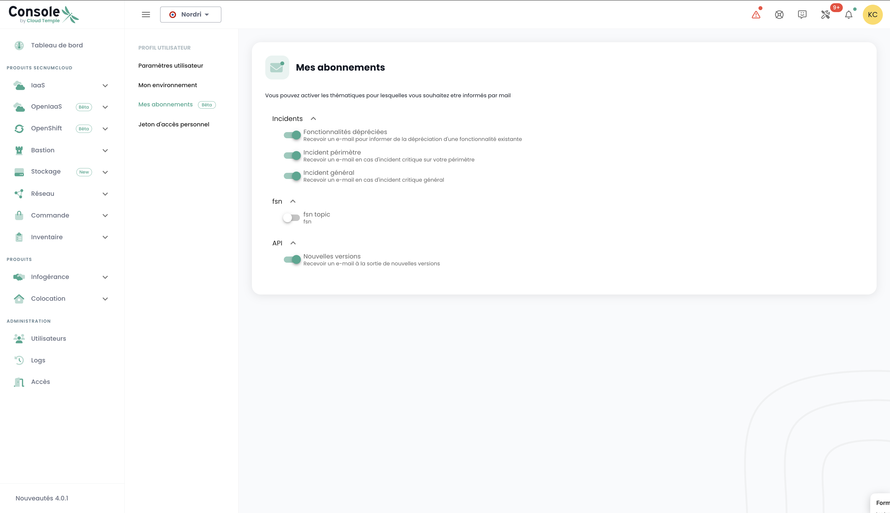
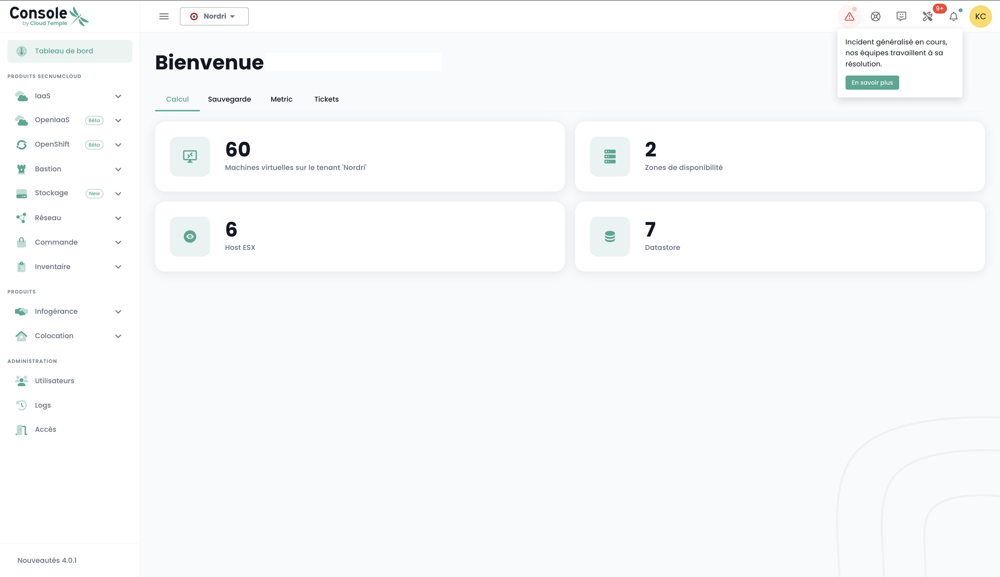

Wie jede Cloud-Infrastrukturplattform unterliegt die Cloud Temple-Plattform regelmäßigen Wartungsarbeiten und sowohl Hardware- als auch Softwarepflege.

### Verwaltung von Benachrichtigungen
Um Benutzer schnell über neue Vorfälle zu informieren, wurde ein E-Mail-Benachrichtigungssystem eingerichtet. Über ihre Benutzerprofile können Benutzer über einen Tab mit dem Titel __'*Meine Abonnements*'__ sich für Benachrichtigungen für zwei Arten von Vorfällen anmelden. Dadurch erhalten sie eine E-Mail innerhalb einer sehr kurzen Zeit, wenn ein Vorfall gemeldet oder gelöst wird.

__Bleiben Sie in Echtzeit über globale Vorfälle informiert__: Wir empfehlen Ihnen dringend, sich für Vorfall-Benachrichtigungen zu registrieren. Indem Sie diesen Service abonnieren, werden Sie direkt über jegliche Störungen oder Vorfälle informiert, die unsere Plattform betreffen, sowie über Aktualisierungen bei deren Lösung. Dies stellt sicher, dass Sie auch außerhalb Ihrer regelmäßigen Überprüfungen sofortige Warnungen erhalten, was Ihnen erlaubt, entsprechend zu planen und mögliche Auswirkungen auf Ihre Aktivitäten zu minimieren. Registrieren Sie sich jetzt für Vorfall-Benachrichtigungen, um sicherzustellen, dass Sie immer in der Kommunikationsschleife für ein möglichst reibungsloses Benutzererlebnis bleiben, selbst in Zeiten der Unterbrechung.

__Zugriff jederzeit__: Falls die Konsole unzugänglich wird, bleibt unsere öffentliche Statusseite, https://status.cloud-temple.com, verfügbar, um Echtzeit-Updates über die Situation zu bieten und während der Behebung des Vorfalls volle Transparenz zu gewährleisten.

Der Betreff der E-Mail wird den Typ des Vorfalls angeben und, im Fall eines perimeterspezifischen Vorfalls, den Namen des betroffenen Perimeters. Die Benachrichtigung wird ebenfalls einen Link enthalten, der einen direkten Zugang zu den Details des Vorfalls ermöglicht:

## Zugang zu laufenden Operationen und Vorfällen
Das Symbol für die Überwachung von Vorgängen ermöglicht es, die geplanten Operationen auf der Cloud Temple-Infrastruktur sowie die auf dem Mandanten eröffneten Vorfälle zu visualisieren. Dieses Symbol ist in der Symbolleiste oben links auf dem Bildschirm zugänglich und hat die Form eines __'Werkzeuge'__ Symbols.

{:style="width:300px"}

Dieses Symbol zielt darauf ab, eine Sichtbarkeit über geplante, laufende und abgeschlossene Eingriffe und/oder Vorfälle auf dem Mandanten zu bieten.

Wenn Eingriffe und/oder Vorfälle laufend sind, erscheint eine Zahl auf dem Symbol.

Durch Klicken auf Schnellansicht finden Sie die laufenden Eingriffe. Es ist auch möglich, auf __‘Alle Eingriffe’__ oder __‘Alle Vorfälle und Berichte des Mandanten’__ zu klicken, um mehr Details anzuzeigen.

## Überwachung der geplanten Interventionen

Die Seite "Interventionen" besteht aus zwei Registerkarten. Die erste Registerkarte ermöglicht die Anzeige der geplanten Interventionen für die nächsten 30 Tage und der laufenden Interventionen.

Abgeschlossene Interventionen sind in der zweiten Registerkarte 'Abgeschlossen' zu sehen.

Der Zugriff auf diese Informationen erfordert für das Benutzerprofil die Berechtigung '**intervention_read**'.

## Verwaltung von Vorfällen
Zwei Arten von Vorfällen sind zu unterscheiden: globale Vorfälle, die das gesamte System betreffen, und incidents spezifisch für einen Kundenbereich, die nur die Ressourcen oder Dienste beeinträchtigen, die einem bestimmten Kunden zugeordnet sind.

### Globale Vorfälle
Die Wiederherstellung von Informationen bezüglich globaler Vorfälle erfordert keine besonderen Berechtigungen. Ein rotes Banner wird angezeigt, sobald die Verbindung zur Konsole hergestellt wird, um vor einem laufenden globalen Vorfall zu warnen. Der Benutzer hat die Möglichkeit, dieses Banner während seiner Sitzung vorübergehend auszublenden, aber es wird bei jeder neuen Anmeldung oder beim Aktualisieren der Seite wieder erscheinen, solange der Vorfall nicht gelöst ist.

Der Button __'Mehr erfahren'__ leitet zur öffentlichen Statusseite https://status.cloud-temple.com weiter, wo zusätzliche Informationen zum aktuellen Vorfall abgerufen werden können:

Es ist möglich, Berichte über globale Vorfälle zu erhalten. Der Zugang zu diesen Berichten erfordert die spezielle Berechtigung '**incident_management**'. 

Hier ein Beispiel für den Tab, der diese Berichte anzeigt:

### Vorfälle im Zuständigkeitsbereich des Auftraggebers

Die Sichtbarkeit von spezifischen Vorfällen, die einen Kundenbereich betreffen, erfordert die Berechtigung **incident_read**. Diese Vorfälle werden durch ein dediziertes Symbol dargestellt, das mit einem roten Badge versehen ist, welches die Anzahl der laufenden Vorfälle anzeigt.

Das Symbol ist anklickbar und ermöglicht es, die mit den Vorfällen verbundenen Tickets aufzulisten. Jedes Ticket enthält einen Link zu den Details des Vorfalls, der es ermöglicht, den Fortschritt ihrer Lösung zu verfolgen:

Um die Details eines Vorfalls einsehen zu können, ist es notwendig, der Verfasser des Vorfalltickets zu sein oder die Berechtigung **support_management** zu besitzen.