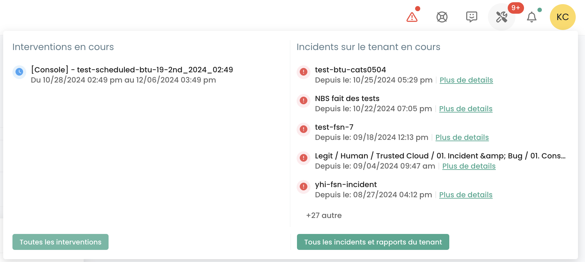

Like any Cloud infrastructure platform, the Cloud Temple platform is subject to regular hardware and software works and maintenance.

### Notification Management
To swiftly inform users in the event of a new incident, an email notification system has been implemented. From their user profile, a tab titled __'*My Subscriptions*'__ allows users to subscribe to notifications for two types of incidents. Thus, they will receive an email in a very short time frame upon the declaration or resolution of an incident.

__Stay informed in real-time in case of a global incident__: We strongly recommend that you sign up for incident notifications. By subscribing to this service, you will be directly informed of any disruptions or incidents affecting our platform, as well as the update upon its resolution. This ensures that, even outside of your regular checks, you will receive immediate alerts, allowing you to plan accordingly and minimize potential impacts on your activities. Register now for incident notifications to ensure you are always in the loop of communication for the smoothest possible user experience, even during service interruptions.

__Access at any time__: In the event that the console becomes inaccessible, our public status site, https://status.cloud-temple.com, remains available to provide real-time updates on the situation, ensuring full transparency throughout the resolution of the incident.

The subject line of the email will indicate the type of incident and, in the case of an incident related to a scope, the name of the impacted scope. The notification will also contain a link for direct access to the incident details:

## Access to Ongoing Operations and Incidents
The operation tracking icon allows you to visualize the scheduled operations on the Cloud Temple infrastructure as well as the open incidents on the tenant. This icon is accessible in the top-left icon bar of the screen and has the shape of an 'Tools' icon.

{:style="width:300px"}

This icon aims to provide visibility on the scheduled, ongoing, and completed interventions and/or incidents on the tenant.

When interventions and/or incidents are in progress, a number appears on the icon.

By clicking on quick view, you will find the ongoing interventions. It is also possible to click on 'All Interventions' or 'All Tenant Incidents and Reports' for more details.

## Tracking of Scheduled Interventions
The Interventions page is composed of two tabs. The first tab displays the interventions planned for the next 30 days and the ongoing interventions.

Completed interventions, on the other hand, can be viewed in the second tab labeled 'Completed'

Access to this information requires the user profile to have '**intervention_read**' permission.

## Incident Management
Two types of incidents must be distinguished: global incidents, which affect the entire system, and incidents specific to a customer's scope, which only impact the resources or services associated with a particular client.

### Global Incidents
The retrieval of information regarding global incidents does not require any special permissions. A red banner is displayed as soon as the user connects to the console to warn of an ongoing global incident being resolved. Users have the option to temporarily hide this banner during their session, but it will reappear with each new connection or upon refreshing the page, as long as the incident remains unresolved.

The __'Learn more'__ button redirects to the public status page https://status.cloud-temple.com to track incidents, providing additional information about the ongoing incident:

It is possible to obtain reports of global incidents. Access to these reports requires the specific permission '**incident_management**'.

Here is an example of the tab displaying these reports:

### Incidents within a Sponsor's Scope
The visibility of incidents specific to a customer area requires the **incident_read** permission. These incidents are represented by a dedicated icon, accompanied by a red badge indicating the number of ongoing incidents.

The icon is clickable and allows for the listing of tickets associated with the incidents. Each ticket includes a link to the incident details, providing the opportunity to follow the progress of their resolution:

To view the details of an incident, it is necessary to be the author of the incident ticket or to have the **support_management** permission.