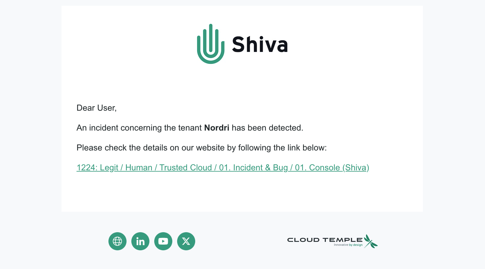
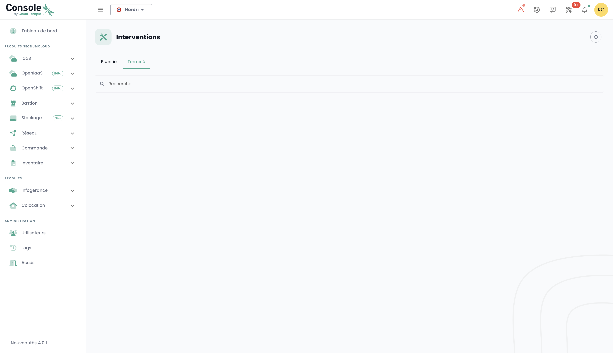
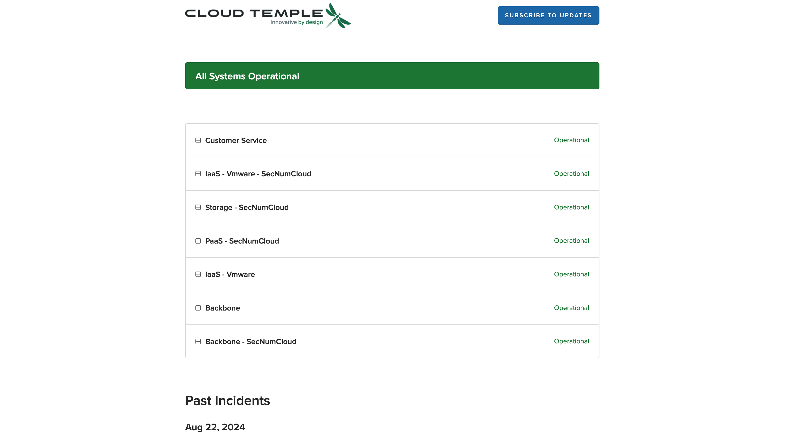
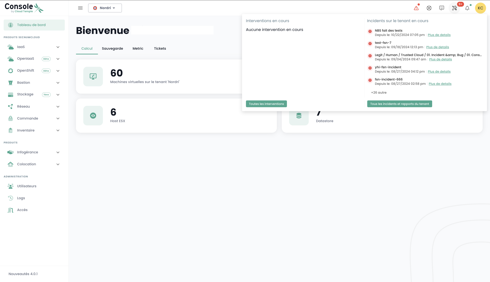

Come qualsiasi piattaforma d'infrastruttura Cloud, la piattaforma Cloud Temple è soggetta a lavori e manutenzioni hardware e software regolari.

### Gestione delle notifiche
Al fine di informare rapidamente gli utenti in caso di nuovo incidente, è stato messo in atto un sistema di notifiche via e-mail. Dal loro profilo utente, una scheda intitolata __'*I miei abbonamenti*'__ permette agli utenti di sottoscrivere le notifiche per i due tipi di incidenti. Così, riceveranno un'e-mail in un lasso di tempo molto breve alla dichiarazione o alla risoluzione di un incidente.

__Resta informato in tempo reale in caso di incidente globale__ : Vi consigliamo vivamente di iscrivervi alle notifiche di incidenti. Sottoscrivendo a questo servizio, sarete direttamente informati di qualsiasi perturbazione o incidente che influenzi la nostra piattaforma, così come l'aggiornamento alla sua risoluzione. Questo assicura che, anche al di fuori dei vostri controlli regolari, riceverete allerte immediate, permettendovi di pianificare di conseguenza e di minimizzare gli impatti potenziali sulle vostre attività. Iscrivetevi ora alle notifiche di incidenti per assicurarvi di essere sempre nel ciclo di comunicazione per un'esperienza utente il più fluida possibile, anche in periodi di interruzione.

__Accesso in qualsiasi momento__ : Nel caso in cui la console diventi inaccessibile, il nostro sito pubblico di stato, https://status.cloud-temple.com, rimane disponibile per fornire aggiornamenti in tempo reale sulla situazione, garantendo una totale trasparenza durante la risoluzione dell'incidente.

L'oggetto dell'e-mail indicherà il tipo di incidente e, in caso di incidente legato a un perimetro, il nome del perimetro impattato. La notifica conterrà anche un link che permette di accedere direttamente ai dettagli dell'incidente:

## Accesso alle operazioni e agli incidenti in corso

L'icona di monitoraggio delle operazioni consente di visualizzare le operazioni pianificate sull'infrastruttura Cloud Temple, così come gli incidenti aperti sul tenant. Questa icona è accessibile nella barra delle icone in alto a sinistra dello schermo ed ha la forma di un'icona __'Strumenti'__

{:style="width:300px"}

Questa icona mira a fornire una visibilità sulle operazioni pianificate, in corso e completate e/o sugli incidenti sul tenant.

Quando ci sono operazioni e/o incidenti in corso, un numero appare sull'icona.

Cliccando sulla visualizzazione rapida, si trovano le operazioni in corso. È anche possibile cliccare su __'Tutte le operazioni'__ o su __'Tutti gli incidenti e rapporti del tenant'__ per visualizzare più dettagli.

## Monitoraggio delle operazioni pianificate
La pagina Interventi è composta da due schede. La prima scheda permette di visualizzare gli interventi previsti per i prossimi 30 giorni e gli interventi in corso.

Gli interventi terminati invece sono visibili nella seconda scheda 'Completato'

L'accesso a queste informazioni richiede per il profilo dell'utente il permesso '**intervention_read**'.

## Gestione degli incidenti
Due tipi di incidenti devono essere distinti: gli incidenti globali, che colpiscono l'intero sistema, e gli incidenti specifici a un perimetro cliente, che influenzano solo le risorse o i servizi associati a un cliente particolare.

### Incidenti globali
Il recupero delle informazioni relative agli incidenti globali non richiede alcuna autorizzazione particolare. Appena si effettua il login alla console, viene mostrata una fascia rossa per segnalare la presenza di un incidente globale in corso di risoluzione. L'utente ha la possibilità di nascondere temporaneamente questa fascia durante la sua sessione, ma essa riapparirà ad ogni nuovo accesso o al refresh della pagina, fino a quando l'incidente non sarà risolto.

Il bottone __'Per sapere più'__ indirizza verso la pagina di stato pubblico https://status.cloud-temple.com per il monitoraggio degli incidenti, consentendo l'accesso a informazioni aggiuntive sull'incidente in corso:

È possibile ottenere i rapporti degli incidenti globali. L'accesso a questi rapporti richiede l'autorizzazione specifica '**incident_management**'.

Ecco un esempio della scheda che mostra questi rapporti:

### Incidenti su un ambito mandante
La visibilità degli incidenti specifici ad un ambito cliente richiede il permesso **incident_read**. Questi incidenti sono rappresentati da un'icona dedicata, accompagnata da un badge rosso che indica il numero di incidenti in corso.

L'icona è cliccabile, permettendo di elencare i biglietti associati agli incidenti. Ogni biglietto include un link ai dettagli dell'incidente, offrendo la possibilità di seguire il progresso della loro risoluzione:

Per consultare i dettagli di un incidente, è necessario essere l'autore del biglietto d'incidente o avere il permesso **support_management**.