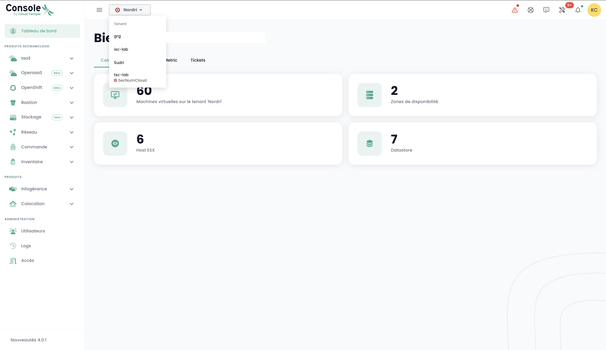

## Tenant Concept
The tenant is a __consolidation of resources within an organization__. An [Organization](organisations.md) has at least one tenant (called the __default tenant__, which can be renamed). Generally, multiple tenants are used to segment responsibilities or technical scopes.

For example:

- A __Production__ tenant
- A __Preproduction__ tenant
- A __Testing__ tenant
- A __Qualification__ tenant

But it is also possible to organize things with an __application view__ or by __criticality__:

- An __Application 1__ tenant or __Criticality 1__
- An __Application 2__ tenant or __Criticality 2__
- ...

The technical resources that are ordered are assigned to a specific tenant and are not shared with other tenants. For instance, a Hypervisor cluster and the associated L2 networks are available only within 1 tenant.
Regarding networks, it is possible to request __'cross tenant'__ networks to ensure network continuity between tenants.

User permissions must be defined in each tenant. Therefore, every organization must carefully consider the desired tenants. This point is usually addressed in the initial workshop when creating the organization.

The architecture can evolve with the addition or removal of tenants.

A tenant cannot be empty. It must necessarily be initialized with a minimum of resources:

- An availability zone (AZ, or a physical data center),
- A compute cluster,
- A storage space,
- A network vlan.

## Creation of a Tenant

The creation of a tenant is carried out by a service request indicating:

- The name of your Organization
- The name of a contact with their email and phone number to finalize the configuration
- The name of the tenant
- The availability zone, or alternatively, the desired physical site for the tenant

*__Note__: The direct creation of a tenant by the principal will be possible in Q2 2024.*

| Order Reference                                            | Unit      | SKU                   |
|------------------------------------------------------------|-----------|-----------------------|
| TENANT - *(REGION)* - Tenant activation                    | 1 tenant  | csp:tenant:v1         |
| TENANT - *(REGION)* - Activation of an availability zone   | 1 tenant  | csp:(region):iaas:az:v1 |

## Tenant Selection
The selection of the tenant is done from the main page of the Shiva console:

*__Nota:__ Resources of a tenant are its own and cannot be mixed with those of other tenants.*

## Tenant Access Authorization: Allowed IPs
Access to the cloud management console is strictly limited to IP addresses that have been previously authorized, in accordance with the requirements of the SecNumCloud qualification. This restriction ensures an enhanced level of security by only allowing access to users coming from specified IP ranges, thus minimizing the risk of unauthorized access and protecting the cloud infrastructure according to the highest security standards.

It is now possible to view the list of authorized public IP addresses on the tenant and to add a new public IP address to this list directly from the "Administration > Access" tab.

To do this, the user must have the `console_public_access_read` right to view the authorized IPs, and the `console_public_access_write` right to add a public IP address to the list.

It is then possible to add a new IP:

{:height="50%" width="50%"}

Note: *The removal of an authorized IP is done by a support request in the Cloud Temple console.*

## Resource Consumption within a Tenant

It is possible to view the cloud resources consumed within a tenant, thus providing a detailed view of the usage of different deployed services. This feature allows users to follow in real time the consumption of their resources, identify the most demanded services, and optimize their usage according to their needs.

In the console menu, click on "Consumption Report" and then select the desired time period. You will be able to view in detail the cloud resource consumption over the defined period, which will enable you to analyze the use of services and optimize your management accordingly:

