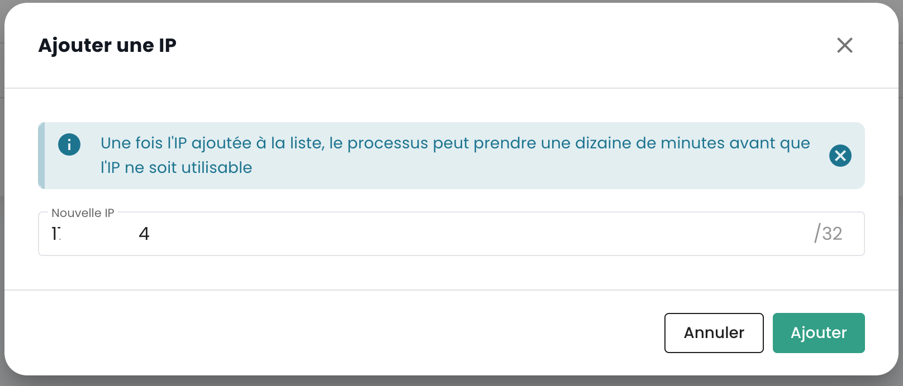

## Concepto de arrendatario
El tenant es un __agrupamiento de recursos dentro de una organización__. Una [Organización](organisations.md) tiene al menos un tenant (llamado __tenant por defecto__, que puede ser renombrado). Generalmente, se utilizan varios tenants para segmentar las responsabilidades o los ámbitos técnicos.

Por ejemplo:

- Un tenant __Producción__
- Un tenant __Preproducción__
- Un tenant __Pruebas__
- Un tenant __Calificación__

Pero también es posible organizar las cosas con una __visión aplicativa__ o por __criticidad__:

- Un tenant __Aplicación 1__ o __Criticidad 1__
- Un tenant __Aplicación 2__ o __Criticidad 2__
- ...

Los recursos técnicos solicitados se asignan a un tenant específico y no se comparten con otros tenants. Por ejemplo, un clúster de Hipervisores y las redes L2 asociadas solo están disponibles en 1 tenant.
En cuanto a las redes, es posible solicitar redes __'cross tenant'__ para asegurar la continuidad de red entre los tenants.

Los permisos de los usuarios se deben definir en cada tenant. Por lo tanto, cada organización debe reflexionar bien sobre los tenants deseados. Este punto generalmente se aborda en el taller de iniciación, en el momento de la creación de la organización.

Es posible evolucionar la arquitectura añadiendo o eliminando tenants.

Un tenant no puede estar vacío. Necesariamente debe ser inicializado con un mínimo de recursos:

- Una zona de disponibilidad (AZ, es decir, un centro de datos físico),
- Un clúster de cómputo,
- Un espacio de almacenamiento,
- Una red vlan.

## Creación de un tenant

La creación de un tenant se realiza a través de una solicitud de servicio indicando:

    El nombre de su Organización
    El nombre de un contacto con su correo electrónico y nº de teléfono para finalizar la configuración
    El nombre del tenant
    La zona de disponibilidad o en su defecto el sitio físico deseado para el tenant

*__Nota__ : La creación de un tenant será posible directamente para el comitente Q2 2024.*

| Referencia de pedido                                        | Unidad    | SKU                     |  
|-------------------------------------------------------------|-----------|-------------------------|
| TENANT - *(REGION)* - Activación de un tenant               | 1 tenant  | csp:tenant:v1           |
| TENANT - *(REGION)* - Activación de una zona de disponibilidad | 1 tenant | csp:(region):iaas:az:v1 |

## Selección de un tenant
La selección del tenant se realiza desde la página principal de la consola Shiva:

*__Nota:__ Los recursos de un tenant son propios y no se pueden mezclar con los de otros tenants.*

## Autorización de acceso a un tenant: IPs autorizadas
El acceso a la consola de gestión en la nube está estrictamente limitado a las direcciones IP previamente autorizadas, conforme a los requisitos de la calificación SecNumCloud. Esta restricción garantiza un nivel de seguridad mejorado al permitir el acceso solo a los usuarios de rangos de IP especificados, minimizando así los riesgos de acceso no autorizado y protegiendo la infraestructura en la nube según los estándares de seguridad más altos.

Ahora es posible mostrar la lista de direcciones IP públicas autorizadas en el arrendatario y agregar una nueva dirección IP pública a esta lista directamente desde la pestaña "Administración > Acceso".

Para ello, el usuario debe tener el derecho `console_public_access_read` para consultar las IPs autorizadas, y el derecho `console_public_access_write` para agregar una dirección IP pública a la lista.

Entonces es posible agregar una nueva IP:

{:height="50%" width="50%"}

Nota: *La eliminación de una IP autorizada se realiza mediante una solicitud de soporte en la consola Cloud Temple.*

## Consumo de recursos dentro de un arrendatario
Es posible visualizar los recursos de nube consumidos dentro de un tenant, ofreciendo así una vista detallada del uso de los diferentes servicios implementados. Esta funcionalidad permite a los usuarios seguir en tiempo real el consumo de sus recursos, identificar los servicios más solicitados y optimizar su utilización en función de las necesidades.

En el menú de la consola, haga clic en "Informe de consumo" y luego seleccione el periodo de tiempo deseado. Podrá visualizar en detalle el consumo de recursos de nube durante el periodo definido, lo que le permitirá analizar el uso de los servicios y optimizar su gestión en consecuencia:

