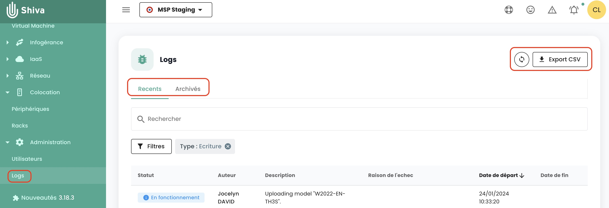
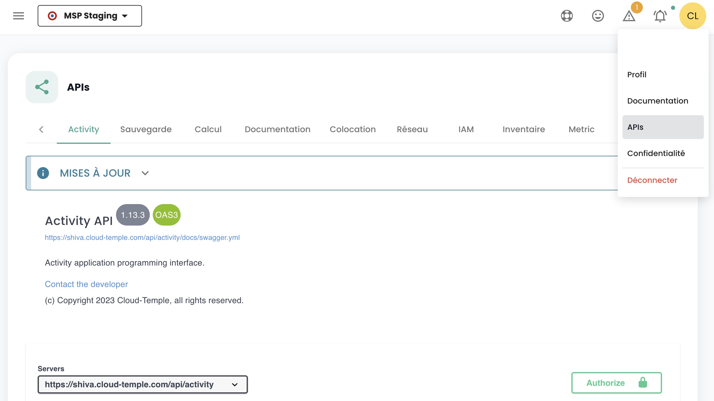

## Wie kontaktiert man den Support?
Klicken Sie auf die Rettungsboje in der Navigationsleiste oben auf der Seite, und dann auf __'Neue Anfrage'__.

Es werden Themen, eine Beschreibung und Bildschirmaufnahmen angefordert, um Ihre Anfrage bestmöglich zu leiten und zu bearbeiten.

Sie können uns auch kontaktieren:

- über das Formular hier: https://www.cloud-temple.com/contactez-nous/
- über die Adresse __contact@cloud-temple.com__

## Wie erfahre ich über die letzten Aktualisierungen?
Klicken Sie unten links auf dem grünen Banner auf das Symbol __'Neuheiten'__. Dort erhalten Sie Details zu den Änderungen für jede Version der Cloud Temple Konsole.

{:height="15%" width="15%"} 

## Wie finde ich die Aktivitäten der Nutzer in meinem Bereich?

Sie können zur __'Logs'__ Seite im Bereich __'Verwaltung'__ der grünen Seitenleiste links auf dem Bildschirm navigieren.
Auf dieser Seite können Sie kürzlich durchgeführte Aktivitäten und archivierte Aktivitäten einsehen.

{:height="50%" width="50%"} 

Die sichtbaren Logs entsprechen __den Aktionen, die in der letzten Stunde durchgeführt wurden__. Um ältere Logs einzusehen, klicken Sie auf den Tab __'Archiviert'__.

Sie haben die Möglichkeit, Ihre Journale über das Webinterface im CSV-Format zu exportieren.

## Warum sehe ich kein Ergebnis bei meiner Suche in den Archiven?
Die Cloud Temple Konsole ermöglicht Ihnen, die Protokolle mithilfe des Befehls __'Filter'__ zu filtern. Die Suchfilter sind wie folgt:

{:height="30%" width="30%"}

Sie können ein Startdatum für das Filtern der Protokolle festlegen, den Status der Aufgabe (ausstehend, in Betrieb, fehlgeschlagen oder abgeschlossen) und den Typ der Aktivität (Schreiben oder Lesen).
Die Suche wird auf __die Beschreibung der Aktivität__ angewendet und muss ganze Wörter enthalten.

Um im Feld __'Fehlergrund'__ zu suchen, ist es notwendig, Aktivitäten nach dem Status __'fehlgeschlagen'__ zu filtern. Zum Beispiel eine Suche nach 'debian' mit dem Filter 'fehlgeschlagen':

{:height="70%" width="70%"}

## Welche Browser-Versionen werden unterstützt?
Die folgenden Versionen der Internetbrowser werden von der Cloud Temple Konsole unterstützt:

| Browser           | Version                   |
|-------------------|---------------------------|
| Chrome            | Größer oder gleich 79     |
| Firefox           | Größer oder gleich 72     |
| Internet Explorer | Größer oder gleich 10     |
| Edge              | Größer oder gleich 79     |

## Wie verwendet man die Shiva APIs, um Aufgaben zu automatisieren?

Die Dokumentation __OpenAPI 3.0__ (Swagger) der Shiva-APIs ist direkt in der Anwendung verfügbar.

{:height="70%" width="70%"} 

Der Zugang zu den APIs erfordert eine Authentifizierung. Sie finden in dem Abschnitt [Verwaltung der Konten der Konsole](../../console/accounts.md#les-clés-api) die Methodik zur Erstellung Ihrer API-Schlüssel und Ihrer persönlichen Zugangstokens ('PAT').

Sobald Sie authentifiziert sind, müssen alle Operationen den Header __'Authorization'__ mit dem *Bearer Access Token* enthalten, das während der Authentifizierungsphase erhalten wurde.

__*Hinweis*__ : *Die URL der Shiva-APIs kann aus der API-Dokumentation (Swagger) abgerufen werden.*

## Was ist der Lebenszyklus eines API-Endpoints?

Die Informationen über die Evolution der API-Endpoints finden Sie in den Release-Notizen:

{:height="70%" width="70%"}

Sie finden eine Liste der als veraltet gekennzeichneten Endpoints für jede Aktivität.

Außerdem werden die als veraltet markierten Endpoints in unseren APIs wie folgt angezeigt:
__~~this/is/an/endpoint~~__ sowie ein Enddatum für die endgültige Entfernung in der Beschreibung.

## Was bedeutet das Piktogramm vor dem Namen meines Mandanten?

Dieses Piktogramm:

bedeutet, dass der betreffende Tenant im Rahmen eines Abonnements eines __SecNumCloud-Angebots__ bereitgestellt wurde.

## Warum wird die Beschreibung meines Tickets oder meines Kommentars nicht korrekt in der Cloud Temple Konsole angezeigt?
Nur HTML ohne Skripte und Klartext kann in der Beschreibung eines Tickets oder in einem Kommentar normal interpretiert werden.
Tatsächlich sind Skripte, XML, Json usw. aus Sicherheitsgründen blockiert.

Wenn Sie diese Dateiformate kommunizieren möchten, wird empfohlen, Anhänge zu verwenden.

## Wie lange werden die in der Cloud Temple-Konsole gesammelten Ereignisse aufbewahrt?
Gemäß der Secnumcloud-Qualifizierung beträgt die Mindestdauer für die Speicherung von Cloud-Tempel-Konsole-Ereignissen 6 Monate.