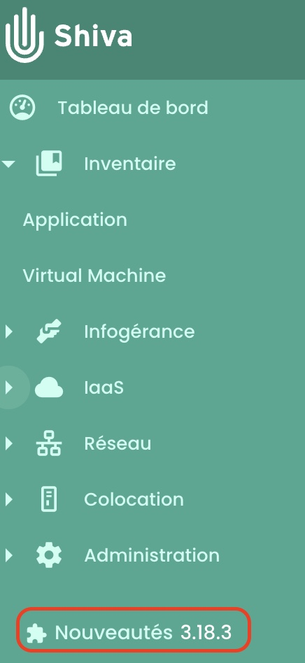
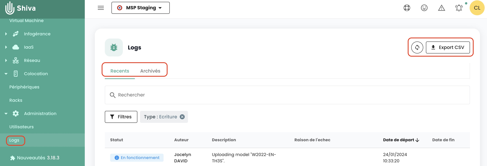
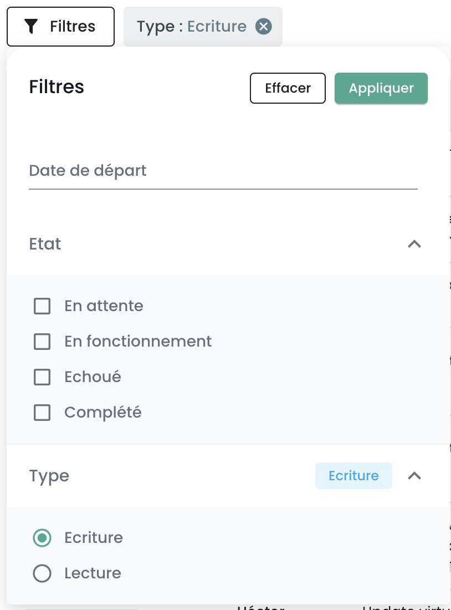
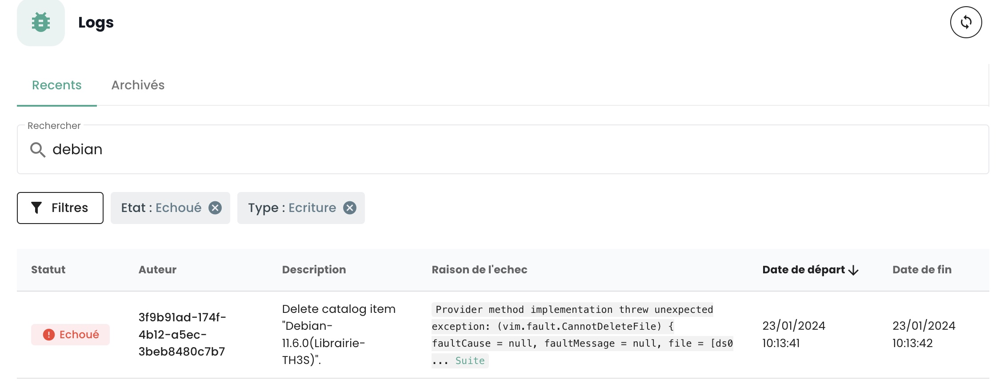
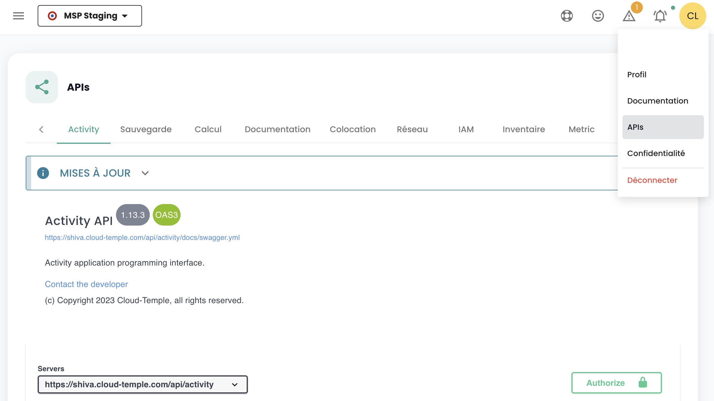
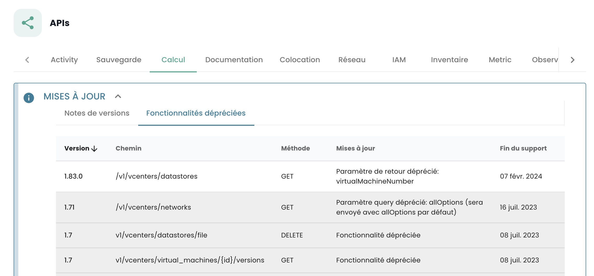

## How to Contact Support?
Click on the lifebuoy in the navigation bar at the top of the page, then on __'New request'__.

 

You will be asked for themes, a description, and screenshots to guide and process your request more effectively.

 

You can also contact us:

- via the form here: https://www.cloud-temple.com/contactez-nous/ 
- via the email address __contact@cloud-temple.com__

## How to find out about the latest updates?
Click on the bottom left of the green banner on the __'New Features'__ icon. You will see the details of the changes for each version of the Cloud Temple console.

{:height="15%" width="15%"} 

## How to Find User Activities Within My Scope?
You can navigate to the __'Logs'__ page found in the __'Administration'__ section of the green sidebar on the left side of the screen.
On this page, you can obtain recent activities and archived activities.

{:height="50%" width="50%"} 

The visible logs correspond __to actions carried out during the last hour__. To view older logs, click on the __'Archived'__ tab.

You have the option to export your logs in CSV format from the web interface.

## Why do I not see any results when I search in the archives?

The Cloud Temple console allows you to filter logs using the __'Filters'__ command. The following search filters are available:

{:height="30%" width="30%"} 

You can specify a start date for filtering logs, the status of the task (pending, running, failed, or completed), and the type of activity (write or read).
The search is applied to __the description of the activity__ and must contain whole words.

To search within the __'failure reason'__ field, it is necessary to filter activities by the __'failed'__ status. For instance, a search for 'debian' with the filtering set to 'failed':

{:height="70%" width="70%"} 

## What versions of web browsers are supported?

The following versions of internet browsers are supported by the Cloud Temple console:

| Browser           | Version                |
|-------------------|------------------------|
| Chrome            | Greater than or equal to 79 |
| Firefox           | Greater than or equal to 72 |
| Internet Explorer | Greater than or equal to 10 |
| Edge              | Greater than or equal to 79 |

## How to use Shiva APIs for automating tasks?
The __OpenAPI 3.0__ (Swagger) documentation for Shiva’s APIs is available directly within the application.

{:height="70%" width="70%"}

Access to the APIs requires authentication. You will find the methodology for creating your API keys and personal access tokens ('PAT') in the [console account management section](../../console/accounts.md#les-clés-api).

Once authenticated, all operations must have the __'Authorization'__ header with the *bearer access token* obtained during the authentication phase.

__*Note*__: *The URL of Shiva's APIs can be retrieved from the API (Swagger) documentation.*

## What is the lifecycle of an API endpoint?
Information on the evolution of API endpoints is available in the release notes:

{:height="70%" width="70%"}

You will find a list of endpoints that are deprecated, organized by activity.

Moreover, the deprecated endpoints will appear in the following manner in our APIs:
__~~this/is/an/endpoint~~__ along with a definitive removal date in the description.

## What does the pictogram in front of my tenant's name represent?
This pictogram:

indicates that the tenant in question has been provisioned as part of a subscription to a __SecNumCloud offer__.

## Why is the description of my ticket or comment not displaying correctly in the Cloud Temple console?

Only HTML without scripts and plain text can be normally interpreted in the description of a ticket or in a comment.
Indeed, scripts, XML, Json, etc., are blocked for security reasons.

When you wish to share these file formats, it is recommended to attach them as files.

## What is the retention duration of the events collected in the Cloud Temple console?
In accordance with the Secnumcloud qualification, the storage duration of Cloud Temple console events is a minimum of 6 months.