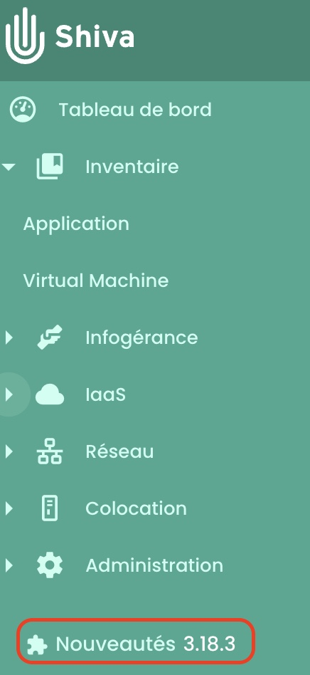
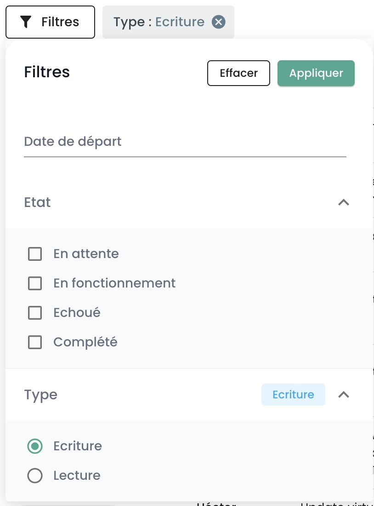
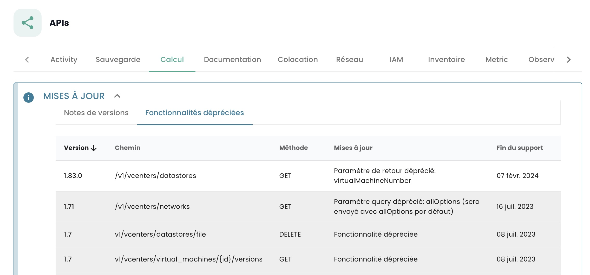

## Cómo contactar con el soporte?
Haga clic en el salvavidas en la barra de navegación en la parte superior de la página, luego en __'Nueva solicitud'__.

Se le pedirán temas, una descripción y capturas de pantalla para guiar y procesar su solicitud de la mejor manera.

También puede contactarnos:

- a través del formulario aquí: https://www.cloud-temple.com/contactez-nous/
- vía la dirección __contact@cloud-temple.com__

## ¿Cómo conocer las últimas actualizaciones?

Haga clic en la parte inferior izquierda de la barra verde en el icono __'Novedades'__. Obtendrá el detalle de las modificaciones para cada versión de la consola Cloud Temple.

{:height="15%" width="15%"}

## ¿Cómo encontrar las actividades de los usuarios en mi ámbito?

Puede ir a la página __'Registros'__ en la sección __'Administración'__ de la barra lateral verde a la izquierda de la pantalla.
En esta página, puede obtener las actividades recientes y las actividades archivadas.

{:height="50%" width="50%"} 

Los registros visibles corresponden __a las acciones realizadas durante la última hora__. Para consultar registros más antiguos, haga clic en la pestaña __'Archivados'__.

Tiene la posibilidad de exportar sus registros en formato CSV desde la interfaz web.

## ¿Por qué no veo resultado cuando hago una búsqueda en los archivos?
La consola de Cloud Temple te permite filtrar los registros mediante el comando __'Filtros'__. Los filtros de búsqueda son los siguientes:

{:height="30%" width="30%"} 

Puedes especificar una fecha de inicio para el filtrado de los registros, el estado de la tarea (pendiente, en ejecución, fallida o completada) y el tipo de actividad (escritura o lectura).
La búsqueda se aplica en __la descripción de la actividad__ y debe contener palabras completas.

Para buscar en el campo __'razón de fracaso'__, es necesario filtrar las actividades por el estado __'fallido'__. Por ejemplo, una búsqueda de 'debian' con el filtro 'fallido':

{:height="70%" width="70%"} 

## ¿Qué versiones de navegadores son compatibles?

Las siguientes versiones de navegadores de internet son compatibles con la consola de Cloud Temple:

| Navegador         | Versión                |
|-------------------|------------------------|
| Chrome            | Superior o igual a 79  |
| Firefox           | Superior o igual a 72  |
| Internet Explorer | Superior o igual a 10  |
| Edge              | Superior o igual a 79  |

## ¿Cómo utilizar las APIs de Shiva para automatizar tareas?
La documentación __OpenAPI 3.0__ (Swagger) de las APIs de Shiva está disponible directamente en la aplicación.

{:height="70%" width="70%"} 

El acceso a las APIs requiere autenticación. Encontrará en la sección [gestión de cuentas de la consola](../../console/accounts.md#las-clés-api) la metodología para crear sus claves APIs y sus tokens de acceso personales ('PAT').

Una vez autenticado, todas las operaciones deben incluir el encabezado __'Authorization'__ con el *bearer access token* obtenido durante la fase de autenticación.

__*Nota*__ : *la url de las APIs de Shiva se puede recuperar desde la documentación de la API (Swagger).*

## ¿Cuál es el ciclo de vida de un endpoint API?

Las informaciones de la evolución de los endpoints de la API están disponibles en las notas de actualización:

{:height="70%" width="70%"}

Encontrará la lista de endpoints que están depreciados, actividad por actividad.

Además, los endpoints que están deprecados aparecerán de la siguiente manera en nuestras API:
___~~this/is/an/endpoint~~__ con una fecha de eliminación definitiva en la descripción.

## ¿Qué representa el pictograma delante del nombre de mi tenant?

Este pictograma:

indica que el inquilino en cuestión ha sido provisto en el contexto de una suscripción a una __oferta SecNumCloud__.

## ¿Por qué la descripción de mi ticket o de mi comentario no se muestra correctamente en la consola Cloud Temple?
Sólo el HTML sin script y el texto plano podrán ser interpretados normalmente en la descripción de un ticket o en un comentario.
De hecho, los scripts, XML, Json, etc. están bloqueados por razones de seguridad.

Cuando desee comunicar estos formatos de archivos, se recomienda hacerlo a través de archivos adjuntos.

## ¿Cuál es el período de retención de los eventos recopilados en la consola Cloud Temple?
De acuerdo con la calificación Secnumcloud, el almacenamiento de los eventos del consola Cloud Temple es de una duración mínima de 6 meses.