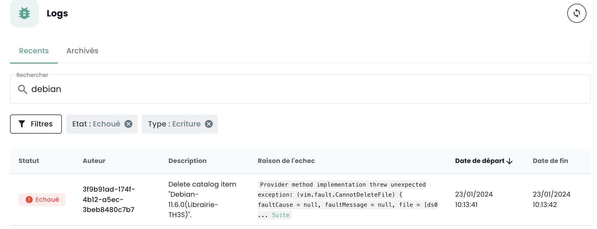

## Come contattare il supporto?
Fare clic sulla boa nella barra di navigazione in alto della pagina, poi su __'Nuova richiesta'__.

Vi verranno richiesti dei temi, una descrizione e degli screenshot per indirizzare e trattare al meglio la vostra richiesta.

Potete anche contattarci:

- tramite il modulo qui: https://www.cloud-temple.com/contactez-nous/
- tramite l'indirizzo __contact@cloud-temple.com__

## Come conoscere gli ultimi aggiornamenti?

Cliccate in basso a sinistra sulla fascia verde sull'icona __'Novità'__. Avrete il dettaglio delle modifiche per ogni versione della console Cloud Temple.

{:height="15%" width="15%"} 

## Come trovare le attività degli utenti nel mio ambito?

Potete andare alla pagina __'Logs'__ nella sezione __'Amministrazione'__ della barra laterale verde a sinistra dello schermo.
Su questa pagina, potete ottenere le attività recenti e le attività archiviate.

{:height="50%" width="50%"} 

I log visibili corrispondono __alle azioni effettuate nell'ultima ora__. Per consultare log più vecchi, cliccate sulla scheda __'Archivati'__.

Avete la possibilità di esportare i vostri registri in formato CSV dall'interfaccia web.

## Perché non vedo risultati durante la mia ricerca negli archivi?
La console Cloud Temple consente di filtrare i registri tramite il comando __'Filtri'__. I filtri di ricerca disponibili sono i seguenti:

{:height="30%" width="30%"}

È possibile specificare una data di inizio per il filtraggio dei registri, lo stato del task (in attesa, in esecuzione, fallito o completato) e il tipo di attività (scrittura o lettura).
La ricerca si applica su __la descrizione dell'attività__ e deve contenere parole intere.

Per effettuare ricerche sul campo __'motivo del fallimento'__, è necessario filtrare le attività per lo stato __'fallito'__. Ad esempio, una ricerca su 'debian' con il filtro 'fallito':

{:height="70%" width="70%"}

## Quali versioni dei browser sono supportate?
Le seguenti versioni dei browser internet sono supportate dalla console Cloud Temple:

| Navigatore        | Versione                |
|-------------------|-------------------------|
| Chrome            | Superiore o uguale a 79 |
| Firefox           | Superiore o uguale a 72 |
| Internet Explorer | Superiore o uguale a 10 |
| Edge              | Superiore o uguale a 79 |

## Come utilizzare le API Shiva per automatizzare i compiti?

La documentazione __OpenAPI 3.0__ (Swagger) delle API di Shiva è disponibile direttamente nell'applicazione.

{:height="70%" width="70%"}

L'accesso alle API richiede l'autenticazione. Troverete nella sezione [gestione degli account della console](../../console/accounts.md#le-chiavi-api) la metodologia per creare le vostre chiavi API e i vostri token di accesso personali ('PAT').

Una volta autenticato, tutte le operazioni devono avere l'intestazione __'Authorization'__ con il *bearer access token* ottenuto nella fase di autenticazione.

__*Nota*__ : *l'URL delle API di Shiva può essere recuperato dalla doc API (Swagger).*

## Qual è il ciclo di vita di un endpoint API?
Le informazioni riguardanti l'evoluzione degli endpoint dell'API sono disponibili nelle note di rilascio:

{:height="70%" width="70%"} 

Troverete l'elenco degli endpoint che sono deprecati attività per attività.

Inoltre, gli endpoint che sono deprecati appariranno in questo modo sulle nostre API:
__~~this/is/an/endpoint~~__ e una data di rimozione definitiva nella descrizione.

## A cosa corrisponde il pittogramma davanti al nome del mio tenant?

Questo pittogramma:

significa che il tenant in questione è stato provisionato nell'ambito di una sottoscrizione a un'__offerta SecNumCloud__.

## Perché la descrizione del mio ticket o del mio commento non viene visualizzata correttamente nella console Cloud Temple?

Solo l'HTML senza script e il testo semplice potranno essere interpretati normalmente nella descrizione di un ticket o in un commento. 
Infatti, gli script, XML, Json, ecc. sono bloccati per motivi di sicurezza.

Quando si desidera condividere questi formati di file, è consigliabile utilizzare gli allegati.

## Qual è il periodo di conservazione degli eventi raccolti nella console Cloud Temple?
Conformemente alla qualifica Secnumcloud, la conservazione degli eventi della console Cloud Temple è di una durata minima di 6 mesi.