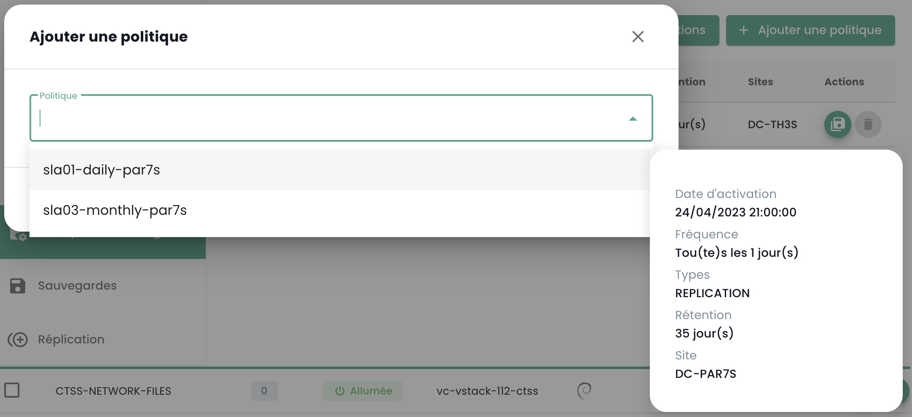
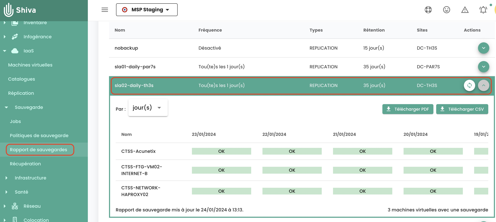
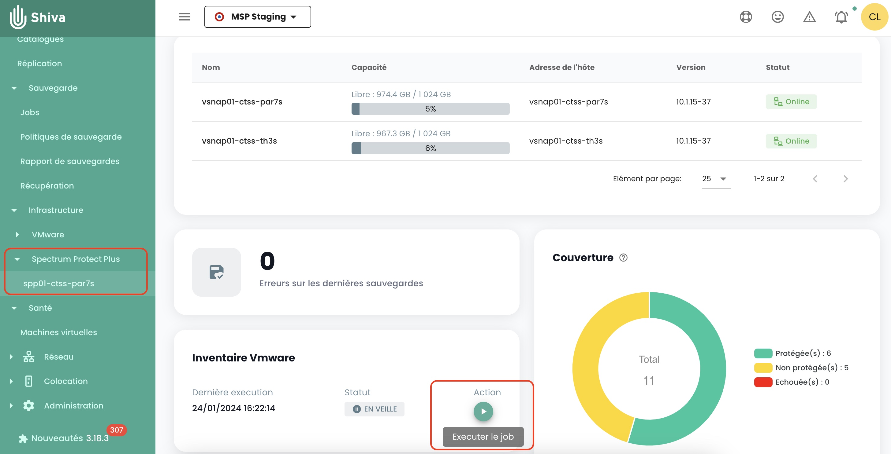

## Wie klont man eine virtuelle Maschine?
Es gibt zwei Möglichkeiten, eine virtuelle Maschine zu klonen:

  - Die erste Option ermöglicht es, direkt vom Symbol __'Klonen'__ Ihrer virtuellen Maschine aus zu klonen:

{:height="70%" width="70%"}

  - Die zweite Lösung besteht darin, die virtuelle Maschine zu klonen, indem man __eine Sicherung__ der virtuellen Maschine verwendet und dann die Wiederherstellung im Klonmodus einer Sicherung benutzt.
Gehen Sie zum Abschnitt __'Sicherung'__ Ihrer virtuellen Maschine und wählen Sie die Aktion __'Wiederherstellen'__ aus:

{:height="70%" width="70%"}

Wählen Sie dann die Wiederherstellungsoption __'Klonen'__:

{:height="70%" width="70%"}

## Warum sehe ich nicht dieselben virtuellen Maschinen, wenn ich auf der Seite "Sicherungsrichtlinien" eine Richtlinie auswähle, wie wenn ich auf "Sicherungsberichte" gehe und dieselbe Richtlinie auswähle?
Dies bedeutet, dass die fehlenden virtuellen Maschinen für eine gewisse Zeit die betreffende Richtlinie zugewiesen hatten (was ihre Anwesenheit in den Backup-Berichten erklärt), jedoch __ist dies gegenwärtig nicht mehr der Fall__.

## Wie fügt man einer virtuellen Maschine eine Backup-Politik hinzu?
Gehen Sie zur Seite __'Virtuelle Maschinen'__ im __'IaaS'__ Abschnitt des grünen Menübands auf der linken Seite des Bildschirms.

Wählen Sie eine virtuelle Maschine aus und dann die Registerkarte __'Sicherungsrichtlinien'__ dieser Maschine:

{:height="70%" width="70%"}

Fügen Sie die gewünschte Sicherungsrichtlinie hinzu:

{:height="70%" width="70%"}

## Wie entfernt man eine Sicherungsrichtlinie von einer virtuellen Maschine?
Gehen Sie zur Seite __'Virtuelle Maschinen'__, wählen Sie eine virtuelle Maschine aus und dann die Registerkarte __'Sicherungsrichtlinien'__ dieser Maschine.

Löschen Sie die gewünschte Sicherungsrichtlinie und bestätigen Sie das Löschen:

{:height="70%" width="70%"}

__*Anmerkung*__: *Achtung! __Secnumcloud besteht darauf, dass es für jede virtuelle Maschine mindestens eine Sicherungsrichtlinie gibt.__*

## Wie kann ich feststellen, ob eine Sicherung erfolgreich war?
Es gibt 2 mögliche Lösungen:

1. Gehen Sie zur Seite __'Jobs'__ im Menu __'Backup'__ im grünen Balken auf der linken Seite Ihres Bildschirms. Wählen Sie den für die Sicherung entsprechenden Job aus und selektieren Sie ihn.
Anschließend finden Sie die zugehörige *Jobsession* für Ihre Sicherung und wählen sie über das Menu __'Aktionen'__ aus.

{:height="70%" width="70%"}

Diese Aktionen ermöglichen es, die detaillierten Logs der Ausführung der Sicherung zu erhalten. Sie können in den Sicherungsprotokollen suchen:

{:height="70%" width="70%"}

2. Gehen Sie zur Seite __'Backup-Berichte'__ und wählen Sie die Richtlinie aus, die Sie interessiert:

{:height="70%" width="70%"}

Dann können Sie nach einem Datum filtern, den Bericht im Format __PDF__ oder __CSV__ herunterladen, um ihn in Drittwerkzeugen zu nutzen.

## Wie startet man eine Wiederherstellung?
Besuchen Sie die Seite __'Virtuelle Maschinen'__, wählen Sie eine virtuelle Maschine und dann das Tab __'Sicherungen'__ dieser Maschine aus. Um die Wiederherstellung zu starten, wählen Sie die zu restaurierende Sicherung aus.

{:height="70%" width="70%"}

## Was ist die Option des Quiescings?

Das __Quiescing__ ist ein Prozess, der das System auffordert, in einen geeigneten Zustand überzugehen, bevor die Erstellung eines Snapshots beginnt.
Standardmäßig ist das __Quiescing aktiviert__. Es kann jedoch manuell deaktiviert werden, falls das System das Snapshot schlecht verwaltet oder wenn der Agent des Hypervisors nicht auf der virtuellen Maschine installiert ist.

Um dies zu tun, klicken Sie im Abschnitt __'Sicherungen'__ Ihrer virtuellen Maschine auf __'Optionen ändern'__ und deaktivieren Sie das __Quiescing__:

{:height="70%" width="70%"}

## Welche Wiederherstellungsoptionen gibt es für eine virtuelle Maschine?

3 Hauptoptionen für die Wiederherstellung einer VM, entweder am ursprünglichen Standort oder an einem anderen Ziel:

  - __'KLON'__: Stellt die virtuelle Maschine wieder her, indem sie umbenannt wird, ohne die ursprüngliche virtuelle Maschine zu ersetzen.

{:height="70%" width="70%"}

  - __'PRODUKTION'__: Stellt die Produktions-virtuelle Maschine wieder her und __ersetzt__ die virtuelle Maschine (die derzeitige Produktions-virtuelle Maschine wird __zerstört__)

{:height="70%" width="70%"}

  - __'TEST'__: Stellt die Produktions-virtuelle Maschine wieder her, __ohne sie zu überschreiben__.

{:height="70%" width="70%"}

Weitere Details finden Sie in [der Dokumentation zur Datensicherung](../../../iaas/backup.md).

## Wie stellen Sie die Produktions-virtuelle Maschine wieder her und ersetzen sie, ohne die derzeitige Produktions-virtuelle Maschine beizubehalten?
Wählen Sie den Wiederherstellungsmodus __'Produktion'__ aus. Die Option 'Virtuelle Maschine überschreiben' ist standardmäßig eingestellt.

{:height="70%" width="70%"}

## Warum unterscheidet sich die Anzahl der virtuellen Maschinen zwischen den Backup- und Compute-Modulen?
Der Unterschied in virtuellen Maschinen kann darauf zurückzuführen sein, dass das Backup-Modul die zuletzt erstellten Maschinen nicht abgerufen hat.

Um das Backup-Modul zu aktualisieren, muss die Backup-Software-Schicht gebeten werden, die virtuellen Maschinen neu zu inventarisieren.
Zu diesem Zweck navigieren Sie im Menü __'Infrastruktur'__ des grünen Banners auf der linken Seite des Bildschirms zum Untermenü __'Spectrum Protect Plus'__ und verwenden die __'Aktion'__-Schaltfläche des Inventars:

{:height="70%" width="70%"}

Beachten Sie, dass das Datum des letzten Inventars angegeben ist.

Wenn ein Unterschied bei der virtuellen Maschine weiterhin besteht, kann dies an virtuellen Maschinen liegen, die das System für die Backups hosten. Tatsächlich zählen sie sich selbst nicht in die Berechnung der Anzahl von Maschinen im Backup-Modul ein.

## Wie führt man die Inventarisierung virtueller Maschinen im Backup-Modul durch?
Um eine Bestandsaufnahme der virtuellen Maschinen im Backup-Modul durchzuführen, navigieren Sie im grünen Banner links auf dem Bildschirm über das Menü __'Infrastruktur'__ zum Untermenü __'Spectrum Protect Plus'__ und verwenden Sie die Schaltfläche __'Aktion'__ für das Inventar:

{:height="70%" width="70%"}

Beachten Sie, dass das Datum der letzten Bestandsaufnahme angezeigt wird.

## Warum schlägt die Sicherung meiner virtuellen Maschine fehl, indem ein Snapshot-Problem angezeigt wird?
Dieser Fehler bedeutet, dass es das erste Mal ist, dass Ihr Rechner zu sichern versucht wird.

__Bei der ersten Sicherung einer virtuellen Maschine darf kein Snapshot auf dem Rechner vorhanden sein.__

## Wie kann die Produktions-virtuelle Maschine wiederhergestellt und ersetzt werden, während die Produktions-virtuelle Maschine erhalten und umbenannt wird?
Hier erfahren Sie, wie es geht:

- Wählen Sie den __'KLONEN'__ Modus (der Klonmodus führt zu einer Änderung der MAC-Adresse und der UUID der virtuellen Maschine),
- Benennen Sie die wiederhergestellte virtuelle Maschine mit dem endgültigen Namen (der Produktions-VM),
- Benennen Sie die alte Produktions-virtuelle Maschine um (in _ALT).

## Wie stellt man eine virtuelle Maschine wieder her, ohne die ursprüngliche virtuelle Maschine zu ersetzen?
Hier ist das Vorgehen:

- Wählen Sie den Modus __'KLONEN'__ (der Klonmodus führt zu einer Änderung der MAC-Adresse und der UUID der virtuellen Maschine)
- Legen Sie den Namen des Klons fest (_REST oder andere)

## Warum kann ich eine Festplatte im Instant-Access-Modus auf meiner virtuellen Maschine nicht löschen?
Führen Sie das Backup-Inventar aus: Navigieren Sie im grünen Banner am linken Bildschirmrand über das Menü __'Infrastruktur'__ zum Untermenü __'Spectrum Protect Plus'__ und verwenden Sie die __'Aktion'__ Schaltfläche des Inventars:

{:height="70%" width="70%"} 

Führen Sie das Löschen der Festplatte durch, nachdem das Inventar abgeschlossen ist. Aktualisieren Sie die virtuelle Maschine, um zu überprüfen, dass die Festplatte tatsächlich gelöscht wurde.

## Warum kann ich eine virtuelle Maschine nicht mit einer Richtlinie im Status Held (ausgesetzte Richtlinie) starten?
Eine Richtlinie im Status "Held" ist ein Feature, das es ermöglicht, die Vorgänge der Datenhaltung und Löschung vorübergehend zu pausieren. Dadurch wird gewährleistet, dass die Daten über ihre Standardaufbewahrungsfrist hinaus intakt und verfügbar bleiben, aus spezifischen Gründen wie Compliance oder rechtlichen Anforderungen.

Angenommen, ein Unternehmen hat eine 30-tägige Backup-Aufbewahrungspolitik für einige Produktionsdaten. Aufgrund einer rechtlichen Untersuchung erhalten sie die Anforderung, alle relevanten Backups auf unbestimmte Zeit zu erhalten. Sie haben die Möglichkeit, die zugehörige Backup-Richtlinie durch den Status "Held" zu suspendieren, um die automatische Löschung dieser Backups nach 30 Tagen zu verhindern, und damit sicherzustellen, dass die Daten für die gesamte Dauer der Untersuchung verfügbar bleiben.

Eine suspendierte Backup-Politik (im Status Held) wird die geplanten Backups nicht durchführen, wodurch die virtuelle Maschine nicht als geschützt angesehen werden kann und dies den SecNumCloud-Normen nicht entspricht.

Zögern Sie nicht, unser Support-Team für Beratung zu diesem Thema zu kontaktieren.