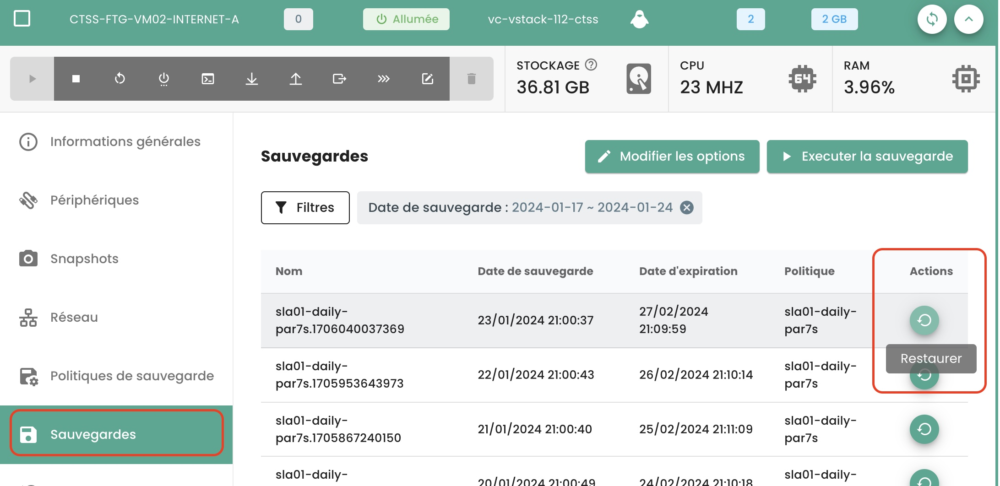
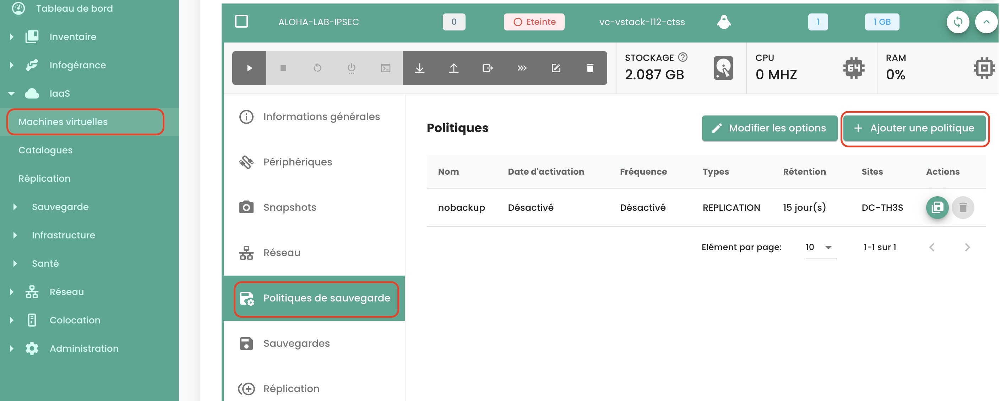
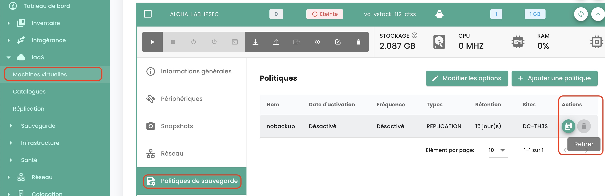
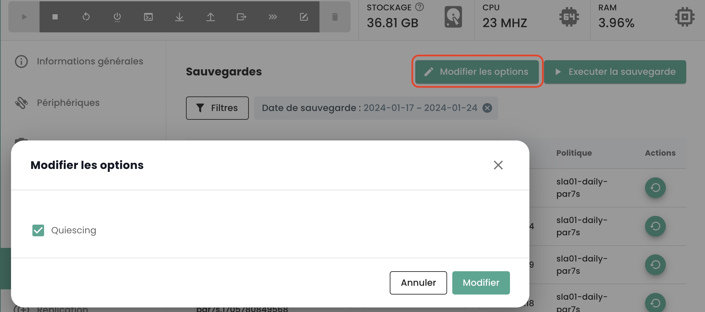

## How do I clone a virtual machine?

There are two ways to clone a virtual machine:

  - The first option allows you to clone a virtual machine directly from the __'Clone'__ icon of your virtual machine:

{:height="70%" width="70%"}

  - The second solution involves cloning the virtual machine by using __a backup__ of the virtual machine and then using __the cloning mode restore__ of a backup. Go to the __'Backup'__ section of your virtual machine and choose the __'Restore'__ action:

{:height="70%" width="70%"}

Then select the __'Clone'__ restore option:

{:height="70%" width="70%"}

## Why, when I go to the "backup policies" page and I select a policy, do I not see the same virtual machines as when I go to the "backup reports" and select the same policy?
This means that the missing virtual machines had the policy in question assigned to them for a period (explaining their presence on backup reports) but that __this is no longer the case at present__.

## How to Add a Backup Policy to a Virtual Machine?
Navigate to the __'Virtual Machines'__ page in the __'IaaS'__ section of the green menu bar on the left side of the screen.

Select a virtual machine and then the __'Backup Policies'__ tab for that machine:

{:height="70%" width="70%"}

Add the desired backup policy:

{:height="70%" width="70%"}

## How to remove a backup policy from a virtual machine?
Navigate to the __'Virtual Machines'__ page, select a virtual machine then the __'Backup Policies'__ tab for that machine.

Delete the desired backup policy and confirm the deletion:

{:height="70%" width="70%"}

__*Note*__: *Beware! __Secnumcloud mandates that there be at least one backup policy__ for each virtual machine.*

## How to know if a backup was successfully executed?
There are two possible solutions:

1. Go to the __'Jobs'__ page from the __'Backup'__ menu in the green banner on the left of your screen. Choose the job corresponding to the backup and select it. 
Then, find the *jobsession* corresponding to your backup, select it through the __'Actions'__ menu.

{:height="70%" width="70%"}

These actions allow you to obtain detailed logs of the backup execution. You can search the backup logs:

{:height="70%" width="70%"}

2. Go to the __'Backup Reports'__ page and select the policy that interests you:

{:height="70%" width="70%"}

You can then filter by date, download the report in __PDF__ or __CSV__ format to use it in third-party tools.

## How to initiate a restoration?
Navigate to the __'Virtual Machines'__ page, select a virtual machine, and then the __'Backups'__ tab for that machine. To start the restoration, select the backup you wish to restore.

{:height="70%" width="70%"}

## What is the quiescing option?
Quiescing is a process that involves alerting the system to transition into an appropriate state before the commencement of a snapshot.
By default, quiescing is enabled. It may be disabled manually in instances where the system poorly manages the snapshot or if the hypervisor agent is not installed on the virtual machine.

To do this, in the 'Backups' section of your virtual machine, click on 'Edit Options' and disable quiescing:

{:height="70%" width="70%"}

## What are the restoration options for a virtual machine?
Three main options for restoring a VM, either to its original target or to a different one:

  - __'CLONE'__: Restores the virtual machine by renaming it, without replacing the original virtual machine.

{:height="70%" width="70%"}

  - __'PRODUCTION'__: Restores and __replaces__ the production virtual machine (the virtual machine currently in production is __destroyed__)

{:height="70%" width="70%"}

  - __'TEST'__: Restores the production virtual machine __without overwriting it__.

{:height="70%" width="70%"}

You can find more details in [the backup documentation](../../../iaas/backup.md).

## How to restore and replace the production virtual machine, without keeping the currently in production virtual machine?

Select the __'Production'__ restore mode. The 'overwrite virtual machine' option is the default.

{:height="70%" width="70%"}

## Why is the number of virtual machines different between the backup and compute modules?
The difference in virtual machines may be due to the backup module not retrieving the latest machines created.

To update the backup module, it is necessary to request the backup software layer to re-inventory the virtual machines.
To do this, in the __'Infrastructure'__ menu of the green banner on the left of the screen, navigate to the __'Spectrum Protect Plus'__ submenu and use the __'Action'__ button from the inventory:

{:height="70%" width="70%"}

Please note that the date of the last inventory is indicated.

If a difference in virtual machines persists, it may come from the virtual machines hosting the system allowing for backups. Indeed, they do not count themselves in the computation of the number of machines on the backup module.

## How to inventory virtual machines on the backup module?
To launch an inventory of virtual machines on the backup module, in the __'Infrastructure'__ menu of the green banner on the left side of the screen, navigate to the __'Spectrum Protect Plus'__ submenu and use the __'Action'__ button for the inventory:

{:height="70%" width="70%"}

Note that the date of the last inventory is indicated.

## Why does the backup of my virtual machine fail indicating a snapshot issue?
This error indicates that it is the first time your machine is attempting to be backed up.

__For the initial backup of a virtual machine, no snapshot must be present on the machine.__

## How to restore and replace the production virtual machine, while preserving and renaming the production virtual machine?
Here's how to proceed:

- Select the __'CLONE'__ mode (clone mode leads to a change in the MAC address and UUID of the virtual machine),
- Rename the restored virtual machine with the final name (of the production vm),
- Rename the old production virtual machine (to _OLD).

## How to restore a virtual machine without replacing the original virtual machine?

Here is how to proceed:

- Select the __'CLONE'__ mode (the clone mode results in a change of MAC address and UUID of the virtual machine)
- Define the name of the clone (_REST or others)

## Why can't I delete a disk in instant access mode on my virtual machine?
Execute the backup inventory: In the __'Infrastructure'__ menu on the green banner to the left of the screen, navigate to the __'Spectrum Protect Plus'__ submenu and use the __'Action'__ button for the inventory:

{:height="70%" width="70%"}

Perform the disk deletion after the inventory is completed. Refresh the virtual machine to ensure that the disk has been successfully removed.

## Why can’t I start a virtual machine with a policy in Held status (suspended policy)?

A policy in "Held" status is a feature that temporarily suspends retention and data deletion actions, thus ensuring that data remains intact and available beyond their standard retention period for specific reasons such as compliance or legal requirements.

Suppose a company has a 30-day backup retention policy for certain production data. Due to a legal investigation, they receive a demand to preserve all relevant backups for an indefinite period. You have the option to suspend the associated backup policy via the "Held" status to prevent the automatic deletion of these backups after 30 days, thus ensuring that the data remains available for the duration of the investigation.

A suspended backup policy (in Held status) will not execute the backups of the schedule assigned to it, and the virtual machine cannot then be considered protected, which does not comply with SecNumCloud standards.

Do not hesitate to ask our support team for advice on this matter.