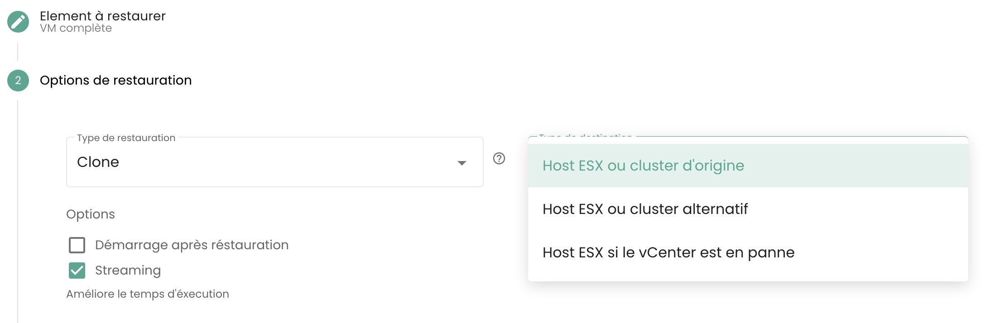

## ¿Cómo clonar una máquina virtual?
Existen 2 maneras de clonar una máquina virtual:

  - La primera opción permite clonar una máquina virtual directamente desde el ícono __'Clonar'__ de su máquina virtual:

{:height="70%" width="70%"}

  - La segunda solución consiste en clonar la máquina virtual utilizando __una copia de seguridad__ de la máquina virtual y luego usando __la restauración en modo clon__ de una copia de seguridad.
Vaya a la sección __'Copia de seguridad'__ de su máquina virtual y elija la acción __'Restaurar'__:

{:height="70%" width="70%"}

Elija luego la opción __'Clonar'__ de restauración:

{:height="70%" width="70%"}

## ¿Por qué cuando voy a la página "políticas de copia de seguridad" y selecciono una política, no veo las mismas máquinas virtuales que cuando voy a "informe de copias de seguridad" y selecciono la misma política?
Esto significa que las máquinas virtuales que faltan tuvieron asignada la política en cuestión durante un tiempo (explicando su presencia en los informes de respaldo) pero que __ya no es el caso en la actualidad__.

## ¿Cómo agregar una política de respaldo a una máquina virtual?

Visite la página __'Máquinas Virtuales'__ en la sección __'IaaS'__ de la barra de menú verde en el lado izquierdo de la pantalla.

Seleccione una máquina virtual y luego la pestaña __'Políticas de Respaldo'__ de esta máquina:

{:height="70%" width="70%"}

Agregue la política de respaldo deseada:

{:height="70%" width="70%"}

## ¿Cómo eliminar una política de respaldo de una máquina virtual?

Diríjase a la página __'Máquinas Virtuales'__, seleccione una máquina virtual y luego la pestaña __'Políticas de Respaldo'__ de esa máquina.

Elimine la política de respaldo deseada y confirme la eliminación:

{:height="70%" width="70%"}

__*Nota*__ : *¡Cuidado! __Secnumcloud exige que haya al menos una política de respaldo__ para cada máquina virtual.*

## ¿Cómo saber si un respaldo se ha realizado correctamente?

Existen 2 soluciones posibles:

1. Vaya a la página __'Trabajos'__ del menú __'Respaldo'__ en la franja verde a la izquierda de su pantalla. Elija el trabajo correspondiente al respaldo y selecciónelo.
Luego, encuentre la *sesión de trabajo* correspondiente a su respaldo, selecciónela a través del menú __'Acciones'__.

{:height="70%" width="70%"}

Estas acciones permiten tener los registros detallados de la ejecución del respaldo. Puede buscar en los registros de respaldo:

{:height="70%" width="70%"}

2. Vaya a la página __'Informes de respaldo'__ y seleccione la política que le interesa:

{:height="70%" width="70%"}

Entonces puede filtrar por una fecha, descargar el informe en formato __PDF__ o __CSV__ para utilizarlo en herramientas de terceros.

## ¿Cómo iniciar una restauración?
Diríjase a la página __'Máquinas Virtuales'__, seleccione una máquina virtual y luego la pestaña __'Copias de seguridad'__ de dicha máquina. Para iniciar la restauración, seleccione la copia de seguridad que desea restaurar.

{:height="70%" width="70%"}

## ¿Qué es la opción de quiescing?
El __quiescing__ es un proceso que consiste en alertar al sistema para que se ponga en un estado adecuado antes del inicio de la instantánea.
Por defecto, el __quiescing está habilitado__. Puede ser deshabilitado manualmente en casos donde el sistema maneja mal la instantánea o si el agente del hipervisor no está instalado en la máquina virtual.

Para hacer esto, en la sección __'Copias de seguridad'__ de su máquina virtual, haga clic en __'Modificar opciones'__ y desactive el __quiescing__:

{:height="70%" width="70%"}

## ¿Cuáles son las opciones de restauración de una máquina virtual?

3 opciones principales para restaurar una VM, en su objetivo inicial u en un objetivo diferente:

  - __'CLONAR'__: Restaura la máquina virtual renombrándola, sin reemplazar la máquina virtual original.

{:height="70%" width="70%"}

  - __'PRODUCCIÓN'__: Restaura y __reemplaza__ la máquina virtual de producción (la máquina virtual actualmente en producción es __destruida__)

{:height="70%" width="70%"}

  - __'PRUEBAS'__: Restaura la máquina virtual de producción __sin sobrescribirla__.

{:height="70%" width="70%"}

Encontrará más detalles en [la documentación sobre la copia de seguridad](../../../iaas/backup.md). 

## ¿Cómo restaurar y reemplazar la máquina virtual de producción, sin conservar la máquina virtual que está actualmente en producción?
Elija el modo de restauración __'Producción'__. La opción 'sobrescribir la máquina virtual' está seleccionada por defecto.

{:height="70%" width="70%"}

## ¿Por qué varía el número de máquinas virtuales entre los módulos de copia de seguridad y computación?
La diferencia en máquinas virtuales puede deberse a que el módulo de copias de seguridad no ha recuperado las últimas máquinas creadas.

Para actualizar el módulo de copias de seguridad, es necesario pedir a la capa de software de copias de seguridad que reinvente las máquinas virtuales.
Para hacerlo, en el menú __'Infraestructura'__ del panel verde a la izquierda de la pantalla, navegue hacia el submenú __'Spectrum Protect Plus'__ y utilice el botón __'Acción'__ del inventario:

{:height="70%" width="70%"}

Tenga en cuenta que se indica la fecha del último inventario.

Si persiste una diferencia en las máquinas virtuales, puede deberse a las máquinas virtuales que alojan el sistema que permite
las copias de seguridad. De hecho, estas no se cuentan a sí mismas en el cálculo del número de máquinas en el módulo de copias de seguridad.

## ¿Cómo hacer el inventario de máquinas virtuales en el módulo de copias de seguridad?
Para lanzar un inventario de las máquinas virtuales en el módulo de respaldos, en el menú __'Infraestructura'__ de la franja verde a la izquierda de la pantalla, navegue hacia el submenú __'Spectrum Protect Plus'__ y utilice el botón __'Acción'__ del inventario:

{:height="70%" width="70%"}

Tenga en cuenta que se indica la fecha del último inventario.

## ¿Por qué falla la copia de seguridad de mi máquina virtual indicando un problema de snapshot?

Este error significa que esta es la primera vez que se intenta realizar una copia de seguridad de su máquina.

__Durante la primera copia de seguridad de una máquina virtual, no debe haber ninguna instantánea presente en la máquina.__

## ¿Cómo restaurar y reemplazar la máquina virtual de producción, conservando y renombrando la máquina virtual de producción?

Aquí le mostramos cómo hacerlo:

- Elija la opción __'CLONAR'__ (el modo clonar provoca un cambio en la dirección MAC y en el UUID de la máquina virtual),
- Renombre la máquina virtual restaurada con el nombre definitivo (de la vm de producción),
- Renombre la antigua máquina virtual de producción (a _ANTIGUA).

## ¿Cómo restaurar una máquina virtual sin reemplazar la máquina virtual original?

Así es cómo proceder:

- Elija el modo __'CLONO'__ (el modo clon implica un cambio de dirección MAC y de UUID de la máquina virtual)
- Defina el nombre del clon (_REST u otros)

## ¿Por qué no puedo eliminar un disco en modo acceso instantáneo en mi máquina virtual?
Ejecuten el inventario de la copia de seguridad: en el menú __'Infraestructura'__ de la banda verde a la izquierda de la pantalla, naveguen 
hacia el submenú __'Spectrum Protect Plus'__ y utilicen el botón __'Acción'__ del inventario:

{:height="70%" width="70%"} 

Realicen la eliminación del disco una vez finalizado el inventario. Refresquen la máquina virtual para verificar que el disco ha sido efectivamente eliminado.

## ¿Por qué no puedo iniciar una máquina virtual con una política en estado Held (política suspendida)?

Una política en estado "Held" es una funcionalidad que permite suspender temporalmente las acciones de retención y eliminación de datos, asegurando así que los datos permanezcan intactos y disponibles más allá de su período de retención estándar por razones específicas tales como el cumplimiento o las necesidades legales.

Supongamos que una empresa tiene una política de retención de copias de seguridad de 30 días para ciertos datos de producción. Debido a una investigación legal, reciben una solicitud de preservar todas las copias de seguridad relevantes por un período indefinido. Tiene la opción de suspender la política de copias de seguridad asociada a través del estado "Held" para evitar la eliminación automática de estas copias de seguridad después de 30 días, asegurando así que los datos permanezcan disponibles por toda la duración de la investigación.

Una política de copia de seguridad suspendida (en estado Held) no ejecutará las copias de seguridad de la programación que se le ha asignado, la máquina virtual entonces no puede ser considerada como protegida lo que no cumple con las normas SecNumCloud.

No dude en pedir consejo a nuestro equipo de soporte sobre este tema.