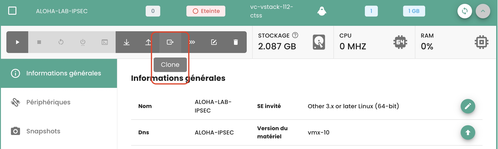
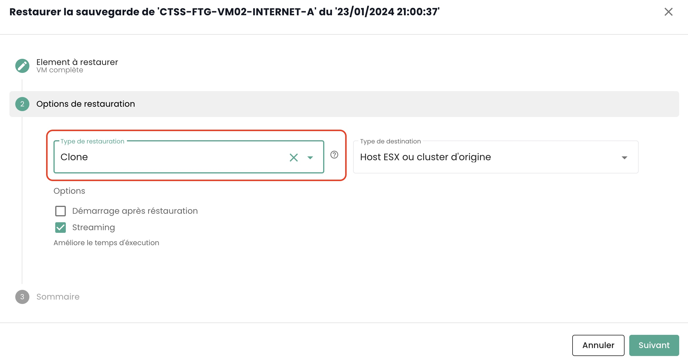
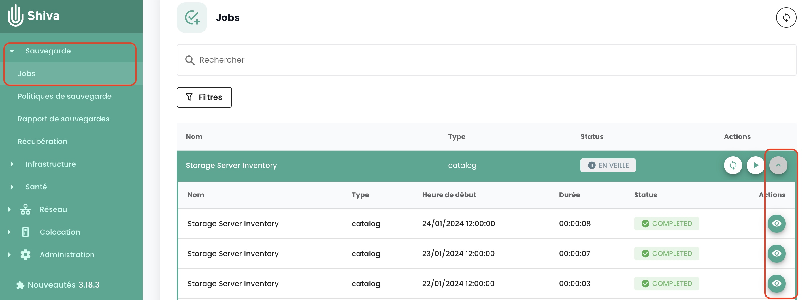

## Come si clona una macchina virtuale?

Esistono 2 modi per clonare una macchina virtuale:

  - La prima opzione consente di clonare una macchina virtuale direttamente dall'icona __'Clone'__ della vostra macchina virtuale:

{:height="70%" width="70%"}

  - La seconda soluzione consiste nel clonare la macchina virtuale utilizzando __un backup__ della macchina virtuale e poi utilizzando __il ripristino in modalità clone__ di un backup.
Andate nella sezione __'Backup'__ della vostra macchina virtuale e scegliete l'azione __'Ripristina'__:

{:height="70%" width="70%"}

Scegliete poi l'opzione __'Clone'__ per il ripristino:

{:height="70%" width="70%"}

## Perché quando vado sulla pagina "politiche di backup" e seleziono una politica, non vedo le stesse macchine virtuali che quando vado su "report di backup" e seleziono la stessa politica?

Questo significa che le macchine virtuali mancanti hanno avuto la politica in questione che è stata loro assegnata per 
un periodo (spiegando la loro presenza sui rapporti di backup) ma che __attualmente non è più il caso__.

## Come aggiungere una politica di backup a una macchina virtuale?

Visitate la pagina __'Macchine Virtuali'__ nella sezione __'IaaS'__ della barra dei menu verde sul lato sinistro dello schermo.

Selezionate una macchina virtuale e poi la scheda __'Politiche di backup'__ di questa macchina:

{:height="70%" width="70%"}

Aggiungete la politica di backup desiderata:

{:height="70%" width="70%"}

## Come rimuovere una politica di backup da una macchina virtuale?
Visitate la pagina __'Macchine Virtuali'__, selezionate una macchina virtuale e poi la scheda __'Politiche di backup'__ di questa macchina.

Eliminate la politica di backup desiderata e confermate l'eliminazione:

{:height="70%" width="70%"}

__*Nota*__: *Attenzione! __Secnumcloud impone che ci sia almeno una politica di backup__ per ogni macchina virtuale.*

## Come sapere se un backup è stato eseguito correttamente ?
Ci sono 2 soluzioni possibili:

1. Visitate la pagina __'Lavori'__ dal menu __'Backup'__, che si trova nella barra verde a sinistra del vostro schermo. Selezionate il lavoro corrispondente al backup e sceglietelo.
Successivamente, trovate la *sessione di lavoro* corrispondente al vostro backup, selezionatela tramite il menu __'Azioni'__.

{:height="70%" width="70%"}

Queste azioni consentono di ottenere i log dettagliati dell'esecuzione del backup. Potete cercare nei registri del backup:

{:height="70%" width="70%"}

2. Visitate la pagina __'Rapporti di backup'__ e selezionate la policy di vostro interesse:

{:height="70%" width="70%"}

Potete quindi filtrare per data, scaricare il rapporto nei formati __PDF__ o __CSV__ per utilizzarlo con strumenti terzi.

## Come avviare un ripristino?

Visitate la pagina __'Macchine Virtuali'__, selezionate una macchina virtuale e poi la scheda __'Backup'__ di questa macchina. Per avviare il ripristino, selezionate il backup da ripristinare.

{:height="70%" width="70%"}

## Che cos'è l'opzione di quiescing?

Il __quiescing__ è un processo che avvisa il sistema affinché si porti in uno stato appropriato prima dell'inizio dello snapshot.
Di default, il __quiescing è attivato__. Può essere disattivato manualmente nel caso in cui il sistema gestisca male lo snapshot o se l'agente dell'hypervisor non è installato sulla macchina virtuale.

Per farlo, nella sezione __'Backup'__ della vostra macchina, virtuale, cliccate su __'Modificare le opzioni'__ e disattivate il __quiescing__ :

{:height="70%" width="70%"}

## Quali sono le opzioni di ripristino per una macchina virtuale?

3 opzioni principali per ripristinare una vm, sul suo target iniziale o su un target diverso:

  - __'CLONE'__: Ripristina la macchina virtuale rinominandola, senza sostituire la macchina virtuale originale.

{:height="70%" width="70%"}

  - __'PRODUZIONE'__: Ripristina e __sostituisce__ la macchina virtuale di produzione (la macchina virtuale attualmente in produzione viene __distrutta__)

{:height="70%" width="70%"}

  - __'TEST'__: Ripristina la macchina virtuale di produzione __senza sovrascriverla__.

{:height="70%" width="70%"}

Potete trovare maggiori dettagli nella [documentazione sulla backup](../../../iaas/backup.md).

## Come ripristinare e sostituire la macchina virtuale di produzione, senza conservare la macchina virtuale attualmente in produzione?
Scegliete la modalità di ripristino __'Produzione'__. L'opzione 'sostituire la macchina virtuale' è predefinita.

{:height="70%" width="70%"}

## Perché il numero delle macchine virtuali è diverso tra i moduli backup e compute?

La differenza tra macchine virtuali può venire dal fatto che il modulo di backup non ha recuperato le ultime macchine create.

Per aggiornare il modulo di backup, è necessario chiedere al layer software di backup di reinventariare le macchine virtuali.
Per fare ciò, nel menu __'Infrastruttura'__ della barra verde a sinistra dello schermo, navigare verso il sottomenu __'Spectrum Protect Plus'__ e utilizzare il pulsante __'Azione'__ dell'inventario:

{:height="70%" width="70%"}

Notate che avete la data dell'ultimo inventario indicata.

Se una differenza di macchine virtuali persiste, ciò può venire dalle macchine virtuali che ospitano il sistema che permette i backup. Infatti, queste non si conteggiano sé stesse nel calcolo del numero di macchine sul modulo di backup.

## Come fare l'inventario delle macchine virtuali sul modulo backup?
Per avviare un inventario delle macchine virtuali nel modulo di backup, nel menu __'Infrastruttura'__ della barra verde a sinistra dello schermo, navigare verso il sottomenu __'Spectrum Protect Plus'__ e utilizzare il pulsante __'Azione'__ per l'inventario:

{:height="70%" width="70%"}

Si noti che viene indicata la data dell'ultimo inventario.

## Perché il backup della mia macchina virtuale fallisce indicando un problema di snapshot?

Questo errore indica che questa è la prima volta che la vostra macchina sta tentando di essere salvata.

__Durante il primo backup di una macchina virtuale, non deve essere presente alcuno snapshot sulla macchina.__

## Come ripristinare e sostituire la macchina virtuale di produzione, mantenendo e rinominando la macchina virtuale di produzione?

Ecco come procedere:

- Scegliete la modalità __'CLONE'__ (la modalità clone comporta un cambiamento dell'indirizzo MAC e dell'UUID della macchina virtuale),
- Rinominate la macchina virtuale ripristinata con il nome definitivo (della vm di produzione),
- Rinominate la vecchia macchina virtuale di produzione (con _OLD).

## Come ripristinare una macchina virtuale, senza sostituire la macchina virtuale originale?
Ecco come procedere:

- Scegliete la modalità __'CLONE'__ (la modalità clone comporta la modifica dell'indirizzo MAC e dell'UUID della macchina virtuale)
- Definite il nome del clone (_REST o altri)

## Perché non posso eliminare un disco in modalità accesso istantaneo sulla mia macchina virtuale?
Esegui l'inventario del backup: nel menu __'Infrastruttura'__ della barra verde a sinistra dello schermo, naviga 
verso il sottomenu __'Spectrum Protect Plus'__ e usa il pulsante __'Azione'__ dell'inventario:

{:height="70%" width="70%"} 

Procedi alla rimozione del disco una volta completato l'inventario. Aggiorna la macchina virtuale per verificare che il disco sia stato effettivamente rimosso.

## Perché non riesco ad avviare una macchina virtuale con una politica in stato Held (politica sospesa)?

Una politica in stato "Held" è una funzionalità che permette di sospendere temporaneamente le azioni di mantenimento e cancellazione dei dati, garantendo così che i dati rimangano intatti e disponibili oltre il loro periodo di conservazione standard per motivi specifici come la conformità o le esigenze legali.

Supponiamo che un'azienda abbia una politica di conservazione dei backup di 30 giorni per certi dati di produzione. A causa di un'indagine legale, ricevono una richiesta di preservare tutti i backup pertinenti per una durata indeterminata. Avete la possibilità di sospendere la politica di backup associata tramite lo stato "Held" per impedire la cancellazione automatica di questi backup dopo 30 giorni, assicurando così che i dati rimangano disponibili per tutta la durata dell'indagine.

Una politica di backup sospesa (in stato Held) non eseguirà i backup del piano che le è stato assegnato, il che significa che la macchina virtuale non può essere considerata protetta, non rispettando così le norme SecNumCloud.

Non esitate a chiedere consiglio al nostro team di supporto su questo argomento.