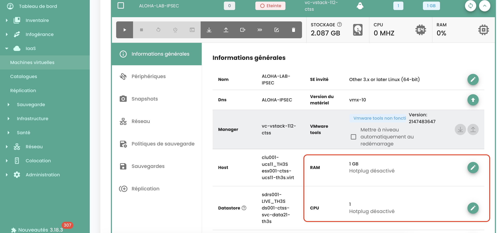
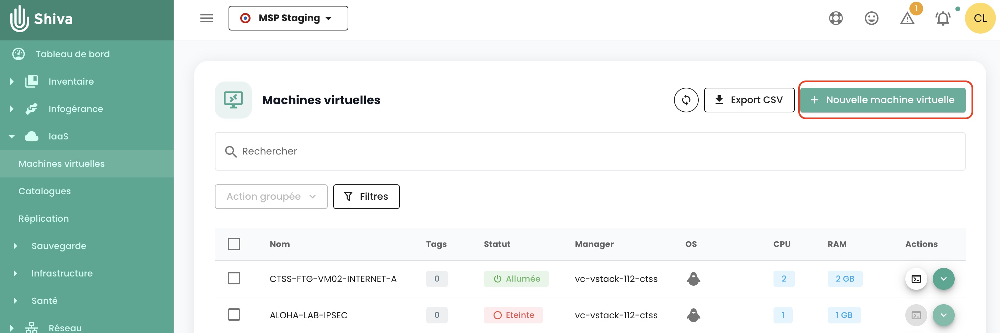
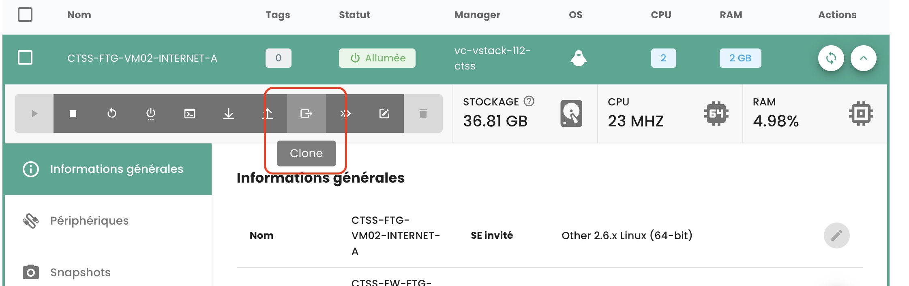

## Wie montiere ich ein ISO in einer virtuellen Maschine?
Gehen Sie auf die Registerkarte __'Virtuelle Maschinen'__ im Menü __'IaaS'__ und zeigen Sie die Details einer virtuellen Maschine an. Klicken Sie auf die Schaltfläche __'ISO Einlegen'__:

{:height="70%" width="70%"}

Wählen Sie die Content-Bibliothek aus, in der sich das ISO befindet, oder wählen Sie einen Datenspeicher und navigieren Sie in den Ordnern, um das Ziel-ISO zu finden.

{:height="50%" width="50%"}

## Wie bearbeite ich den RAM oder CPU einer virtuellen Maschine?
Navigieren Sie zum Tab __'Virtuelle Maschinen'__, zeigen Sie die Details einer virtuellen Maschine an, 
wählen Sie den Tab __'Allgemeine Informationen'__ und klicken Sie auf die Schaltfläche, um die zu bearbeitende Variable zu editieren:

{:height="70%" width="70%"} 

## Wie erstellt man eine virtuelle Maschine?
Gehen Sie zur Seite __'Virtuelle Maschinen'__ und klicken Sie auf die Schaltfläche 'Neue virtuelle Maschine'.

{:height="70%" width="70%"} 

## Wie aktualisiert man die Details einer virtuellen Maschine?
Wenn die Details der Maschine seit dem letzten Seitenladen noch nicht angezeigt wurden, klicken Sie auf die virtuelle Maschine. Andernfalls müssen die Details der Maschine angezeigt werden, damit Sie auf den Knopf in der Aktions-Spalte der ausgewählten virtuellen Maschine klicken können.

## Warum beginnt meine virtuelle Maschine zu laden, ohne dass ich eine Aktion durchführe?
Dieses Verhalten bedeutet, dass __eine andere Person__ Aktionen auf der gleichen virtuellen Maschine durchführt.

## Warum kann ich keine Festplatten zu meiner virtuellen Maschine hinzufügen?
Wenn die Schaltfläche zum Hinzufügen einer Festplatte deaktiviert ist, dann __ist die maximale Anzahl von Festplatten__ erreicht.

## Warum kann ich die Festplatte meiner virtuellen Maschine nicht ändern?
Eine virtuelle Festplatte kann nicht modifiziert werden, wenn sie von __einem Snapshot__ betroffen ist oder wenn sie bereits __in Bearbeitung__ ist.

## Warum kann ich eine Festplatte auf meiner virtuellen Maschine nicht löschen?
Um eine Festplatte zu entfernen, muss die virtuelle Maschine __ausgeschaltet__ sein. Wenn die virtuelle Maschine ausgeschaltet ist und das Entfernen der Festplatte fehlschlägt, überprüfen Sie, ob die Festplatte nicht in __einem Snapshot__ gesichert ist.

## Welche Festplattenmodi gibt es?
- __Persistent__: Änderungen werden sofort und dauerhaft auf die virtuelle Festplatte geschrieben. **Dies ist der empfohlene Modus.**
- __Unabhängig nicht-persistent__: Änderungen an der virtuellen Festplatte werden in einem neuen Log erfasst und beim Ausschalten gelöscht. Nicht betroffen von Snapshots. **Wird von der Sicherung nicht unterstützt.**
- __Unabhängig persistent__: Änderungen werden sofort und dauerhaft auf die virtuelle Festplatte geschrieben. Nicht betroffen von Snapshots. **Wird von der Sicherung nicht unterstützt.**

## Warum kann ich CPU/RAM nicht bearbeiten, wenn die virtuelle Maschine eingeschaltet ist?
Die virtuelle Maschine hat nicht die erforderliche Option, die standardmäßig aktiviert ist. Um diese Option zu aktivieren, kontaktieren Sie bitte den Support.

## Wie veröffentlicht man ISO- oder OVF-Dateien in einer Inhaltsbibliothek?
Um ein ISO/OVF zu veröffentlichen, müssen Sie in der Ansicht __'Katalog'__ gehen und oben auf der Seite auf die Schaltfläche __'Dateien veröffentlichen'__ klicken:

{:height="70%" width="70%"}

## Wie ist das Tastaturlayout der Konsole konfiguriert?


Dieser Punkt wird [im Abschnitt zur Konsole zur Steuerung virtueller Maschinen](../../../iaas/compute.md#console-einer-virtuellen-maschine) beschrieben

## Ist es möglich, das Zeichen '@' über die Shiva-Konsole zu erhalten?

Dieser Punkt wird [im Abschnitt Konsole der Steuerung virtueller Maschinen](../../../iaas/compute.md#console-einer-virtuellen-maschine) beschrieben

## Wie wandelt man eine VM in ein Modell um?
Wählen Sie eine virtuelle Maschine aus und verwenden Sie die __'Klonen'__ Aktionschaltfläche:

{:height="50%" width="50%"} 

Wählen Sie __'In vm-Vorlage exportieren'__:

{:height="70%" width="70%"} 

Geben Sie anschließend die erforderlichen Informationen ein. Danach ist es möglich, eine neue VM aus dem Modell mit der Schaltfläche __'Neue virtuelle Maschine'__ oder über die Seite __'Kataloge'__ zu erstellen. Es besteht auch die Möglichkeit, die VM im OVF-Format zu exportieren.

## Wie klonen Sie eine virtuelle Maschine?

Sehen Sie die Antwort im Abschnitt Sicherung: [eine virtuelle Maschine klonen](../backup/backup.md)

## Wofür steht der reservierte Prozentsatz des Speichers auf einem Cluster-Host?

Dieser Prozentsatz entspricht einem festgelegten Limit für die Ressourcengruppe, die dem Cluster entspricht.
Im folgenden Beispiel entspricht der graue Bereich dem reservierten Speicher und der grüne Bereich dem genutzten Speicher:

{:height="50%" width="50%"}

## Warum entspricht der Speicher meiner virtuellen Maschine nicht der Größe ihrer Disks?


Der Speicherplatz, der auf einer virtuellen Maschine angezeigt wird, entspricht nicht nur der Größe der Festplatten, 
dieser Wert schließt auch __die Protokolle, die Schnappschüsse, die Konfigurationsdateien usw.__ ein.

## Wie konvertiert man eine OVA-Datei zu OVF und umgekehrt?
Die am häufigsten verwendete Methode ist der Vmware Converter, aber es gibt auch eine einfache Methode unter Verwendung von ```tar```

### Extraktion der OVA-Datei
```
$ tar -cvf vmName.ova vmName.ovf
```

### Ein OVA-Datei aus einer OVF-Datei erstellen
```
$ tar -cvf vmName-NEW.ova vmName.ovf vmName-disk1.vmdk vmName.mf

```