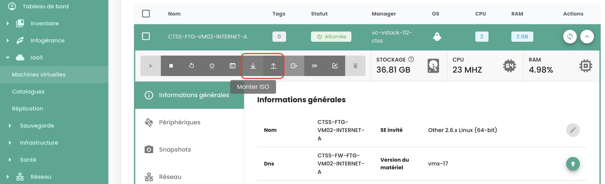
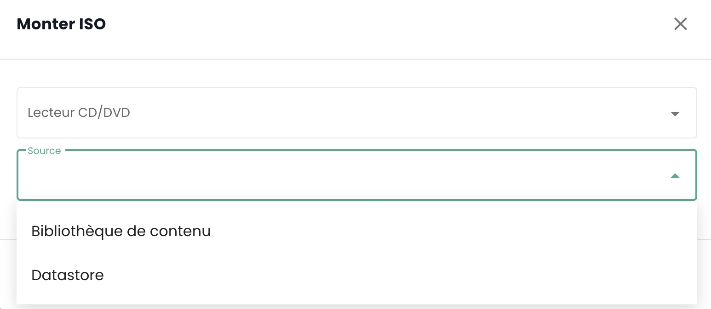
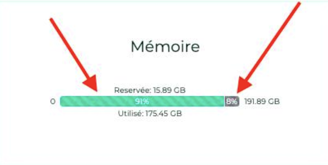

## How to mount an ISO in a virtual machine?
Navigate to the __'Virtual Machines'__ tab in the __'IaaS'__ menu, display the details of a virtual machine. Click on the __'Mount ISO'__ button:

{:height="70%" width="70%"} 

Select the content library where the ISO to mount is located, or select a datastore and navigate through the folders to find the target ISO.

{:height="50%" width="50%"} 

## How to edit the RAM or CPU of a Virtual Machine?

Navigate to the __'Virtual Machines'__ tab, display the details of a virtual machine, 
select the __'General Information'__ tab and click on the edit button for the variable you wish to modify:

{:height="70%" width="70%"} 

## How to create a virtual machine?

Navigate to the __'Virtual Machines'__ page and click on the 'New Virtual Machine' button.

{:height="70%" width="70%"}

## How to refresh the details of a virtual machine?

If the details of the machine have not yet been displayed since the last page load, click on the virtual machine. Otherwise, the machine details must be displayed in order to click the button in the action column of the selected virtual machine.

## Why does my virtual machine start loading without me taking any action?
This behavior means that **another person** is performing actions on the same virtual machine.

## Why can't I add disks to my virtual machine?
If the button to add a disk is disabled, then __the maximum number of disks__ has been reached.

## Why can't I modify the disk of my virtual machine?
A virtual disk cannot be modified if it is involved with __a snapshot__ or if it is already __undergoing modification__.

## Why can't I delete a disk on my virtual machine?
To remove a disk, the virtual machine must be __powered off__. If the virtual machine is off and the disk removal fails, ensure that the disk is not saved in __a snapshot__.

## What are the disk modes?
- __Persistent__: Changes are immediately and permanently written to the virtual disk. **This is the recommended mode.**
- __Non-persistent independent__: Changes made to the virtual disk are logged in a new log and deleted upon power off. Not affected by snapshots. **It is not supported by the backup.**
- __Persistent Independent__: Changes are immediately and permanently written to the virtual disk. Not affected by snapshots. **It is not supported by the backup.**

## Why can't I edit CPU/RAM when the virtual machine is powered on?
The virtual machine does not have the necessary option, which is enabled by default. To activate this option, please contact support.

## How to Publish ISO or OVF Files in a Content Library?
To publish an ISO/OVF, one must navigate to the __'Catalog'__ view and click on the __'publish files'__ button at the top of the page:

{:height="70%" width="70%"}

## How is the console keyboard configured?

This point is described [in the Virtual Machine Management Console section](../../../iaas/compute.md#console-of-a-virtual-machine)

## Is it possible to obtain the '@' character via the Shiva console?
This point is described [in the virtual machine management console section](../../../iaas/compute.md#console-dune-machine-virtuelle)

## How to Convert a VM into a Template?
Select a virtual machine and use the __'clone'__ action button:

{:height="50%" width="50%"} 

Select __'Export as vm-template'__:

{:height="70%" width="70%"} 

Then fill in the necessary information. It will then be possible to deploy a new VM from the model using the __'New virtual machine'__ button or from the __'Catalogs'__ page. It is also possible to export the VM in OVF format.

## How to clone a virtual machine?

See the answer in the backup section: [clone a virtual machine](../backup/backup.md)

## What does the reserved memory percentage on a cluster host signify?

This percentage represents a limit imposed on the resource group corresponding to the cluster.
In the following example, the gray part corresponds to the reserved memory and the green part to the memory used:

{:height="50%" width="50%"} 

## Why does the storage of my virtual machine not match the size of its disks?

The storage indicated on a virtual machine does not solely refer to the size of the disks; 
this value also includes __logs, snapshots, configuration files, etc__.

## How to convert an OVA file to OVF and vice versa?
The most common method used is Vmware Converter, but there is also a simple method utilizing ```tar```

### Extracting the ova file
```
$ tar -cvf vmName.ova vmName.ovf
```

### Create an OVA File from an OVF File

The provided text is a command-line instruction for creating a tar archive file. It does not contain any content that requires translation from French to English. Since it is a command, it should remain unchanged regardless of the language.