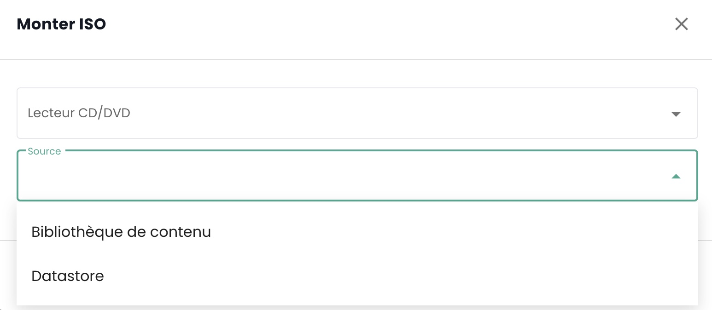
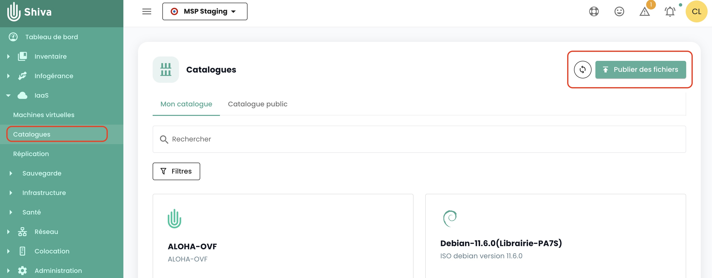

## ¿Cómo montar un ISO en una máquina virtual?
Vaya a la pestaña __'Máquinas Virtuales'__ en el menú __'IaaS'__, muestre los detalles de una máquina virtual. Haga clic en el botón __'Montar ISO'__ :

{:height="70%" width="70%"}

Seleccione la biblioteca de contenido donde se encuentra el ISO para montar o seleccione un datastore y navegue por los directorios para encontrar el ISO objetivo.

{:height="50%" width="50%"} 

## ¿Cómo editar la RAM o el CPU de una máquina virtual?
Diríjase a la pestaña __'Máquinas Virtuales'__, muestre los detalles de una máquina virtual, 
seleccione la pestaña __'Información general'__ y haga clic en el botón de edición de la variable a modificar:

{:height="70%" width="70%"} 

## ¿Cómo crear una máquina virtual?

Vaya a la página __'Máquinas Virtuales'__ y haga clic en el botón 'Nueva máquina virtual'.

{:height="70%" width="70%"}

## ¿Cómo actualizar los detalles de una máquina virtual?
Si los detalles de la máquina no se han mostrado desde la última carga de la página, haga clic en la máquina virtual.
De lo contrario, los detalles de la máquina deben mostrarse para poder hacer clic en el botón en la columna de acción de la máquina virtual seleccionada.

## ¿Por qué mi máquina virtual comienza a cargar sin que realice ninguna acción?
Este comportamiento significa que __otra persona__ está realizando acciones en la misma máquina virtual.

## ¿Por qué no puedo añadir discos a mi máquina virtual?
Si el botón para añadir un disco está desactivado, entonces se ha alcanzado __el número máximo de discos__.

## ¿Por qué no puedo modificar el disco de mi máquina virtual?

Un disco virtual no puede ser modificado si está afectado por __un snapshot__ o si ya está __en proceso de modificación__.

## ¿Por qué no puedo eliminar un disco en mi máquina virtual?
Para eliminar un disco, la máquina virtual debe estar __apagada__. Si la máquina virtual está apagada y 
la eliminación del disco falla, verifique que el disco no esté guardado en __una instantánea__.

## ¿Cuáles son los modos de discos?
- __Persistente__ : Las modificaciones se escriben inmediata y permanentemente en el disco virtual. **Este es el modo recomendado.**
- __Independiente no persistente__ : Las modificaciones realizadas en el disco virtual se registran en un nuevo log y se eliminan al apagar. No afectado por los snapshots. **No es compatible con la copia de seguridad.**
- __Independiente persistente__ : Las modificaciones se escriben inmediata y permanentemente en el disco virtual. No afectado por los snapshots. **No es compatible con la copia de seguridad.**

## ¿Por qué no puedo editar CPU/RAM cuando la máquina virtual está encendida?
La máquina virtual no tiene la opción necesaria, que está activada por defecto. Para activar esta opción, por favor contacte con el soporte.

## ¿Cómo publicar ISO u OVF en una biblioteca de contenido?
Para publicar un ISO/OVF, es necesario ir a la vista __'Catálogo'__ y hacer clic en el botón __'publicar archivos'__ en la parte superior de la página:

{:height="70%" width="70%"}

## ¿Cómo está configurado el teclado de la consola?
Este punto se describe [en la sección de consola del control de las máquinas virtuales](../../../iaas/compute.md#console-de-una-máquina-virtual)

## ¿Es posible obtener el carácter '@' a través de la consola de Shiva?
Este punto se describe [en la sección de consola del control de las máquinas virtuales](../../../iaas/compute.md#console-de-una-máquina-virtual)

## ¿Cómo convertir una VM en modelo?
Seleccione una máquina virtual y use el botón de acción __'clonar'__:

{:height="50%" width="50%"} 

Seleccione __'Exportar como plantilla de vm'__:

{:height="70%" width="70%"} 

A continuación, proporcione la información necesaria. Entonces será posible desplegar una nueva VM a partir de la plantilla utilizando el botón __'Nueva máquina virtual'__ o desde la página __'Catálogos'__. También es posible exportar la VM en formato OVF.

## ¿Cómo clonar una máquina virtual?
Ver la respuesta en la sección de respaldo: [clonar una máquina virtual](../backup/backup.md)

## ¿A qué corresponde el porcentaje reservado de la memoria en un host de clúster?

Este porcentaje corresponde a un límite impuesto al grupo de recursos correspondiente al clúster.
En el siguiente ejemplo, la parte gris corresponde a la memoria reservada y la parte verde a la memoria utilizada:

{:height="50%" width="50%"} 

## ¿Por qué el almacenamiento de mi máquina virtual no corresponde al tamaño de sus discos?

El almacenamiento indicado en una máquina virtual no corresponde únicamente al tamaño de los discos,
este valor también incluye __los registros, las instantáneas, los archivos de configuración, etc__.

## ¿Cómo convertir un archivo OVA a OVF y viceversa?
El método más común utilizado es Vmware convertor, pero también existe un método sencillo utilizando ```tar```

### Extracción del archivo ova
```
$ tar -xvf vmName.ova
```

### Crear un archivo OVA a partir de un archivo OVF
```
$ tar -cvf vmName-NEW.ova vmName.ovf vmName-disk1.vmdk vmName.mf

```