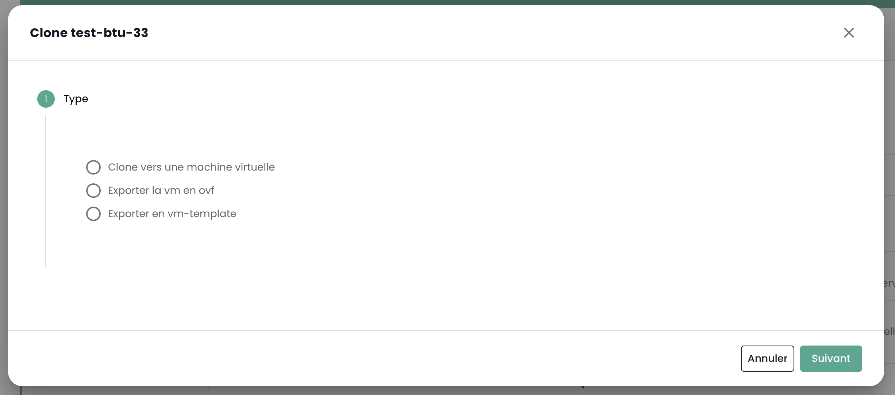

## Come montare un ISO in una macchina virtuale?
Recatevi nella scheda __'Macchine Virtuali'__ nel menu __'IaaS'__, visualizzate i dettagli di una macchina virtuale. Fare clic sul pulsante __'Montare ISO'__:

{:height="70%" width="70%"} 

Selezionate la libreria di contenuti dove si trova l'ISO da montare o selezionate un datastore e navigare nelle cartelle per trovare l'ISO desiderato.

{:height="50%" width="50%"} 

## Come modificare la RAM o la CPU di una macchina virtuale?
Passare alla scheda __'Macchine Virtuali'__, visualizzare i dettagli di una macchina virtuale, 
selezionare la scheda __'Informazioni generali'__ e fare clic sul pulsante di modifica della variabile da modificare:

{:height="70%" width="70%"} 

## Come creare una macchina virtuale?

Andate alla pagina __'Macchine Virtuali'__ e fate clic sul pulsante 'Nuova macchina virtuale'.

{:height="70%" width="70%"} 

## Come aggiornare i dettagli di una macchina virtuale?

Se i dettagli della macchina non sono stati ancora visualizzati dall'ultimo caricamento della pagina, cliccate sulla macchina virtuale.
In caso contrario, i dettagli della macchina devono essere visualizzati per poter cliccare sul pulsante nella colonna azione della macchina virtuale selezionata.

## Perché la mia macchina virtuale inizia a caricare senza che io compia alcuna azione?

Questo comportamento indica che __un'altra persona__ sta eseguendo delle azioni sulla stessa macchina virtuale.

## Perché non posso aggiungere dischi alla mia macchina virtuale?
Se il pulsante per aggiungere un disco è disabilitato, allora è stato raggiunto __il numero massimo di dischi__.

## Perché non posso modificare il disco della mia macchina virtuale?
Un disco virtuale non può essere modificato se è interessato da __un snapshot__ o se è già __in fase di modifica__.

## Perché non riesco a eliminare un disco dalla mia macchina virtuale?
Per eliminare un disco, la macchina virtuale deve essere __spenta__. Se la macchina virtuale è spenta e 
l'eliminazione del disco fallisce, verificate che il disco non sia salvato in __uno snapshot__.

## Quali sono le modalità dei dischi?

  - __Persistente__: Le modifiche sono immediatamente e permanentemente scritte sul disco virtuale. **Questo è il modo consigliato.**
  - __Indipendente non persistente__: Le modifiche apportate al disco virtuale sono registrate in un nuovo log e cancellate allo spegnimento. Non influenzato dagli snapshot. **Non è supportato dal backup.**
  - __Indipendente persistente__: Le modifiche sono immediatamente e permanentemente scritte sul disco virtuale. Non influenzato dagli snapshot. **Non è supportato dal backup.**

## Perché non posso modificare la CPU/RAM quando la macchina virtuale è accesa?
La macchina virtuale non dispone dell'opzione necessaria, che è attivata per impostazione predefinita. Per attivare questa opzione, si prega di contattare il supporto.

## Come pubblicare ISO o OVF in una biblioteca di contenuti?


Per pubblicare un ISO/OVF, è necessario andare nella vista __'Catalogo'__ e fare clic sul pulsante __'pubblicare file'__ nella parte superiore della pagina:

{:height="70%" width="70%"}

## Come è configurata la tastiera della console?


Questo punto è descritto [nella sezione console della gestione delle macchine virtuali](../../../iaas/compute.md#console-dune-machine-virtuelle)

## È possibile ottenere il carattere '@' tramite la console di Shiva?

Questo punto è descritto [nella sezione console della gestione delle macchine virtuali](../../../iaas/compute.md#console-dune-machine-virtuelle)

## Come trasformare una VM in un modello?


Selezionare una macchina virtuale e utilizzare il pulsante d'azione __'clona'__:

{:height="50%" width="50%"}

Selezionare __'Esporta in vm-template'__:

{:height="70%" width="70%"}

Inserire quindi le informazioni necessarie. Sarà poi possibile implementare una nuova VM a partire dal modello dal pulsante __'Nuova macchina virtuale'__ o dalla pagina __'Cataloghi'__. È anche possibile esportare la VM in formato OVF.

## Come clonare una macchina virtuale?
Visualizzare la risposta nella sezione backup: [clonare una macchina virtuale](../backup/backup.md)

## A cosa corrisponde la percentuale di memoria riservata su un host cluster?
Questa percentuale corrisponde ad un limite imposta al gruppo di risorse corrispondente al cluster.
Nell'esempio seguente, la parte grigia corrisponde alla memoria riservata e la parte verde alla memoria utilizzata:

{:height="50%" width="50%"}

## Perché la memoria di archiviazione del mio computer virtuale non corrisponde alla dimensione dei suoi dischi?

Il armazenamento indicato su una macchina virtuale non corrisponde solamente alla dimensione dei dischi, 
questo valore include anche __i log, gli snapshot, i file di configurazione, ecc__.

## Come convertire un file da OVA a OVF e viceversa?
Il metodo più comune utilizzato è Vmware Converter, ma esiste anche un metodo semplice utilizzando ```tar```

### Estrazione del file ova
```
$ tar -xvf vmName.ova
```

### Creare un file OVA da un file OVF
```
$ tar -cvf nomeVm-NEW.ova nomeVm.ovf nomeVm-disk1.vmdk nomeVm.mf

```