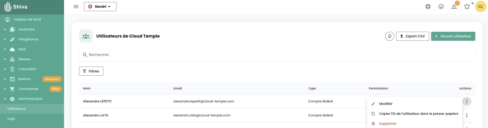

## Was sind die verfügbaren Berechtigungen für Shiva-Konsolenbenutzerkonten?

Hier ist die Liste der [verfügbaren Berechtigungen](../../console/permissions.md#verfügbare-berechtigungen-für-die-benutzer-ihres-verbandes).

## Wie füge ich eine Berechtigung hinzu?

Hier ist das [Verfahren zum Zuweisen von Berechtigungen an einen Benutzer](../../console/accounts.md#zuweisen-von-berechtigungen-an-einen-benutzer)

## Warum kann ich keine Berechtigung hinzufügen?

Um eine Berechtigung hinzuzufügen, benötigen Sie die Berechtigung __'iam_write'__ und die __Berechtigung, die Sie hinzufügen möchten__.

## Wie füge ich einen Benutzer hinzu?

*__Hinweis:__ Um einen Benutzer hinzufügen zu können, benötigen Sie die Berechtigung __'iam_write'__.*

Hier ist das Verfahren [zum Hinzufügen eines neuen Benutzers](../../console/accounts.md#erstellen-eines-benutzerkontos-in-ihr-org)

## Wie überprüfe ich die Zugriffs-/Benutzerberechtigungen?

Gehen Sie zur Benutzerseite und klicken Sie auf die Schaltfläche __'CSV exportieren'__:

## Wie lösche ich einen Benutzer?

Im Menü __'Verwaltung'__ auf der grünen Leiste links auf dem Bildschirm, im Untermenü __'Benutzer'__, klicken Sie auf das Icon __ 'Aktion' __ des Zielbenutzers und wählen __'Löschen'__.

*__Hinweis:__
- *Um einen Benutzer hinzufügen zu können, benötigen Sie die Berechtigung __'iam_write'__.*
- *Wenn es sich um einen verbundenen Benutzer handelt, __stellen Sie sicher, dass der Benutzer auch aus dem Identitätsverzeichnis gelöscht wurde__.*

## Wie setze ich mein Passwort zurück?
Sie können Ihr Passwort auf der Login-Seite der Shiva-Konsole zurücksetzen, indem Sie auf __'Passwort vergessen?'__ Klicken.

{:height="30%" width="30%"}

## Warum sind einige Benutzer ausgegraut?
Die ausgegrauten Benutzer sind diejenigen, die ihr Konto nicht bestätigt haben. Bei der Erstellung des Kontos hat der Benutzer eine Bestätigungs-E-Mail erhalten.  

{:height="50%" width="50%"}

Sobald die Überprüfung abgeschlossen ist, kann sich der Benutzer an der Konsole anmelden.  

Das Konto ist solange ausgegraut, bis die Überprüfung abgeschlossen ist.

## Was ist ein Personal Access Token (PAT)?

Die Generierung eines API-Schlüssels, auch __Personal Access Token (PAT)__ genannt, 
ist eine sichere Methode zum Verbinden mit Shiva-APIs ohne über eine grafische Schnittstelle. 

Sie finden alle Informationen zu [API-Schlüsseln hier](../../console/accounts.md#api-schlüssel)

## Was ist MFA und ist es obligatorisch?
MFA (multi-factor authentication) ist ein Konzept zur Überprüfung der Identität eines Benutzers in zwei Schritten, genannt __zwei-Faktor-Authentifizierung__.

Der Benutzer muss zwei verschiedene Identitätsnachweise liefern. Im Falle der Shiva-Konsole ist die Zwei-Faktor-Authentifizierung obligatorisch und erfordert das Eingeben eines Einmal-Passcodes, sobald der Benutzer das Passwort für sein Konto eingegeben hat. 

## Was ist Captcha? Warum könnte es die Verbindung zur Anwendung blockieren?
Das __ 'Captcha' __ ist eine Sicherheitsmaßnahme, die dazu dient, Ihr Konto vor Spam zu schützen und alle Versuche zur Entschlüsselung von Passwörtern zu verhindern.

Das __ 'Captcha' __ stellt einen einfachen Test dar, der sicherstellen soll, dass es sich tatsächlich um einen Menschen handelt und nicht um einen Roboter, der versucht, auf das Konto zuzugreifen. 

Die Cloud Temple-Konsole verwendet ein Captcha vom Typ v3. Typ v3 ist ein unsichtbarer Test, der einen Vertrauensindex basierend auf Benutzerinteraktionen erstellt. 

Die Cloud Temple-Konsole basiert auf diesem Vertrauensscore-Index, um dem Benutzer das Einloggen zu erlauben oder zu verbieten. 

Wenn Sie Probleme mit dem __ 'Captcha' __ -Test haben, um sich bei der Shiva-Konsole anzumelden, wenden Sie sich bitte an den Benutzersupport.
