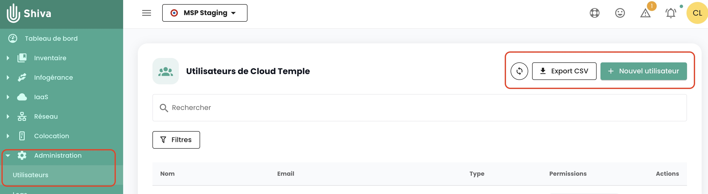
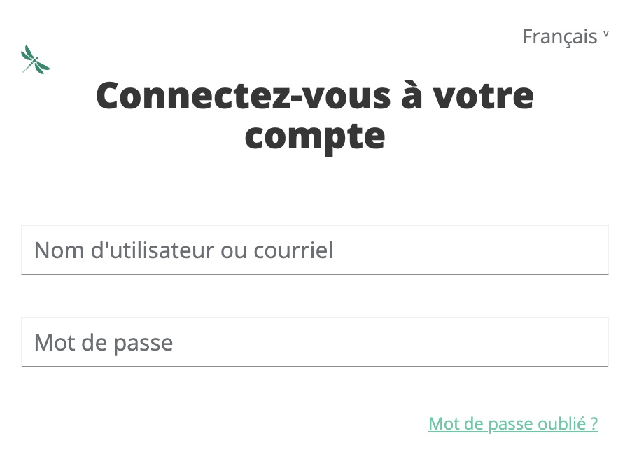

## Quali sono i permessi disponibili per gli account utente della console Shiva?

Ecco l'elenco dei [permessi disponibili](../../console/permissions.md#permissions-disponibles-pour-les-utilisateurs-de-votre-organisation).

## Come aggiungere un permesso?

Ecco la [procedura per assegnare un permesso a un utente](../../console/accounts.md#affectation-des-permissions-à-un-utilisateur)

## Perché non posso aggiungere un permesso?

Per aggiungere un permesso, è necessario avere il permesso __'iam_write'__ e il __permesso che si desidera aggiungere__.

## Come aggiungere un utente?

*__Nota__ : Per aggiungere un utente, è necessario avere il diritto __'iam_write'__.*

Ecco la procedura [per aggiungere un nuovo utente](../../console/accounts.md#création-dun-compte-utilisateur-dans-votre-organisation)

## Come auditare gli accessi / permessi degli utenti?

Vai alla pagina dell'utente e clicca sul pulsante __'Esporta csv'__ :

## Come eliminare un utente?

Nel menu __'Amministrazione'__ sulla barra verde a sinistra dello schermo, nel sottomenu __'utente'__, clicca sull'icona __'Azione'__ dell'utente target e seleziona __'Elimina'__.

*__Nota__ :*
- *Per aggiungere un utente, è necessario avere il diritto __'iam_write'__.*
- *Se si tratta di un utente federato, __assicurarsi che l'utente sia stato anche eliminato dal repository di identità__.*

## Come ripristinare la password?
È possibile ripristinare la password dalla pagina di accesso della console Shiva cliccando su __'Password dimenticata?'__.

{:height="30%" width="30%"}

## Perché alcuni utenti sono in grigio?
Gli utenti in grigio sono quelli che non hanno convalidato il loro account. Durante la creazione dell'account, ;'utente ha ricevuto una mail di verifica. 

{:height="50%" width="50%"}

Dopo aver completato la verifica, l'utente potrà accedere alla console. 

L'account è grigio fino a quando la verifica non è stata completata.

## Cos'è un Personal Access Token (PAT)?

La generazione di una chiave API, chiamata anche __Personal Access Token (PAT)__, 
è un modo sicuro per connettersi alle API Shiva senza passare da un'interfaccia grafica. 

Troverete tutte le informazioni sulle [chiavi API qui](../../console/accounts.md#les-clés-api)

## Cos'è l'MFA ed è obbligatorio?
L'MFA (multi-factor authentication) è un concetto di verifica dell'identità dell'utente in due fasi, chiamato __autenticazione a doppio fattore__.

L'utente deve fornire due diverse prove di identità. Nel caso della console Shiva, l'autenticazione a doppio fattore è obbligatoria e richiede di inserire un codice usa e getta una volta che l'utente ha inserito la password del suo account. 

## Cos'è il captcha? Perché può bloccare l'accesso all'applicazione?
Il __'Captcha'__ è una misura di sicurezza che protegge il tuo account dallo spam e previene qualsiasi tentativo di decifrare la password.

Il __'Captcha'__ presenta un semplice test che verifica se si tratta di un essere umano e non di un robot che tenta di accedere all'account. 

La console Cloud Temple utilizza un captcha di tipo v3. Il tipo v3 è un test invisibile che stabilisce un indice di fiducia basato sulle interazioni dell'utente. 

La console Cloud Temple si basa su questo punteggio di indice di fiducia per autorizzare o meno l'utente a connettersi. 

Se si incontrano difficoltà con il test __'Captcha'__ per connettersi alla console Shiva, si prega di contattare il supporto utente.

