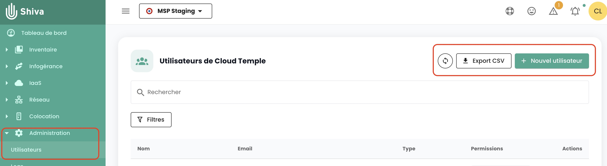
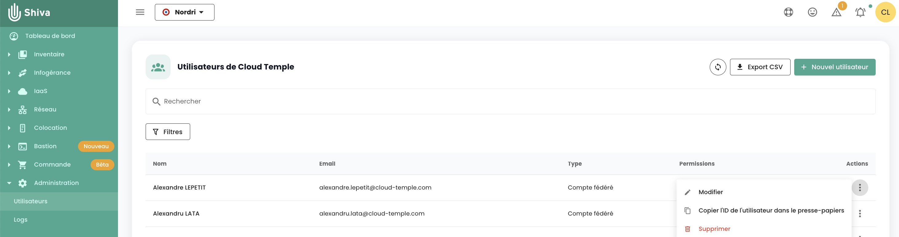
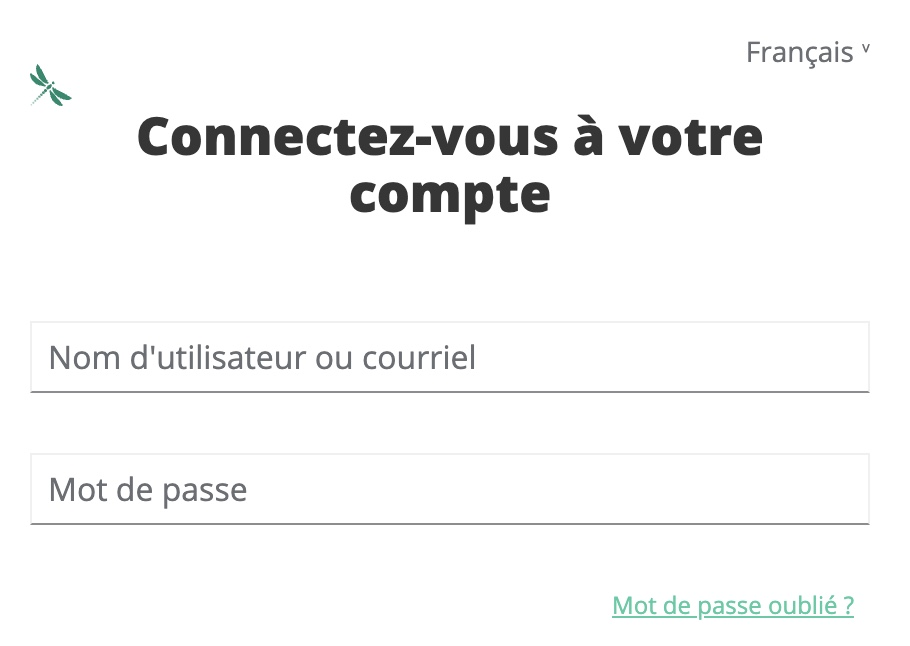

## Quelles sont les permissions disponibles pour les comptes utilisateur de la console Shiva ?

Voici la liste des [permissions disponibles](../../console/permissions.md#permissions-disponibles-pour-les-utilisateurs-de-votre-organisation).

## Comment ajouter une permission ?

Voici la [procédure d'affectation de permission pour un utilisateur](../../console/accounts.md#affectation-des-permissions-à-un-utilisateur)

## Pourquoi je ne peux pas ajouter une permission ?

Pour ajouter une permission, vous avez besoin de posséder la permission __'iam_write'__ ainsi que la __permission que vous souhaitez ajouter__.

## Comment ajouter un utilisateur ?

*__Nota__ : Pour ajouter un utilisateur, vous devez posséder le droit __'iam_write'__.*

Voici la procédure [d'ajout pour un nouvel utilisateur](../../console/accounts.md#création-dun-compte-utilisateur-dans-votre-organisation)

## Comment auditer les accès/permissions des utilisateurs ?

Allez sur la page utilisateurs et cliquez sur le bouton __'Exporter csv'__ :

## Comment supprimer un utilisateur ?

Dans le menu __'Administration'__ sur le bandeau vert à gauche de l'écran, dans le sous menu __'utilisateur'__, cliquer sur l'icône __'Action'__ de l'utilisateur cible et choisissez __'Supprimer'__.

*__nota__ :*
- *Pour ajouter un utilisateur, vous devez posséder le droit __'iam_write'__.*
- *S'il s'agit d'un utilisateur fédéré, __assurez-vous que l'utilisateur a été supprimé également depuis le référentiel d'identité__.*

## Comment réinitialiser son mot de passe ?
Il est possible de réinitialiser son mot de passe depuis la page de connexion de la console Shiva en cliquant sur __'Mot de passe oublié ?'__.

{:height="30%" width="30%"}

## Pourquoi certains utilisateurs sont grisés ?
Les utilisateurs grisés sont ceux n'ayant pas validé leur compte. Lors de la création du compte, ;'utilisateur a recu un mail de vérification.  

{:height="50%" width="50%"}

Une fois la vérification terminée, l'utilisateur pourra se connecter sur la console.  

Le compte est grisé tant que la vérification n'a pas été finalisée.

## Qu'est-ce qu'un Personal Access Token (PAT) ?

La génération d'une clé API, aussi appelée __Personal Access Token (PAT)__, 
est une manière sécurisée de se connecter aux API Shiva sans passer par une interface graphique. 

Vous trouverez toutes les informations sur [les clés API ici](../../console/accounts.md#les-clés-api)

## Qu'est-ce que le MFA et est-il obligatoire ?
Le MFA (multi-factor authentication) est un concept de vérification de l'identité d'un utilisateur en deux étapes, appelée __authentification à double facteur__.

L'utilisateur doit fournir deux preuves d'identité distinctes. Dans le cas de la console Shiva, l'authentification à double facteur est obligatoire et requiert de rentrer un code à usage unique une fois que l'utilisateur a entré le mot de passe de son compte. 

## Qu'est-ce que le captcha ? Pourquoi peut-il bloquer la connexion à l'application ?
Le __'Captcha'__ est une mesure de sécurité permettant de protéger votre compte du spam et d'empêcher toute tentative de décryptage de mot de passe.

Le __'Captcha'__ soumet un test simple visant à vérifier qu'il s'agit bien d'un être humain et non d'un robot qui tente d'accéder au compte. 

La console Cloud Temple utilise un Captcha de type v3. Le type v3 est un test invisible qui établie un indice de confiance basé sur les interactions de l'utilisateur. 

La console Cloud Temple se base sur ce score d'indice de confiance pour autoriser ou non l'utilisateur pour se connecter. 

Si vous rencontrez des difficultés avec le test __'Captcha'__ pour vous connecter à la console Shiva, veuillez contacter le support utilisateur. 
