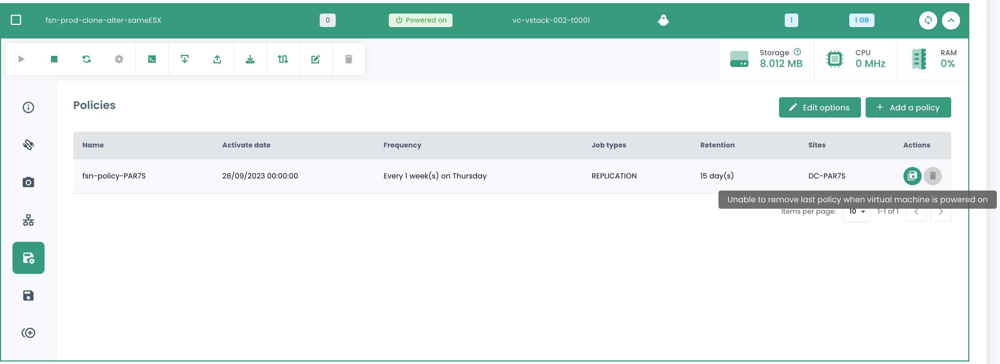

## Virtual Machine Backup Service
Cloud Temple offers __a native cross-backup architecture which is non-disconnectable__ (it is mandatory in the French secnumcloud qualification).

Backups are stored in an availability zone and on a different physical datacenter from the one hosting the virtual machine.

This protects against a major fault at the production datacenter and allows for restoration on a secondary datacenter (e.g., in the case of a fire).

This solution includes:

- Off-site hot backup of all disks,
- The instant presentation and start-up of a virtual machine from the mass storage infrastructure, and hot reloading on the production SANs,
- The partial restoration of files from the backup,
- Retention limited only by the allocation of mass storage space.

This backup infrastructure is based on the *IBM Spectrum Protect Plus* solution, an agentless architecture solution that is easy to use and enables the automation of backup processes in addition to optimizing space in mass storage.

The speeds of backups and restorations are dependent on the change rate in the environments.
The backup policy is configurable from [the Cloud Temple Console](../console/console.md) for each virtual machine.

*__Nota:__*

*__Certain virtual machines are not compatible with this backup technology__ which uses the hypervisor's snapshot mechanisms.
These are typically machines whose disk write loads are constant. It is not possible for the hypervisor to close the snapshot, which 
requires freezing the virtual machine in order to finish the closing operation. This freeze can last several hours and is not stoppable.*

*The solution then is to exclude the disk that is the target of constant writes and to backup the data by another method.*

| Reference                                                | Unit | SKU                            |
| -------------------------------------------------------  | ---- | ------------------------------ |
| BACKUP - Access to IBM Spectrum Protect Plus service     | 1 VM | csp:(region):iaas:backup:vm:v1 |

### Create a Backup Policy

To add a new backup policy, a request must be made to support. Support can be accessed via the lifebuoy icon at the top right of the window.

The creation of a new backup policy is carried out by __a service request__ indicating:

    The name of your Organization
    The name of a contact with their email and telephone number to finalize the configuration
    The name of the tenant
    The name of the backup policy
    The characteristics (x days, y weeks, z months, ...)

### Assigning a backup policy to a virtual machine
When an SLA is assigned to a virtual machine (VM), all disks associated with that VM automatically inherit the same SLA. Subsequently, it is possible to manually initiate the backup execution via the "Backup Policies" tab. If not manually triggered, the backup will execute automatically according to the schedule configured by the SLA.

SecNumCloud requires the assignment of a backup policy to a virtual machine before it can start. Otherwise, you will receive the following notification:

{:height="50%" width="50%"}

Click on the __'Backup Policies'__ tab in your virtual machine's menu. There, you can view the backup policy or policies assigned to it.

To assign a new backup policy to the virtual machine, click the __'Add a policy'__ button and select the desired backup policy.

### Assigning a Backup Policy to a Virtual Disk
It is also possible to assign a Service Level Agreement (SLA) directly to a specific virtual disk of a machine. In this case, the virtual machine does not inherit the SLA applied individually to the disk. However, it is not possible to manually initiate the execution of the backup at the disk level, as this functionality is not supported in Spectrum Protect Plus.

On the other hand, it is possible to exclude certain disks from one or more virtual machine backup policies (SLAs), which allows for the unassigning of one or more SLA(s) on a disk-by-disk basis. This approach offers the flexibility to manually initiate the execution of an SLA backup without affecting all the disks of the virtual machine, thus allowing for a more refined management of backups.

Click on the action bar of the disk to which you want to assign a backup policy. Then click on __'Policies'__ and select the desired backup policy.

_Note_: The policy to be added must be located in a different availability zone from the virtual machine.

### Execute a Backup Policy

In the __'Backup Policies'__ menu of your virtual machine, click on the __'Run'__ button in the __'Actions'__ column of the backup policy you wish to execute.

To execute a backup policy, you may also start from the __'Backups'__ section in the menu of your virtual machine. Click on the __'Execute Backup'__ button, then select the backup you wish to execute from the dropdown list.

### Remove a Backup Policy
In the __'Backup Policies'__ menu of your virtual machine, click on the __'Remove'__ button in the __'Actions'__ column of the backup policy you want to remove.

__Please note, it is not possible to remove the last SLA from a turned-on virtual machine:__

### Deletion of a Backup Policy: Case of a Held Backup Policy ("held")
When the last resource is disassociated from an SLA policy, the system automatically detects this situation. Consequently, all jobs related to this SLA policy automatically switch to the "Held" status. It is important to note that at this stage, direct deletion of the SLA policy is not possible due to the existence of dependent jobs. To proceed with the deletion of the policy, a series of steps must be followed.

It is necessary to verify that the concerned jobs are indeed in the "Held" status. Once this verification is done, these jobs can be deleted. Only after deleting these dependent jobs can the SLA policy be permanently erased from the system.

A particular case deserves specific attention: the addition of a new resource to an SLA policy whose dependent jobs have not been deleted. In this situation, the job identifiers will be retained. However, it is crucial to note that jobs in the "Held" state will not automatically resume. Manual intervention will be necessary to reactivate them and allow their execution.

Note: For any clarification on this situation, please contact Cloud Temple support.

The Cloud Temple console prevents the assignment of a virtual machine to a suspended policy:

{:height="50%" width="50%"}

Similarly, it is not possible to start a virtual machine that is associated with a suspended backup policy:

{:height="50%" width="50%"}

### Restore a Backup

The __'Backups'__ tab in the menu of your virtual machines allows you to access the list of backups for it.
To restore a backup, click on the __'Restore'__ button on the row corresponding to the backup you wish to restore.

1. **Production Mode**: Production mode allows for disaster recovery on the local site from primary storage or a remote disaster recovery site, by replacing the original machine images with recovery images. All configurations are transferred as part of the recovery, including names and identifiers, and any associated data copy jobs for the virtual machine continue to run. As part of a production mode restoration, you can choose to replace the storage in the virtual machine with a virtual disk from a previous virtual machine backup.

2. **Test Mode**: Test mode creates temporary virtual machines for development, testing, snapshot verification, and disaster recovery verification based on a repeatable schedule, without impacting production environments. Test machines run as long as necessary to perform the test and verification, and then they are cleaned up. Through isolated networking, you can establish a safe environment to test your works without interfering with the production-use virtual machines. Virtual machines that are created in test mode have unique names and identifiers to avoid any conflicts in your production environment.

3. **Clone Mode**: Clone mode creates copies of virtual machines for use cases requiring permanent or long-running copies for data exploration or duplication of a test environment on an isolated network. Virtual machines created in clone mode have unique names and identifiers to avoid any conflicts in your production environment. In clone mode, you must be mindful of resource consumption as clone mode creates permanent or long-term machines.

**Restoration is by default in "TEST" mode to preserve production**, and it is possible for you to choose the name of the restored vm:

{:height="80%" width="80%"}

Note that if the tests are satisfactory, it is possible to switch a virtual machine from test mode to production mode:

{:height="80%" width="80%"}

## Agent-based Backup Service
For the backup of complex environments (large file servers, SAP, databases, etc.), Cloud Temple can provide IBM Storage Protect solution within your tenant. 
Based on an agent architecture and a dedicated platform, Spectrum Protect offers advanced data backup mechanisms including compression, source-side deduplication, and encryption.

Advanced backup agents are available for core applications (such as email, ERP systems, etc.).

For more information about IBM Storage Protect, please visit: https://www.ibm.com//products/storage-protect

| Reference                                                                                                               | Unit        | SKU                                         |
| ----------------------------------------------------------------------------------------------------------------------- | ------------ | ------------------------------------------- |
| BACKUP - IBM Storage Protect Service - 1 virtual appliance                                                              | 1 appliance  | csp:(region):backup:sp:service:access:v1    |
| BACKUP - IBM Spectrum Protect - 1 TiB source backed up including backup space (for a 7 days - 5 weeks - 6 months policy) | 1 TiB        | csp:(region):backup:sp:1tib:v1              |

## Outsourcing of backups to LTO tape
**Note: The service has been discontinued as of December 1, 2023.**

With the goal of maximizing the security of your backup data, Cloud Temple offers to write and store backups on LTO magnetic tapes.
The data written on the tapes is encrypted and cannot be tampered with.

It is appropriate to reserve the number of LTO drives (LTO8 or LTO9 technology) according to your needs.

Cloud Temple uses its partner [__Iron Mountain__](https://www.ironmountain.com) for outsourcing tape backups (transportation, storage, and tape management),
in order to meet the needs for data protection, disaster recovery, and legal archiving.

| Reference                                                           | Unit         | SKU        |
| ------------------------------------------------------------------- | ------------ | ---------- |
| BACKUP - Reservation of an LTO drive                                | 1 drive      | DEPRECATED |
| BACKUP - LTO tape for backup externalization                        | 1 LTO tape   | DEPRECATED |
| BACKUP - Iron Mountain's tape externalization service               | 1 package    | DEPRECATED |