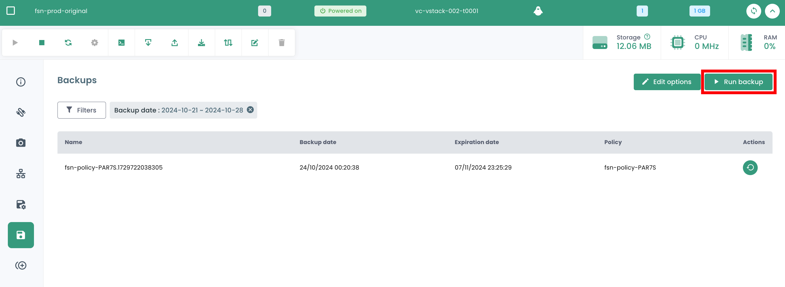
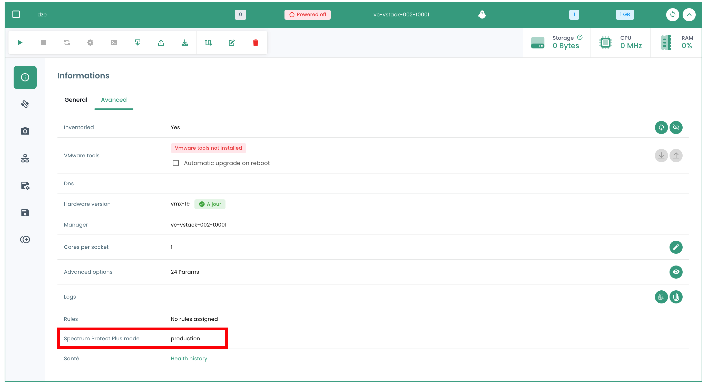

## Servizio di backup delle macchine virtuali
Cloud Temple propone __un'architettura di backup incrociato nativa e obbligatoria__ (è obbligatoria per la qualificazione secnumcloud francese).

I backup sono archiviati in una zona di disponibilità e in un data center fisico diverso da quello che ospita la macchina virtuale.

Questo permette protezione in caso di guasto grave nel data center di produzione e di ripristino in un data center secondario (ad esempio, in caso di incendio).

Questa soluzione include:

- Il backup remoto in tempo reale di tutti i dischi,
- La presentazione e l'avvio immediato di una macchina virtuale dall'infrastruttura di mass storage e il ricaricamento in tempo reale sui SAN di produzione,
- Il ripristino parziale dei file dal backup,
- Una ritenzione limitata solo dalla allocazione di spazio di stoccaggio di massa.

Questa infrastruttura di backup si basa sulla soluzione *IBM Spectrum Protect Plus*, una soluzione con architettura senza agenti,
facile da usare e che permette l'automazione dei processi di backup oltre a un'ottimizzazione dello spazio di mass storage.

Le velocità di backup e di ripristino dipendono dal tasso di variazione negli ambienti.
La politica di backup è configurabile da [la Console Cloud Temple](../console/console.md) per ogni macchina virtuale.

*__Nota:__*

*__Alcune macchine virtuali non sono compatibili con questa tecnologia di backup__ che utilizza i meccanismi di snapshot istantanei dell'hypervisor.
Sono tipicamente macchine le cui operazioni di scrittura su disco sono costanti. Non è possibile per l'hypervisor chiudere lo snapshot istantaneo, il che 
obbliga al congelamento della macchina virtuale per poter completare l'operazione di chiusura. Questo congelamento può durare diverse ore e non è interrompibile.*

*La soluzione è quindi escludere il disco che è bersaglio di scritture permanenti e di salvare i dati con un altro metodo.*

| Riferimento                                               | Unità | SKU                            |
| --------------------------------------------------------- | ----- | ------------------------------ |
| BACKUP - Accesso al servizio IBM Spectrum Protect Plus    | 1 VM  | csp:(regione):iaas:backup:vm:v1 |

### Creare una politica di backup
Per aggiungere una nuova politica di backup, è necessario fare una richiesta al supporto. Il supporto è accessibile dall'icona del salvagente in alto a destra della finestra.

La creazione di una nuova politica di backup è realizzata mediante __una richiesta di servizio__ indicando:

    Il nome della vostra Organizzazione
    Il nome di un contatto con la sua email e n° di telefono per finalizzare la configurazione
    Il nome del tenant
    Il nome della politica di backup
    Le caratteristiche (x giorni, y settimane, z mesi, ...)

### Assegnare una politica di backup a una macchina virtuale
Quando una SLA viene assegnata a una macchina virtuale (VM), tutti i dischi associati a questa VM ereditano automaticamente la stessa SLA. Successivamente, è possibile avviare manualmente l'esecuzione del backup tramite la scheda "Politiche di backup". In assenza di un avvio manuale, il backup verrà eseguito automaticamente secondo la pianificazione configurata dalla SLA.

SecNumCloud rende obbligatoria l'assegnazione di una politica di backup a una macchina virtuale prima del suo avvio. In caso contrario, riceverete la seguente notifica:

{:height="50%" width="50%"}

Cliccate sulla scheda __'Politiche di backup'__ nel menu della vostra macchina virtuale. Potete visualizzare la o le politiche di backup assegnate a essa.

Per assegnare una nuova politica di backup alla macchina virtuale, cliccate sul pulsante __'Aggiungi una politica'__ e selezionate la politica di backup desiderata.

### Assegnare una politica di backup a un disco virtuale

È anche possibile assegnare un SLA direttamente a un disco virtuale specifico di una macchina. In questo caso, la macchina virtuale non eredita questo SLA applicato individualmente al disco. Tuttavia, non è possibile avviare manualmente l'esecuzione del backup a livello dei dischi, poiché questa funzionalità non è supportata in Spectrum Protect Plus.

D'altra parte, è possibile escludere alcuni dischi da una o più politiche di backup (SLA) della VM, il che consente di deselezionare una o più SLA(s) su base disco per disco. Questo approccio offre la flessibilità di avviare manualmente l'esecuzione del backup di uno SLA senza influenzare tutti i dischi della macchina virtuale, permettendo così una gestione più dettagliata dei backup.

Fare clic sulla barra delle azioni del disco a cui si desidera assegnare una politica di backup. Poi, fare clic su __'Politiche'__ e selezionare la politica di backup desiderata.

_Nota_ : La politica da aggiungere deve trovarsi in una zona di disponibilità diversa da quella della macchina virtuale.

### Eseguire una politica di backup

Nel menu __'Politiche di backup'__ della vostra macchina virtuale, cliccate sul bottone __'Esegui'__ nella colonna __'Azioni'__ della politica di backup che desiderate eseguire.

Per eseguire una politica di backup, potete anche iniziare dalla sezione __'Backup'__ nel menu della vostra macchina virtuale. Cliccate sul bottone __'Esegui backup'__, poi selezionate il backup che desiderate eseguire nell'elenco a discesa.

### Rimuovere una politica di backup

Nel menu __'Politiche di backup'__ della vostra macchina virtuale, cliccate sul bottone __'Rimuovi'__ nella colonna __'Azioni'__ della politica di backup che volete rimuovere.

__Attenzione, non è possibile rimuovere l'ultimo SLA su una macchina virtuale accesa:__

### Eliminazione di una politica di backup: caso di una politica di backup sospesa ("held")
Quando l'ultima risorsa è dissociata da una politica SLA, il sistema rileva automaticamente questa situazione. Di conseguenza, tutti i lavori correlati a questa politica SLA passano automaticamente allo stato "Sospeso" ("In attesa"). È importante notare che a questo punto non è possibile eliminare direttamente la politica SLA a causa della presenza di lavori dipendenti. Per procedere alla rimozione della politica, è necessario seguire una serie di passaggi.

Bisogna verificare che i lavori interessati siano effettivamente nello stato "Sospeso". Una volta eseguita questa verifica, questi lavori possono essere eliminati. Solo dopo aver eliminato questi lavori dipendenti sarà possibile cancellare definitivamente la politica SLA dal sistema.

Un caso particolare merita un'attenzione specifica: l'aggiunta di una nuova risorsa a una politica SLA i cui lavori dipendenti non sono stati eliminati. In questa situazione, gli identificativi dei lavori saranno mantenuti. Tuttavia, è cruciale notare che i lavori in stato "Sospeso" non riprenderanno automaticamente. Sarà necessaria un'intervento manuale per riattivarli e permettere la loro esecuzione.

nota: Per ulteriori chiarimenti su questa situazione, contattare il supporto Cloud Temple.

La console Cloud Temple impedisce l'assegnazione di una macchina virtuale a una politica sospesa:

{:height="50%" width="50%"}

Allo stesso modo, non è possibile avviare una macchina virtuale che è associata a una politica di backup sospesa:

{:height="50%" width="50%"}

### Ripristinare un backup

La scheda __'Backup'__ nel menu delle vostre macchine virtuali vi permette di accedere all'elenco dei backup di quest'ultima. 
Per ripristinare un backup, cliccate sul pulsante __'Ripristina'__ sulla riga corrispondente al backup che desiderate ripristinare.

1. **Modalità produzione**: La modalità produzione consente il recupero di emergenza sul sito locale dallo storage primario o da un sito di recupero di emergenza remoto, sostituendo le immagini originali della macchina con le immagini di recupero. Tutte le configurazioni vengono trasferite come parte del recupero, inclusi i nomi e gli identificatori, e tutti i lavori di copia dei dati associati alla macchina virtuale continuano ad essere eseguiti. In caso di ripristino in modalità produzione, potete scegliere di sostituire lo storage nella macchina virtuale con un disco virtuale da un backup precedente della macchina virtuale.

2. **Modalità test**: La modalità test crea macchine virtuali temporanee per lo sviluppo, il test, la verifica istantanea e la verifica del recupero di emergenza basato su una pianificazione iterabile, senza impatto sugli ambienti di produzione. Le macchine di test funzionano per tutto il tempo necessario per eseguire il test e la verifica, dopodiché vengono eliminate. Attraverso la rete isolata, potete stabilire un ambiente sicuro per testare i vostri lavori senza interferire con le macchine virtuali utilizzate per la produzione. Le macchine virtuali create in modalità test hanno nomi e identificatori unici per evitare conflitti nell'ambiente di produzione.

3. **Modalità clone**: La modalità Clone crea copie delle macchine virtuali per casi d'uso che richiedono copie permanenti o a lunga esecuzione per l'esplorazione di dati o la duplicazione di un ambiente di test su una rete isolata. Le macchine virtuali create in modalità clone hanno nomi e identificatori unici per evitare conflitti nell'ambiente di produzione. In modalità clone, bisogna prestare attenzione al consumo di risorse poiché questa modalità crea macchine permanenti o a lungo termine.

**Il ripristino è impostato di default sulla modalità "TEST" per preservare la produzione** ed è possibile scegliere il nome della vm ripristinata:

{:height="80%" width="80%"}

Si noti che se i test sono soddisfacenti, è possibile spostare una macchina virtuale dalla modalità test alla modalità produzione:

{:height="80%" width="80%"}

## Servizio di backup tramite agent

Per il backup di ambienti complessi (grossi server file, SAP, database,...), Cloud Temple può fornire all'interno del vostro tenant la soluzione IBM Storage Protect.
Basata su un'architettura con agenti e su una piattaforma dedicata, Spectrum Protect offre meccanismi avanzati di backup dei dati, inclusa la compressione, la deduplicazione alla fonte e la cifratura.

Agenti di backup avanzati sono disponibili per le applicazioni principali (come la posta elettronica, gli ERP...).

Per maggiori informazioni su IBM Storage Protect, cliccate qui: https://www.ibm.com//products/storage-protect

| Riferimento                                                                                                            | Unità       | SKU                                      |
| ---------------------------------------------------------------------------------------------------------------------- | ----------- | ---------------------------------------- |
| BACKUP - Servizio IBM Storage Protect - 1 appliance virtuale                                                           | 1 appliance | csp:(regione):backup:sp:servizio:accesso:v1 |
| BACKUP - IBM Spectrum Protect - 1 TiB fonte salvata includente spazio di backup (per una politica di 7g - 5set - 6m) | 1 TiB       | csp:(regione):backup:sp:1tib:v1          |

## Esternalizzazione dei backup su nastro LTO

**Nota: Il servizio non è più commercializzato dal 1 dicembre 2023.**

Al fine di massimizzare la sicurezza dei vostri dati di backup, Cloud Temple offre la possibilità di scrivere e memorizzare i backup su nastri magnetici LTO.
I dati registrati su nastro sono criptati e non falsificabili.

Si raccomanda di prenotare il numero di lettori LTO (tecnologia LTO8 o LTO9) a seconda delle vostre esigenze. 

Cloud Temple si avvale della collaborazione con il partner [__Iron Mountain__](https://www.ironmountain.com) per l'esternalizzazione dei backup su nastro (trasporto, archiviazione e gestione dei nastri), 
per soddisfare le esigenze di protezione dei dati, di ripresa dopo un disastro e di archiviazione legale.

| Riferimento                                                         | Unità       | SKU        |
| ------------------------------------------------------------------- | ----------- | ---------- |
| BACKUP - Prenotazione di un lettore LTO                             | 1 lettore   | DEPRECATED |
| BACKUP - Nastro LTO per l'esternalizzazione dei backup             | 1 nastro LTO| DEPRECATED |
| BACKUP - Servizio di esternalizzazione Iron Mountain dei nastri LTO | 1 forfait   | DEPRECATED |